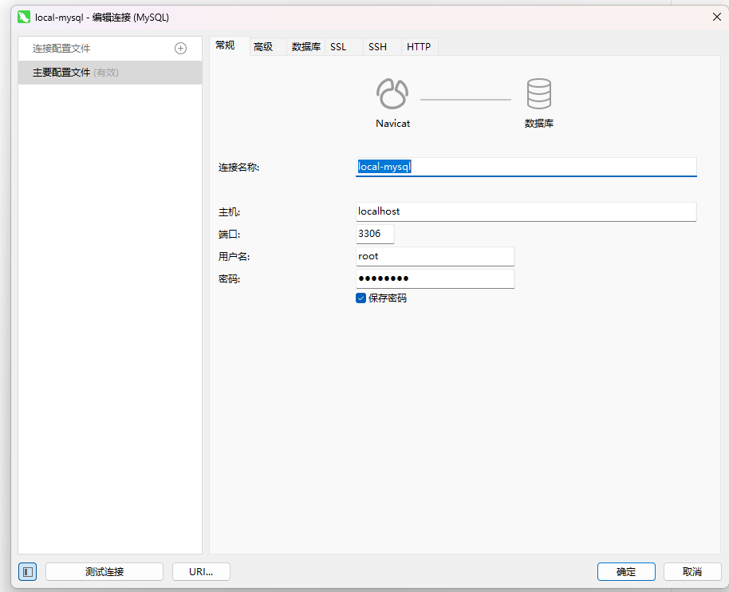
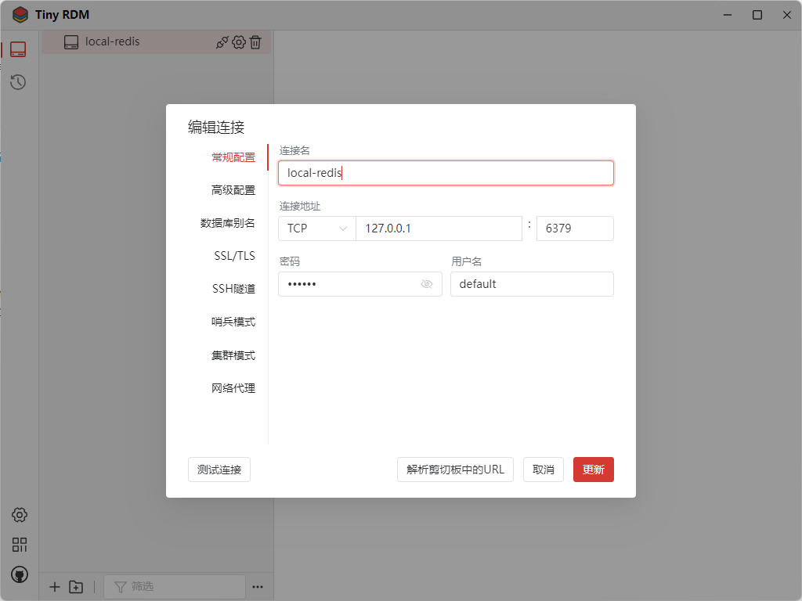

# docker

## 安装mysql


### 拉取mysql镜像

```bash
# 拉取mysql8.0镜像
docker pull mysql:8.0

# 拉取mysql最新镜像
docker pull mysql:latest
```

### 查看当前docker下的镜像

```bash
docker images
```

### 创建并运行一个mysql容器

```bash
# 创建mysql8.0容器，设置密码为123456，用户名默认是root
docker run --name=mysql8.0 -itd -p 3306:3306 -e MYSQL_ROOT_PASSWORD=123456 -d mysql:8.0


# 创建mysql最新容器，设置密码为123456，用户名默认是root
docker run --name=mysql -itd -p 3306:3306 -e MYSQL_ROOT_PASSWORD=123456 -d mysql
```

参数说明：

- --name：指定了容器的名称，方便之后进入容器的命令行。
- -itd：其中，i是交互式操作，t是一个终端，d指的是在后台运行。
- -p：指在本地生成一个随机端口，用来映射mysql的3306端口。
- -e：设置环境变量。
- MYSQL_ROOT_PASSWORD=123456：指定了MySQL的root密码
- -d mysql：指运行mysql镜像，设置容器在在后台一直运行。

### 查看当前docker下的容器

```bash
docker ps
```

### 进入mysql容器

```bash
# mysql8.0 是 容器名称
docker exec -it mysql8.0 /bin/bash

# 容器id
docker exec -it 9479408cb905 /bin/bash
```

### 进入mysql

```bash
# 超管进入
mysql -uroot -p

# 输入密码
Enter password：123456
```

### mysql开启远程访问权限

```bash
# 选择 mysql 数据库
# 默认，超管进入mysql操作，就是mysql数据库，不切换也行，保险起见还是切换一下。
use mysql;
```

### 给root用户分配远程访问权限

> 这一步很重要，不然 `navicat` 等gui工具，是无法访问到的。

```bash
GRANT ALL PRIVILEGES ON *.* TO root@'%' WITH GRANT OPTION;
```

参数说明：

- GRANT：赋权命令
- ALL PRIVILEGES：当前用户的所有权限
- ON：介词
- *.*：当前用户对所有数据库和表的相应操作权限
- TO：介词
- ‘root’@’%’：权限赋给root用户，所有ip都能连接
- WITH GRANT OPTION：允许级联赋权

### 强制刷新权限

```bash
FLUSH PRIVILEGES;
```

### 完整命令

```bash
docker pull mysql:8.0

docker run --name=mysql8.0 -itd -p 3306:3306 -e MYSQL_ROOT_PASSWORD=123456 -d mysql:8.0

docker exec -it mysql8.0 /bin/bash

mysql -uroot -p

use mysql;

GRANT ALL PRIVILEGES ON *.* TO root@'%' WITH GRANT OPTION;

FLUSH PRIVILEGES;
```

### navicat连接




## 安装redis

> 基础 docker 安装步骤，熟读mysql安装

### 完整命令

```bash
docker pull redis:6.2

# 指定密码是123456，用户名随意，默认是default，密码修改可以在redis容器内部修改，具体百度~
docker run --name redis6.2 -d -p 6379:6379 redis:6.2 --requirepass "123456"
```

### tiny RDM连接




