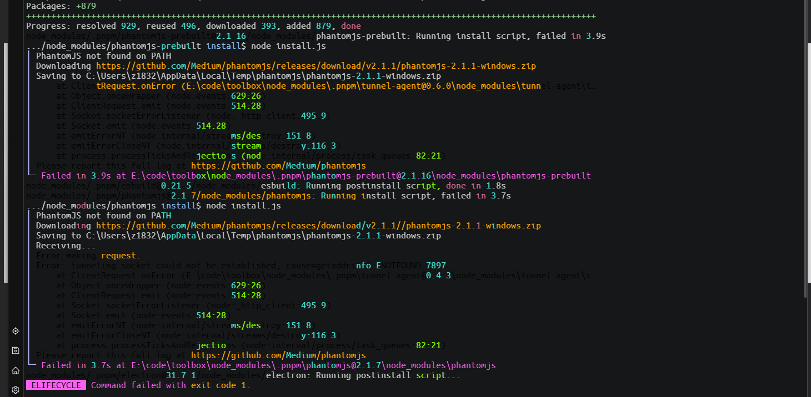
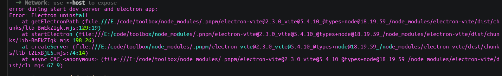
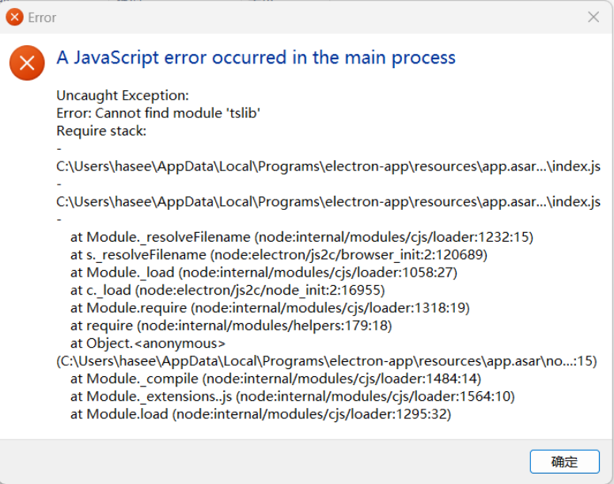

# electron

## 二次项目构建运行

### 安装依赖失败

先执行如下命令，进行安装

```bash
nrm use taobao
pnpm i
```

出现如下错误，安装`phantomjs@2.1.1`失败



解决方案，单独安装

```bash
pnpm add phantomjs@2.1.1 --ignore-scripts
```

如果失败，执行以下步骤，再重试上面操作，

删除 `node_modules` 、`package-lock.json` ，并且清除缓存，重新安装！！！

### 运行提示缺少electron

运行项目：

```bash
npm run dev
```
出现如下错误：



解决方案，单独安装（注意，单独安装包的命令，不知道要去百度，不一定是错误提示的这个名字）

```bash
pnpm add electron@latest
```
如果失败，执行以下步骤，再重试上面操作，

删除 `node_modules` 、`package-lock.json` ，并且清除缓存，重新安装！！！


## win打包报错


以管理员身份运行

## 打包成功，安装exe失败



原因是：依赖安装失败，删除 `node_modules` 、`package-lock.json` ，并且清除缓存，重新安装！！！