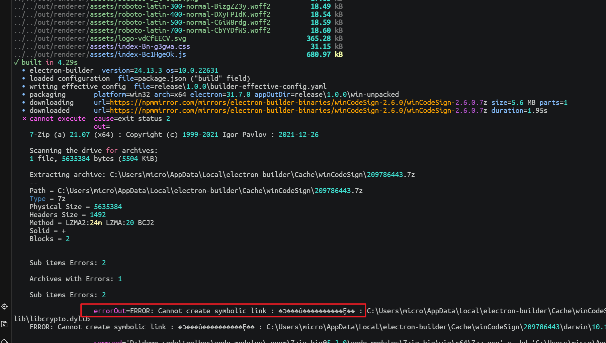

# electron

## 踩坑记录

### 安装依赖失败


```bash
npm install phantomjs@2.1.1 --ignore-scripts
```

### win打包报错



以管理员身份运行


### 安装exe失败


依赖安装失败，删除 `node_modules` 重新安装！！！

尽量使用 `npm` 安装，因为 `pnpm` 老是落安装部分依赖，导致这个问题。