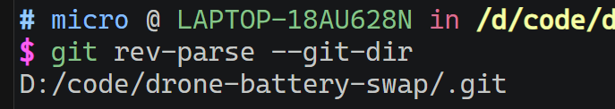

# git

## 添加/修改/删除远程仓库

```bash
# 添加远程仓库
git remote add origin <remote-url>

# 删除远程仓库
git remote rm origin

# 修改远程仓库
git remote set-url origin <remote-url>

# 仓库路径查询
git remote -v

# 首次提交三部曲
git add .
git commit -m "首次提交"
git push origin master

```

## git merge 合并分支

合并同事的`feat-temp`分支内容，到`develop`分支

```bash

# 创建feat-temp分支
git checkout -b feat-temp

# 或切换feat-temp分支
git checkout feat-temp


# 拉取feat-temp分支代码到本地
git pull

# 切换到develop分支
git checkout develop

# 合并feat-temp分支代码
# --no-ff ： 将合并的内容进行一次commit，方便回退到feat-temp合并分支前
git merge --no-ff feat-temp

# 推送develop
git push

# 如有需要，通知同事，删除已合并分支~~~

```

## tag 标签

```bash

# 查看本地tag
git tag

# 定义tag
git tag v1.0.0

# 推送到远程仓库
git push --tags
git push origin --tags

# 删除本地指定的tag
git tag -d v1.0.0

# 删除本地全部的tag，需要在shell终端上运行
git tag | xargs git tag -d

```

## 修改已提交的commit信息

<https://blog.csdn.net/sodaslay/article/details/72948722>

```bash

# 修改最后一次提交的commit信息（通过创建一个新的提交，来代替当前分支尖端）
git commit --amend -m "修改最后一次提交的commit信息"

# 修改指定提交的commit信息
git rebase -i master~1 #最后一次
git rebase -i master~5 #最后五次
git rebase -i HEAD~3   #当前版本的倒数第三次状态
git rebase -i 32e0a87f #指定的SHA位置

```

## 查看项目的.git目录

```bash
git rev-parse --git-dir
```



```bash
# linux 查询当前目录下的所有.git
find . -name ".git"

# 查看隐藏目录
ls -a
```