# express-session

摘自于：<https://juejin.cn/post/7370925894661357620#heading-0>

## 项目中引入和配置express-session库

```js
// 安装
npm i express-session
// 引入express-session库
const session = require('express-session')
// 配置session的中间件
app.use(session({
  secret: 'keyboard cat', // 服务器端生成session的签名
  name: "sessionName", // 修改session对应的cookie的名称
  resave: false, // 强制保存 session ，即使它并没有变化
  saveUninitialized: true, // 强制将未初始化的session存储
  cookie: { 
      maxAge: 1000*60, // 设置过期时间为一分钟
      secure: false // true 表示只有https协议才能访问cookie
    },
    rolling: true // 在每次请求时强行设置cookie，这将重置cookie的过期时间（默认值为false）
}));

```

使用`app.use(session(options))`就可以使用这个中间件。

## express-session 的参数

- secre：String类型的字符串，是一个密钥，用来作为服务端生成session的签名sessionId。
- name：返回客户端的key的名称，默认为`connect.sid`，也可以自行设置。
- resave：Boolean类型，默认为true，是否强制保存session，即在客户端每次请求时重新保存会话，即使会话在请求过程中从未被修改过。比如当设置为true时，客户端向服务端发出两个并行请求，在一个请求中更改session可能会覆盖另一个请求的session，即使另一个请求结束时session没有改变。
- saveUninitialized：Boolean类型，默认为true，当为 true时，客户端不论是否登录网站，只要访问网站都会生成一个 session，只不过这个 session 是一个空的session对象，无论有没有session和cookie，每次请求都设置个session和cookie ，默认给cookie一个标示为connect.sid。
- cookie：设置返回到客户端cookie的属性，默认值为`{path:'/',httpOnly:true,secure:false,maxAge:null}`。
- rolling：Boolean类型，默认为false，是否按照原设定的maxAge值重设session同步到cookie中。当设置为true 时，假设cookie 是10分钟过期，每次请求都会再设置10分钟。要保证session有操作的时候必须设置这个属性为true。
- genid: req => genuuid()，设置创建session id的自定义函数，默认使用uid-safe这个库自动生成id，自定义genid创建函数时一定要保证创建的id不要重复。
- proxy: 代理，通过设置这个值可以设置请求头的`X-Forwarded-Proto`字段，值为true，`X-Forwarded-Proto`使用；为false表示所有头信息忽略，只有tls/ssl可以安全连接，undefined，使用`app.set(trust proxy)`设置。
- store: new MemoryStore()，会话存储实例，默认为new MemoryStore 实例。
- unset: 设置是否保存会话，默认为keep。如果选择不保存可以设置destory，请求结束时候session摧毁。

> 请求头的X-Forwarded-Proto字段，用来确定客户端与代理服务器或者负载均衡服务器之间的连接所采用的传输协议（HTTP 或 HTTPS）

在服务器的访问日志中记录的是负载均衡服务器与服务器之间的连接所使用的传输协议，而非客户端与负载均衡服务器之间所使用的协议。为了确定客户端与负载均衡服务器之间所使用的协议，X-Forwarded-Proto 就派上了用场。

```js
X-Forwarded-Proto: http | https // 经过转发的传输协议
```

## cookie参数

cookie对象包含以下参数：

- maxAge: 设置给定过期时间的毫秒数。
- expires: cookie失效时间，默认不设置，http版本为1.1的时使用maxAge，设置maxAge之后自动会生成这个值。
- path: cookie的路径，默认为`/`（域名的根路径）。
- domain: 设置域名，默认为当前域（String），如果没有设置则cookie默认在当前域可以使用。
- sameSite: SameSite-cookies是一种机制，用于定义cookie跨域授权处理方式，可以不设置。默认为`false`，可以设置为`true`、`lax`、`strict`。true和strict表示sameSite使用strict模式，false表示不使用sameSite，lax表示sameSite使用lax模式。
- secure: 是否以https的形式发送cookie，默认为false。为true如果通过 http访问站点，则不会传递cookie，只有https才传递cookie到服务器端。
- httpOnly: 客户端是否只以http/https的形式发送cookie，禁止客户端JavaScript访问cookie，默认为true，也就是客户端不能以document.cookie查看cookie。
- signed: 是否对cookie包含签名，默认为true。
- overwrite: 是否可以覆盖先前的同名cookie，默认为true。

`sameSite`的值为`strict`，表示最严格的防护，有能力阻止所有`CSRF`攻击。然而，它的用户友好性太差，因为它可能会将所有`GET`请求进行`CSRF`防护处理。

举例：用户在`j.com`点击了一个链接（GET请求），这个链接是到`e.com`的，而如果`e.com`使用了`Samesite-cookies`机制并且将值设置为了`strict`，那么用户将不能登陆`e.com`，因为在严格防护情况下，浏览器不允许将`cookie`从A域发送到Ｂ域。

`sameSite`的值为`lax`，只会在使用危险`HTTP`方法发送跨域`cookie`的时候进行阻止，例如`POST`方式。

举例：用户在`g.com`提交了一个表单（`POST`请求），这个表单是提交到`m.com`的，而如果`m.com`使用了`Samesite-cookies`并且将值设置为了`lax`，那么用户将不能正常登陆`m.com`，因为浏览器不允许使用`POST`方式将`cookie`从A域发送到Ｂ域。

## saveUninitialized、resave、rolling使用场景

举例说明：客户端登录网站后，很长一段时间没有操作网页，之后刷新网页或者客户端点击网页某个地方发送请求到服务端，服务端不会正常处理请求而返回登录显示超时，需要重新登录。但是客户端登录网站后一直在操作网页，表示客户端一直在向服务端发送请求，此时服务端正常处理请求，网站一直是登录状态，中间不需要重新登录。

**总结这个场景发现两种情况：**

- 登录网站后，一段时间未刷新网页没有对网页进行操作，会自动退出登录状态。
- 登录网站后，一直在浏览网站信息，客户端一直在向服务端发送请求，网站就不会退出登录状态。

出现这两种场景需要session设置一个过期时间，在express-session中是通过cookie属性中的maxAge来设置。 时间到期之后，session会被自动删除，需要重新登录，比方说网站设置session保存1小时，从客户端登录开始，一小时后，session会被删除。但是现实是客户端一直在浏览网站的信息客户端就会一直发送请求到服务端，一小时后并不会删除。而是一小时之内客户端不向服务端发送任何请求就会将session删除。原因是session的计时设置是根据客户端最后一次请求开始计算，这就需要客户端每次请求时使用原设定的maxAge重设session过期时间。在express-session中通过将rolling的值设置为ture即可，这个值默认为false，需要手动开启。设置resave为true，该值默认为true，这样就会一直强制保存session对象，同时saveUninitialized要设置为false，就要求客户端必须登录后才存储session对象保存会话记录。

## 使用express-session

```js
const express = require('express');
const session = require('express-session');
const app = express();
// 注册中间件
app.use(session({
    secret: 'maomao', // 服务器端生成session的签名
    resave: false, // 强制保存 session ，即使它并没有变化
}))
app.get('/', (req, res) => {
    res.send("hello");
});
app.listen(3000, () => {
    console.log('Server is running at port 3000')
})

```

启动项目后，使用`curl -i localhost:3000`命令测试程序

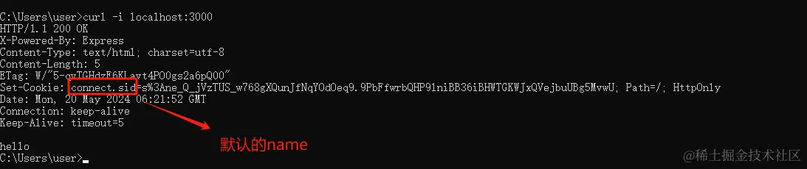

返回客户端的key的名称，session对应的cookie的名称默认为`connect.sid`

```js
const express = require('express');
const session = require('express-session');
const app = express();
// 注册中间件
app.use(session({
    secret: 'maomao', // 服务器端生成session的签名
    name: "sessionName", // 修改session对应的cookie的名称
    resave: false, // 强制保存 session ，即使它并没有变化
}))
app.get('/', (req, res) => {
    res.send("hello");
});
app.listen(3000, () => {
    console.log('Server is running at port 3000')
})

```

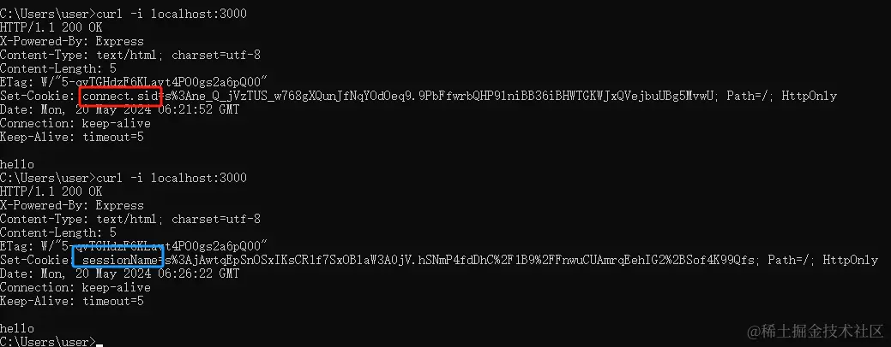

设置cookie属性：

```js
const express = require('express');
const session = require('express-session');
const app = express();
//过期时间为一天
const oneDay = 1000 * 60 * 60 * 24;
// 注册中间件
app.use(session({
    secret: 'maomao', // 服务器端生成session的签名
    name: "sessionName", // 修改session对应的cookie的名称
    resave: false, // 强制保存 session ，即使它并没有变化
    cookie: { maxAge: oneDay, HttpOnly: true, secure: false},
}))
app.get('/', (req, res) => {
    res.send("hello");
});
app.listen(3000, () => {
    console.log('Server is running at port 3000')
})
```

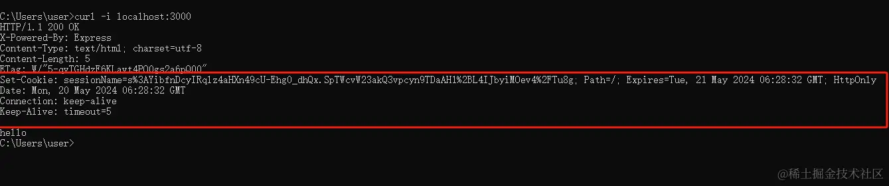

## express-session 的常用方法

```js
req.session.destroy((err) => { /*销毁 session*/ }) // 回调函数可选
req.session.xx=value; //设置 session，xx可以任意取，value可以是任意类型数据
req.session.xx // 获取 session 
req.session.cookie.maxAge=0; //重新设置 cookie 的过期时间,它会销毁所有的session

```

> express-session中设置session是在req上面实现的，而不是常见的res

```js
req.session.authInfo = authInfo // 设置了authInfo来保存一些用户的权限信息
req.session // 查看session
// 删除session就是清除存储的信息，以下方法均可
delete req.session.authInfo
Reflect.deleteProperty(req.session, 'authInfo')
req.session.authInfo = null

```

```js
// 查看session，req.session返回结果
{
 "cookie": {
  "originalMaxAge": 28800000,
  "expires": "2021-09-23T22:43:05.458Z",
  "httpOnly": true,
  "path": "/"
 },
 "authInfo": {
  "name": "abc",
  "path": ["/html", "/css", "/js"]
 }
}

```

## 案例

### session记录页面访问次数

以下是一个记录用户访问页面次数的例子：

当客户端第一次请求时，会给`req.session`写入一个`views`的属性，当客户端再次发起请求时，会把`views`属性加1，然后返回给客户端。

```js
const express = require('express');
const session = require('express-session');
const app = express();
//过期时间为一天
const oneDay = 1000 * 60 * 60 * 24;
// 注册中间件
app.use(session({
    secret: 'maomao', // 服务器端生成session的签名
    name: "sessionName", // 修改session对应的cookie的名称
    resave: false, // 强制保存 session ，即使它并没有变化
    cookie: { maxAge: oneDay, HttpOnly: true, secure: false},
}))
app.get('/',  (req, res, next) => {
 if (req.session.views) {
  req.session.views++;
  res.send(`第${req.session.views}次访问`)
 } else {
  req.session.views = 1
  res.end('第一次访问!');
 }
})

app.listen(3000, () => {
    console.log('Server is running at port 3000')
})

```

启动项目后，使用命令`curl -i localhost:3000`请求服务端，服务端响应返回结果如下：

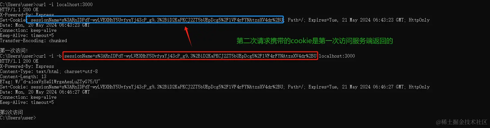

然后再次使用`curl -i -b sessionName=s%3ARnIDPdY-wyLVEXHhY5UvfyxYj43cP_g9.3%2BiD2KaPKCJ2ZT5bUEpDcg5%2FlVF4rFYNAtzsXV4dr%2BU localhost:3000`，携带上`cookie`请求服务端，服务端响应返回结果如下：

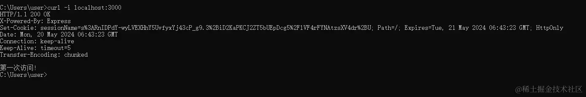

### 实现登录和退出

#### 登录

```js
// index.js
const express = require('express');
const session = require('express-session');
const app = express();
//过期时间为一天
const oneDay = 1000 * 60 * 60 * 24;
// 注册中间件
app.use(session({
    secret: 'maomao', // 服务器端生成session的签名
    name: "sessionName", // 修改session对应的cookie的名称
    resave: false, // 强制保存 session ，即使它并没有变化
    cookie: { maxAge: oneDay, HttpOnly: true, secure: false},
}))
//使用urlencoded中间件解析post请求
app.use(express.urlencoded());
// 中间件初始化静态资源，传入静态资源目录名，如此该目录下的文件就会作为静态资源
app.use('/assets',express.static('static'))
app.get('/',  (req, res, next) => {
    if (req.session.userid) {
        res.send("欢迎 <a href=\'/logout'>点击退出</a>");
    } else {
        res.redirect('http://localhost:3000/assets/index.html');
    }
});
app.post('/login', (req, res) => {
    const username ="admin";
    const password = '123';
    if (req.body.username === username && req.body.password === password) {
        req.session.userid = req.body.username;
        console.log(req.session)
        res.send(`登录成功 <a href=\'/logout'>点击退出</a>`);
    } else {
        res.send('不合理的 username 或 password');
    }
});
app.get('/logout',(req,res) => {
    req.session.destroy();
    res.redirect('/');
});
app.listen(3000, () => {
    console.log('Server is running at port 3000')
})

```

```html
<!-- static/index.html -->
<!DOCTYPE html>
<html>
<head>
    <title>Login</title>
    <style>
        body {
            font-family: Arial, sans-serif;
            background-color: #f2f2f2;
            margin: 0;
            padding: 0;
            display: flex;
            justify-content: center;
            align-items: center;
            height: 100vh;
        }

        .login-container {
            background-color: #fff;
            border-radius: 5px;
            padding: 20px;
            box-shadow: 0 0 10px rgba(0, 0, 0, 0.1);
            width: 300px;
        }

        .login-container h1 {
            text-align: center;
            margin-bottom: 20px;
        }

        .login-form label {
            display: block;
            margin-bottom: 10px;
        }

        .login-form input[type="text"],
        .login-form input[type="password"] {
            width: 100%;
            border: 1px solid #ccc;
            border-radius: 3px;
        }

        .login-form input[type="submit"] {
            background-color: #007bff;
            color: #fff;
            border: none;
            padding: 10px;
            border-radius: 3px;
            width: 100%;
            cursor: pointer;
        }

        .login-form input[type="submit"]:hover {
            background-color: #0056b3;
        }
    </style>
</head>
<body>
    <div class="login-container">
        <h1>Login Form</h1>
        <form class="login-form" method="POST" action="/login">
            <label for="username">Username:</label>
            <input type="text" id="username" name="username" required><br><br>
            
            <label for="password">Password:</label>
            <input type="password" id="password" name="password" required><br><br>
            
            <input type="submit" value="Login">
        </form>
    </div>
</body>
</html>

```

当没有登录时，访问`http://localhost:3000/`会重定向到登录页面`http://localhost:3000/assets/index.html`。

输入错误的用户名或密码：

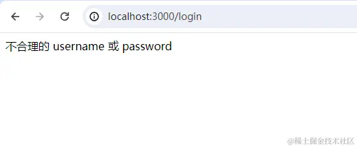

输入正确的用户名和密码后，客户端自动存储了`cookie`

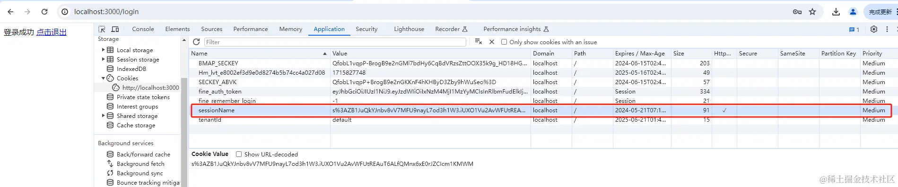

`req.session`获取会话`session`如下：


再次访问根路径就不会重定向到登录页面

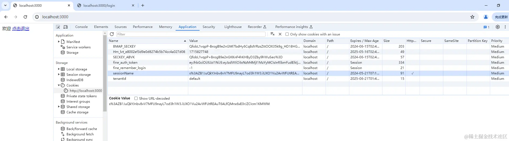

#### 退出

直接调用`session`的`destroy`方法就可以实现退出然后使用`res.redirect`重定向到登录页面

点击退出登录，当再次访问根路径也会重定向到登录页。

## 持久化session

### express-mysql-session

这里使用通过配置`express-mysql-session`中间件来连接`mysql`数据库，安装依赖：

```bash
npm install express-mysql-session --save
npm i mysql2
```

然后在`express-session`中间件配置，会话存储将在内部创建一个 `mysql2` 连接池。当使用默认选项时，会自动创建`sessions`数据库表。

```js
const session = require('express-session'); 
const MySQLStore = require('express-mysql-session')(session); //连接mysql主要模块
// 配置mysql
const options = {
 host: 'localhost', 
 port: 3306,
 user: 'session_test',
 password: 'password',
 database: 'session_test'
};

const sessionStore = new MySQLStore(options);

app.use(session({
 key: 'session_cookie_name',
 secret: 'session_cookie_secret',
 store: sessionStore, //存储管理器
 resave: false,
 saveUninitialized: false
}));
sessionStore.onReady().then(() => {
 // MySQL session store ready for use.
 console.log('MySQLStore ready');
}).catch(error => {
 // Something went wrong.
 console.error(error);
});

```

`new MySQLStore(options)`，options配置对象参数如下：

- host：连接数据库的ip地址。
- port：连接数据库端口号。
- user：连接数据库的用户名。
- password: 连接数据库的密码。
- database：连接数据库的数据库名。

#### 配置mysql对象的详情属性

```js
const options = {
 // Host name for database connection:
 host: 'localhost',
 // Port number for database connection:
 port: 3306,
 // Database user:
 user: 'session_test',
 // Password for the above database user:
 password: 'password',
 // 连接的数据库名
 database: 'session_test', 
 // 是否自动检查和清除过期会话
 clearExpired: true,
 // 多长时间清除一次过期会话，单位是毫秒
 checkExpirationInterval: 900000,
 // 有效会话的最大年龄，单位是毫秒
 expiration: 86400000,
 // 是否创建sessions数据表(如果不存在)
 createDatabaseTable: true,
 // 当存储关闭时是否结束数据库连接
 // 此选项的默认值取决于是否将连接传递给构造函数
 // 如果将连接对象传递给构造函数，则此选项的默认值为false
 endConnectionOnClose: true,
 // 是否禁用触摸
 disableTouch: false,
 charset: 'utf8mb4_bin',
 schema: {
  tableName: 'sessions', //表名
                // 数据表的列选项（字段）
  columnNames: {
   session_id: 'session_id',
   expires: 'expires',
   data: 'data'
  }
 }
};
```

### 代码实现

```js
// index.js
const express=require("express");
const session=require("express-session");
const MySQLStore=require('express-mysql-session')(session); //连接mysql主要模块
const options = {
 host: 'localhost', 
 port: 3306,
 user: 'root',
 password: '123456',
 database: 'session_test',
    schema: {
  tableName: 'sessions', //表名
                // 数据表的列选项（字段）
  columnNames: {
   session_id: 'session_id',
   expires: 'expires',
   data: 'data'
  }
 },
    expiration: 10800000,
    createDatabaseTable: true,  //是否创建数据表
};
const sessionStore = new MySQLStore(options);
const app = express();
//使用urlencoded中间件解析post请求
app.use(express.urlencoded());
// 中间件初始化静态资源，传入静态资源目录名，如此该目录下的文件就会作为静态资源
app.use('/assets',express.static('static'));
app.use(session({
 key: 'session_cookie_name',
 secret: 'session_cookie_secret',
 store: sessionStore, //存储管理器
 resave: false,
 saveUninitialized: false
}));
sessionStore.onReady().then(() => {
 console.log('MySQLStore ready');
}).catch(error => {
 console.error(error);
});
app.get('/',  (req, res, next) => {
    if (req.session.userid) {
        res.send("欢迎 <a href=\'/logout'>点击退出</a>");
    } else {
        res.redirect('http://localhost:3000/assets/index.html');
    }
});
app.post('/login', (req, res) => {
    const username ="admin";
    const password = '123';
    if (req.body.username === username && req.body.password === password) {
        req.session.userid = req.body.username;
        console.log(req.session)
        res.send(`登录成功 <a href=\'/logout'>点击退出</a>`);
    } else {
        res.send('不合理的 username 或 password');
    }
});
app.get('/logout',(req,res) => {
    req.session.destroy();
    res.redirect('/');
});
app.listen(3000, () => {
    console.log('Server is running at port 3000')
})

```

项目启动后，在`session_test`数据库中创建了`sessions`的数据表

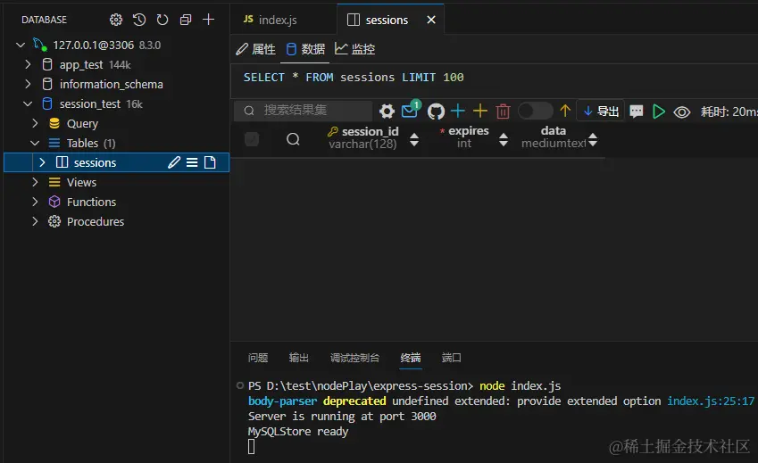

当输入正确的用户名和密码登录后，在数据表中添加了数据

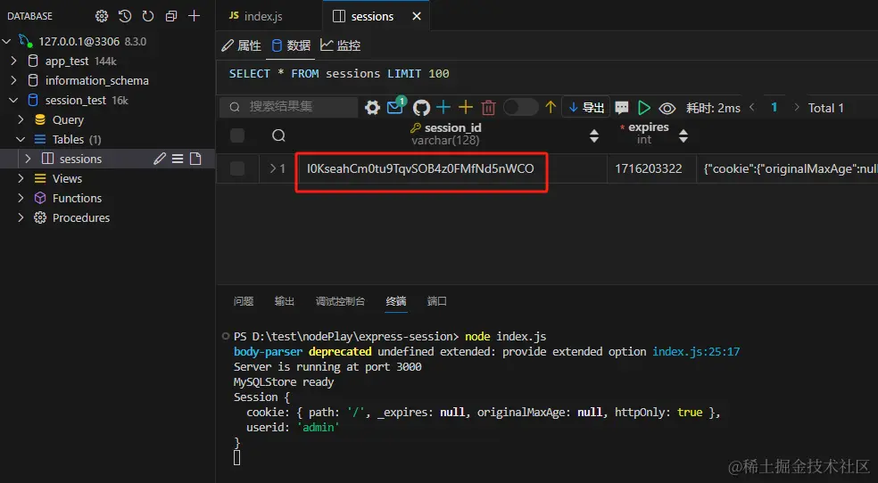

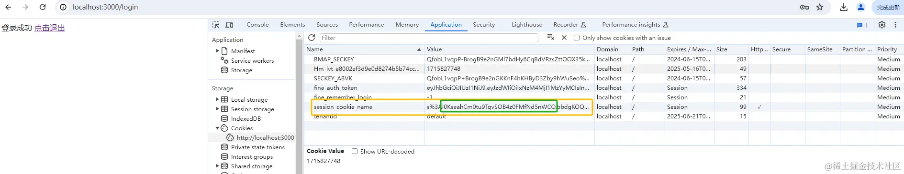
