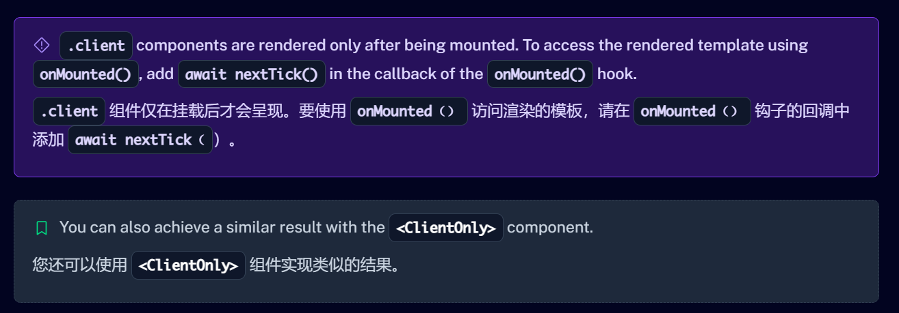

# Nuxt3

> Nuxt.js（通常简称为 Nuxt）是一个基于 Vue.js 的通用应用框架。它主要用于构建服务器端渲染（SSR）、静态站点生成（SSG）以及单页面应用（SPA）等类型的 Web 应用程序。

- 服务器端渲染（SSR）
  - Nuxt 可以在服务器端渲染 Vue 组件，然后将渲染后的 HTML 发送给客户端。这带来了许多好处，例如更好的搜索引擎优化（SEO）效果，因为搜索引擎爬虫可以直接获取到完整的页面内容，而不是像传统单页面应用那样只能看到一个空的 HTML 壳子。另外，SSR 还能提高首屏加载速度，用户可以更快地看到完整的页面，提升用户体验。
- 静态站点生成（SSG）
  - 能够在构建时预先生成所有的页面为静态 HTML 文件。这对于内容相对固定的网站（如博客、文档站点等）非常有用。静态站点具有加载速度快、安全性高、易于部署等优点。Nuxt 可以根据项目的需求灵活选择是进行 SSR 还是 SSG。
- 开发体验优化
  - 提供了一种简单且约定优于配置的开发模式。例如，它有预定义的文件和文件夹结构，开发人员可以按照这种结构组织代码，从而减少配置的复杂性。它还集成了许多有用的工具和功能，如路由管理、代码分割、热模块替换等。
- Vue.js 集成
  - 由于它是基于 Vue.js 构建的，开发人员可以充分利用 Vue.js 的所有特性，如组件化开发、响应式数据绑定等。这使得熟悉 Vue.js 的开发人员能够快速上手 Nuxt 项目的开发。
- 模块系统
  - Nuxt 拥有丰富的模块系统，开发人员可以通过安装和使用各种模块来扩展项目的功能。例如，有用于处理 Axios 请求的模块、用于添加 PWA（渐进式 Web 应用）功能的模块等。这些模块可以方便地集成到项目中，减少了开发人员自己编写功能代码的工作量。

## 使用ref获取组件

[Nuxt3文档，指导/组件](https://nuxt.com/docs/guide/directory-structure/components#client-components)



```vue
<script>
// dom挂载后触发
onMounted(async ()=>{
  await nextTick()
  // 有概率获取到的是null
  console.log('changeSpecificationsRef',changeSpecificationsRef.value)
  // 推荐方式1
  setTimeout(()=>{
    console.log('changeSpecificationsRef1',changeSpecificationsRef.value)
  },500)
})
watchOnce(changeSpecificationsRef,()=>{
  // 推荐方式2
  console.log('changeSpecificationsRef2',changeSpecificationsRef.value)
})
</script>
```


