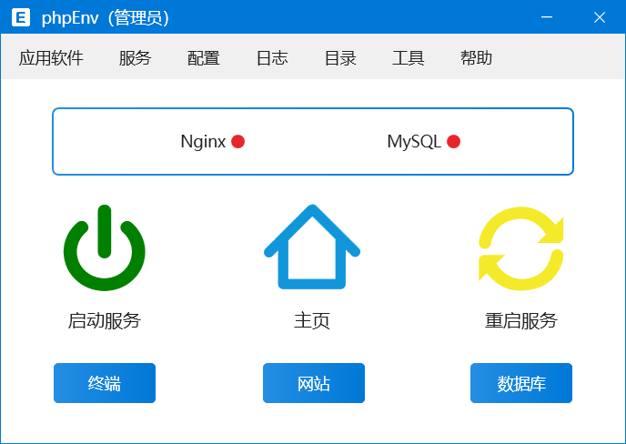
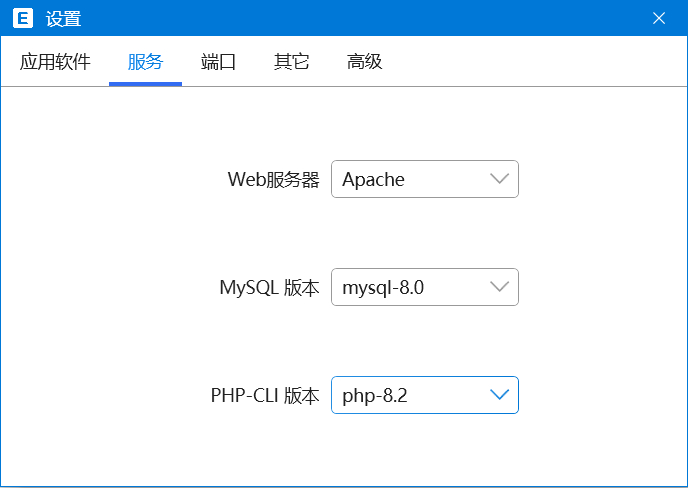
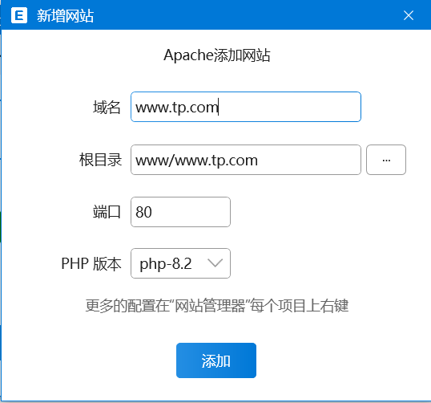
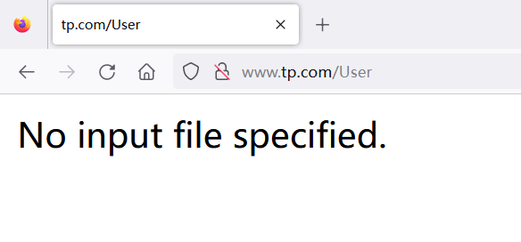
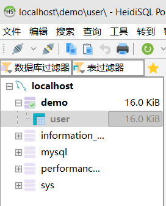
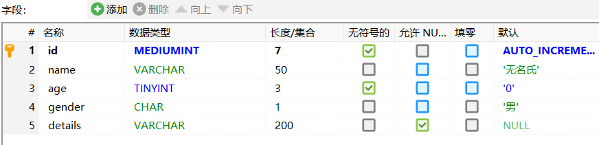
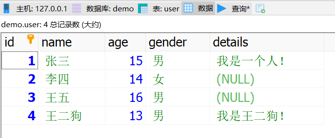
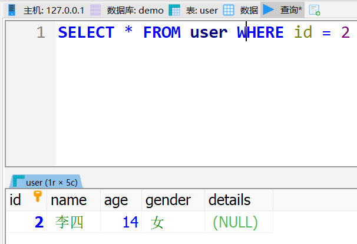
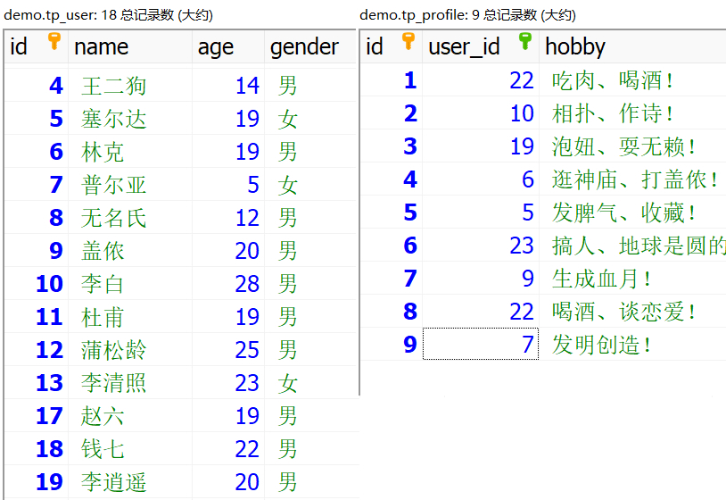
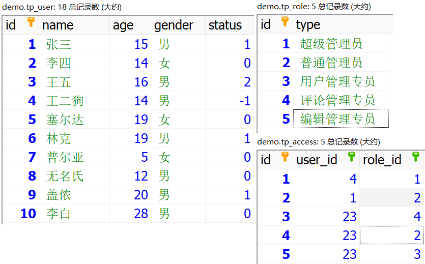

# 01. phpEnv配置安装

<div style="text-align:right;color:#666;font-size:20px;">主讲老师 - 李炎恢</div>


### 1. 学习基础

- ThinkPHP8.x：
  - 前端基础：HTML5/CSS（必须）、JavaScript（可选、但推荐有）；
  - 后端基础：PHP基础，版本不限，但不能太老，至少PHP5.4以上语法，TP8是兼容PHP8.x的；
  - 数据库基础：MySQL数据库，掌握了常规的SQL语句。
  - 编码思维基础：MVC、MVVM、设计模式（单例、观察者等）有简单认知即可；


### 2. 软件获取

- phpEnv：
- 官方网站：https://www.phpenv.cn/ （专业优雅强大的PHP集成环境）；
  
  - 下载最新版本，自动安装后（默认C盘，可选），界面如下：
  
    


- 简单配置：
  - 应用软件->设置->开启CDN加速（方便我们后续安装各种软件）；
  
  - 安装 PHP8.2 和 MySQL8 ，选择 Apache （个人向，教学方便）；
  
  - 然后点击 启动服务 ，允许各种允许访问即可；
  
  - 在浏览器输入：localhost，即可访问PHP探针。
  
    


- 创建站点：
  - 点击 主页 下 网站，添加一个虚拟网站，以便后续学习测试；

  - 可以选择自定义的目录，我教学方便，就默认了；

  - 添加后，会写入hosts，这样我们输入 www.tp.com 域名后就可以访问了；

  - 默认会给你一个index.php，显示结果为：php8.2 info

    


# 02. ThinkPHP8.x配置安装

<div style="text-align:right;color:#666;font-size:20px;">主讲老师 - 李炎恢</div>


### 1. 8.x安装

- 主要特性：（来自手册）
  - 支持PHP8强类型、支持6.x无缝升级、语义化版本策略、升级PSR规范依赖版本；


- 安装方式：
  - 仅在windows教学，Linux或其它平台对照手册执行即可；
  - 键盘：win + R，输入cmd，输入composer，判断是否已经安装；
  - 如果没有安装composer，则：https://getcomposer.org/Composer-Setup.exe （来自手册）；
  - 切换至你项目的根目录，比如第一节课创建的 www.tp.com 文件夹的上一层 www；
  - 输入安装命令：composer create-project topthink/think www.tp.com；
  - 注意：被安装的文件夹必须是空的，先要删除里面的内容；
  - 各种超时，可以先修改成国内源，比如阿里：
  - composer config -g repo.packagist composer https://mirrors.aliyun.com/composer/
  - 查看是否成功：composer config -g -l 
  


### 2. 启动程序

- IDE载入

  - 开发工具任意，因为我们在浏览器测试即可，我这里选择了phpStorm，备选如下：
    - VS Code
    - sublime Text4
    - Zend Stduio
  - 载入项目后，在IDE的终端输入内置服务器命令：php think run，启动Web服务；
  - 访问方式为：www.tp.com:8000 ，默认端口8000，当然也有80端口，不过被占用了；
  - 此时，我们发现，phpEnv还没启动呢，怎么就可以访问了呢？
  - 官方手册 -> 命令行 -> 启动内置服务器，有讲，这是内置的Web服务器，其它服务没有；
    - 所以学习使用时，推荐开启着，比如数据库连接等服务还需要。

  

- 删除广告

  - ThinkPHP8.x目前非常的商业化，打开后，广告糊一脸，我们先把这个去掉。
  - 在app/controller/index.php中的index方法，自定义return结果即可。
  - 或者执行phpinfo()函数，来检测php版本。

  

- 配色问题
  - 我个人开发学习，都是用的深色背景，明亮代码，一般开发工具都是默认这个样式；
  - 也推荐学习者，也用这个默认或差不过的样式，用于保护眼睛和缓解视觉疲劳；
  - 但如果讲课，我一般采用的都是亮色背景，原因如下：
    - 场景切换：如果是深色，切换到亮色界面，对学习者那么一闪，暴击效果显著；
    - 专注力：深色的背景，更加容易让听课者昏睡，注意力不集中；
    - 上课时长：每节课10分钟上下，并不会太疲劳，自己长时间开发用深色；


# 03. 编码规范.目录.配置

<div style="text-align:right;color:#666;font-size:20px;">主讲老师 - 李炎恢</div>


### 1. 编码规范

- 完全版参考手册，这里说重点：
  - TP8遵循PSR-2命名规范、PSR-4自动加载规范；
  - 类名和文件名保持一致，驼峰式命名（首字母大写）如：Index，BaseController
  - 方法和函数名用驼峰式命名（首字母小写）如：index()，hello()
  - 数据表和字段用蛇式命名（两个单词中间下划线）如：think_name，user_name
  - 更多对照手册


### 2. 目录结构

- 对于初学者，一个个说是干啥的，没有意义，这里说重点：

  - app目录是应用目录，我们开发程序就在这个目录
  - config是配置目录，顾名思义，配置程序状态
  - public是公共目录，对外访问目录，运行程序默认执行此目录的index.php
  - 剩下的，后续学到一个，讲一个。

  

  


### 3. 配置定义

- 默认情况下，程序出错会显示：页面出错！请稍候再试~
- 这种情况，一般是应用部署好后，万一出错给用户看的；
- 如果我们自己在开发阶段，需要开启调试模式，来提示具体的错误信息：
  - 在根目录有一个文件：.example.env，改成 .env ，也就是去掉点前面；
  - 然后在配置信息的第一行：APP_DEBUG = true 即可，false则不开启。


- 调试模式开启后，可以发现右下角会出现trace调试工具小图标：
  - 包含了丰富的调试内容：具体自点查看。


# 04. URL访问模式

<div style="text-align:right;color:#666;font-size:20px;">主讲老师 - 李炎恢</div>


### 1. 单应用URL

```php
http://serverName/index.php/控制器/操作/参数/值…
```

- 注意：这里服务器启动是 php think run 的内置服务器，下节课会探讨外置服务器；

- 结构分析：
  
  - serverName就是我们的：www.tp.com:8000；
  
  - index.php 是入口文件，带上 / ；
  
  - 控制器是app\controller\Index.php中的 Index 这个名称，也就是类名；
  
  - 操作是类里面的方法名，比如：index（默认方法），hello（普通方法）；
  
  - 默认方法可以省略，会直接方法，其他普通方法需要键入方法名：
  
    - http://www.tp.com:8000/index.php/Index (默认执行index操作)
    - http://www.tp.com:8000/index.php/Index/index (完整路径)
    - http://www.tp.com:8000/index.php/Index/test (普通方法，必须完整路径)
  
  - 系统默认自带的hello方法，是针对后续路由课程的，在路由文件设置过导致无效；
  
  - 我们在config/app.php中将路由关闭："with_route"  => false,
  
    - http://www.tp.com:8000/index.php/Index/hello （执行默认参数值）
    - http://www.tp.com:8000/index.php/Index/hello/name/World（修改参数值）
  
  - 参数不够直观，尤其多参数的时候，也是支持传统方案的：
  
    - http://www.tp.com:8000/index.php/Index/hello?name=World （问号键值对）
  
    


### 2. 多应用URL

```php
http://serverName/index.php/应用/控制器/操作/参数/值…
```

- 如果开启多应用的话，URL比单应用多一个 应用 路径，其它一致；
- 由于我们教学，都在单应用上，暂时不刻意演示，如果后续有机会，放到最后；


# 05. 内.外置服务器

<div style="text-align:right;color:#666;font-size:20px;">主讲老师 - 李炎恢</div>


### 1. 启动内置

- 在手册命令行 -> 启动内置服务器，有 php think run 启动的服务器介绍；
- 启动后直接输入：127.0.0.1:8000 或 localhost:8000 或 www.tp.com:8000 访问；
- 停止内置服务器，在命令行使用 ctrl + c


### 2. 启动phpEnv

- 不管是本地的外置服务器集成环境phpEnv，还是以后要部署到远程服务器，都需要配置；
- 这里需要配置的重点就是伪静态，我们不启动内置服务器，只用外置访问试试；
- 注意：这里外置服务器，在第一课我们已经创建了 端口为 80 的 www.tp.com；
- 现在，直接访问试试？但出现了如下图的错误：


- 我们在 www.tp.com 目录下创建一个index.html或index.php索引文件，访问后：

  


### 3. 配置目录

- 在第一节课，我们创建的启动目录是 www.tp.com ，但目前知道这个目录下没有 index.php；
- 在手册的 基础 -> 目录结构 中 public 目录 解释为：WEB目录（对外访问目录）；
- 并规范到：在实际项目部署中，确保只将 public 对外访问；
- 所以，我们将phpEnv站点配置目录设置为：www.tp.com/pubic 即可；
- 至于http.conf、伪静态和.htaccess等配置信息，默认情况下支持都用，后续需要配置再说；


# 06. 控制器的定义

<div style="text-align:right;color:#666;font-size:20px;">主讲老师 - 李炎恢</div>


### 1. 定义方式

- 控制器：顾名思义MVC中的C，即逻辑控制定义；

- 默认在app\controller下编写对应的控制器类文件，如果想改默认目录：

  ```php
  // 访问控制器层名称
  "controller_layer"      => "controller",
  ```

  

- 类名和文件名大小写保持一致，并采用驼峰式（首字母大写）；

  ```php
  // app\controller\User.php
  namespace app\controller;
  
  class User
  {
      public function index()
      {
          return "用户";
      }
      
      public function login()
      {
          return "登录成功！";
      }
  }
  ```

  
  - User类创建两个方法 index(默认)和 login，访问 URL 如下：
  - http://www.tp.com:8000/Index.php/user/
  - http://www.tp.com:8000/Index.php/user/login


- 那么如果创建的是双字母组合，比如 class HelloWorld，访问 URL 如下：

- http://www.tp.com:8000/Index.php/helloworld

- http://www.tp.com:8000/Index.php/hello_world

  ```php
  namespace app\controller;
  
  class HelloWorld
  {
      public function index()
      {
          return "index";
      }
  }
  ```


### 2. URL重写

- URL重写可以省去 index.php 入口文件的键入，默认情况下内置服务器支持重写；

  http://www.tp.com:8000/User

  

- 而外置服务器，比如phpEnv，省略了入口文件，则出现如下问题：

  

- 查看手册，根据它URL重写的修改方案（Apache），需要修改.htaccess最后一行：

  ```php
  #RewriteRule ^(.*)$ index.php/$1 [QSA,PT,L]  Apache替换成下面一行
  RewriteRule ^(.*)$ index.php [L,E=PATH_INFO:$1]
  ```

  

- 备注：不同的环境、服务器等等都会有千奇百怪的问题，努力搜索解决即可；
- 如果实在解决不了，请就用 php think run 内置服务器就了，省事。
- 到时候部署到真实服务器环境，再折腾。。。


### 3. 配置渲染

- 如果你想避免引入同类名时的冲突，可以 config\route.php 设置控制器后缀：

  ```php
  // 是否使用控制器后缀
  // 此时，User.php 就必须改成 UserController.php，并类名也需要增加后缀
  "controller_suffix"  => true,
  ```


- ThinkPHP 直接采用方法内 return 返回的方式直接就输出了；

- 如果需要使用 json 输出，直接采用 json 函数；

  ```php
  // json输出，不同浏览器美化样式不同，我这里用的FireFox
  public function json()
  {
  	return json(["name" => "王二狗", "age" => 25, "gender" => "男"]);
  }
  ```

  

- 不推荐使用 die、exit 等 PHP 方法中断代码执行，推荐助手函数 halt()；

  ```php
  halt("中断测试");
  ```

  


# 07. 基础和空控制器

<div style="text-align:right;color:#666;font-size:20px;">主讲老师 - 李炎恢</div>


### 1. 基础控制器

- 一般来说，创建控制器后，推荐继承基础控制器来获得更多的功能方法；

- 基础控制器仅仅提供了控制器验证功能，并注入了think\App和think\Request；

- 这两个对象后面会有章节详细讲解，下面我们继承并简单使用一下；

  ```php
  namespace app\controller;
  use app\BaseController;
  
  class User extends BaseController
  {
      public function index()
      {
          // 返回实际路径
          return $this->app->getBasePath();
          // 返回当前方法名
          return $this->request->action();
      }
  }
  ```


### 2. 空控制器

- 空控制器一般用于载入不存在的控制器时，进行错误提示；

  ```php
  class Error
  {
      public function __call(string $name, array $arguments)
      {
          return "当前控制器不存在！";
      }
  }
  ```

  


# 08. 创建数据表及填充

<div style="text-align:right;color:#666;font-size:20px;">主讲老师 - 李炎恢</div>


### 1. 创建数据表

- 我们直接使用phpEnv自带的MySQL操作软件：HeidiSQL，简称HS；

- 登录的时候，注意修改root和密码后，保存，下次方可直接打开；

- 首先，我们创建一个数据库：demo，用于测试：

  


### 2. 创建用户表

- 设置好数据库后，我们创建一个user表，包含id、name、age、gender、details等字段；

  


- 然后，我们填充一些数据，方便查询测试：

  


- 最后，我们通过SQL语句来测试一下：

  


# 09. 连接数据库和查询

<div style="text-align:right;color:#666;font-size:20px;">主讲老师 - 李炎恢</div>


### 1. 连接数据库

- 我们可以在 **config\database.php** 配置文件中设置与数据库的连接信息：

  - 如果是一般性数据库连接，在 **‘’connections‘’** 配置区设置即可；

  - 如果是本地测试，它会优先读取 **.env** 配置，然后再读取 **database.php** 的配置；

    ```
    # .env文件，部署服务器，请禁用我
    APP_DEBUG = true
    
    DB_TYPE = mysql
    DB_HOST = 127.0.0.1
    DB_NAME = demo
    DB_USER = root
    DB_PASS = 123456
    DB_PORT = 3306
    DB_CHARSET = utf8
    
    DEFAULT_LANG = zh-cn
    ```

    

  - 如果禁用了 .env 配置，则会读取数据库连接的默认配置：

    ```php
    // 数据库连接配置信息
    "connections"     => [
        "mysql" => [
            // 数据库类型
            "type"            => env("DB_TYPE", "mysql"),
            // 服务器地址
            "hostname"        => env("DB_HOST", "127.0.0.1"),
            // 数据库名
            "database"        => env("DB_NAME", "demo"),
            // 用户名
            "username"        => env("DB_USER", "root"),
            // 密码
            "password"        => env("DB_PASS", "123456"),
            // 端口
            "hostport"        => env("DB_PORT", "3306"),
    ```

    

  


### 2. PHP获取数据

- 我们暂时没有详细学习此类语法，可以简单用一些了解一下即可：

  ```php
  // 引入Db数据库类
  use think\facade\Db;
  
  class User extends BaseController
  {
      public function get()
      {
          // 连接user表，查询
          $user = Db::table("user")->select();
          // 输出数据
          return json($user);
      }
  }
  ```

  


# 10. 构造器之数据查询

<div style="text-align:right;color:#666;font-size:20px;">主讲老师 - 李炎恢</div>


### 1. table方法

- Db类旗下有一个 **table** 静态调用的方法，参数为完整的表名（前缀都不能省略）；

- 如果希望只查询一条数据，可以使用 **find()** 方法，需指定 **where** 条件：

  ```php
  // 通过ID查询指定的数据
  // find 方法查询结果不存在，返回 null，否则返回结果数组
  $user = Db::table("user")->where("id", 1)->find();
  ```
  


- 想要了解执行的原生SQL是什么，可以注释掉 return 直接通过 trace 查看；

- 使用 **findOrEmpty()** 方法也可以查询一条数据，但在没有数据时返回一个空数组：

  ```php
  // 没有数据返回空数组
  $user = Db::table("user")->where("id", 11)->findOrEmpty();
  ```


- 使用 **findOrFail()** 方法同样可以查询一条数据，在没有数据时抛出一个异常：

  ```php
  // 没有数据抛出异常
  $user = Db::table("user")->where("id", 11)->findOrFail();
  ```

  

- 想要获取多列数据，可以使用 **select()** 方法：

  ```php
  // 查询所有数据
  $user = Db::table("user")->select();
  ```

  

- **select()** 方法默认返回 **Collection** 对象的数据集，可以通过 **toArray()** 方法转换成数组：

  ```php
  // 用中断函数，来检测返回值
  $user = Db::table("user")->select();
  halt($user);
  
  // 转换成数组
  $user = Db::table("user")->select()->toArray();
  halt($user);
  ```


- 多列数据也可以参与 where() 方法的筛选：

  ```php
  // 多列筛选
  $user = Db::table("user")->where("age", 14)->select();
  ```

  


### 2. 链式查询

- 我们发现通过指向符号 “->” 多次连续调用方法称为：链式查询；
- 当 Db::table("user") 时，返回查询对象（Query），即可连缀数据库对应的方法；
- 当返回查询对象（Query）时，就可以继续调用链式方法，where() 也是链式方法；
- 而 where() 被调用后，依旧返回（Query），可以再次链式调用；
- 在手册 **数据库 -> 查询构造器 -> 链式操作** 可以了解所有可链式的方法：table、where等；
- 直到遇到 find() 或 select() 返回数组或数据集时，结束查询；


# 11. 表前缀之扩展查询

<div style="text-align:right;color:#666;font-size:20px;">主讲老师 - 李炎恢</div>


### 1. 表前缀

- 一般来说，为了保持表名统一性和防止冲突，都会给表加上一个前缀，以下划线结束；

  - 比如：**tp_user**，这里的 **tp_** 就是表前缀，所有；

  - 我们修改MySQL中表名，然后刷新程序，报错；

  - 当然，你可以传递 **Db::table("tp_user")**，但没必要；

    

- 首先，我们可以来配置统一前缀：

  - 在 .env 文件中 添加：DB_PREFIX = tp_

  - 如果部署环境 database.php 中 设置

    ```php
    "prefix" => env("DB_PREFIX", "tp_"),
    ```

    

- 然后，使用 **Db::name("user")** 方法即可：

  ```php
  // 此时，tp_ 表名的前缀可以省略
  $user = Db::name("user")->select();
  ```

  


### 2. 扩展查询

- 通过 **value()** 方法，可以查询指定字段的值（单个），没有数据返回 **null** ；

  ```php
  // value() 方法查询单个列值
  $user = Db::name("user")->where("id", 3)->value("name");
  ```


- 通过 **colunm()** 方法，可以查询指定列的值（多个），没有数据返回空数组；

  ```php
  // colunm() 方法查询多个列值
  $user = Db::name("user")->column("name");
  // 通过id 作为索引
$user = Db::name("user")->column("name,age", "id");
  ```
  
  

- 当大量数据需要 **批处理** 时，比如给所有用户更新数据，就不能一次性全取出来，一批一批的来；

  ```php
  // 批量处理
  Db::name("user")->chunk(2, function ($users) {
      foreach ($users as $user) {
          dump($user);
      }
      echo 1;
  });
  
  // 通过获取最后的SQL语句，发现用的是LIMIT 2
  return Db::getLastSql();
  ```

  

- 另一种处理大量数据：**游标查询**，为了解决内存开销，每次读取一行，并返回到下一行再读取；

  ```php
  // 批量处理2
  $users = Db::name("user")->cursor();
  // PHP生成器
  // halt($user);
  foreach ($users as $user) {
      dump($user);
  }
  ```

  


# 12. 数据的新增方式

<div style="text-align:right;color:#666;font-size:20px;">主讲老师 - 李炎恢</div>


### 1. 单条新增

- 使用 **insert()** 方法可以向数据表添加一条数据，更多的字段采用默认；

  ```php
  // 数据
  $data = [
      "name"    => "张麻子",
      "age"     => 28,
      "gender"  => "男",
      "details" => "我脸上没有麻子！"
  ];
  
  // 单条新增，成功返回1
  return Db::name("user")->insert($data);
  ```

  

- 如果想强行新增抛弃不存在的字段数据，则使用 **strick(false)** 方法，忽略异常；

  ```php
  // 数据
  $data = [
      "name"    => "马邦德",
      "age"     => 30,
      "gender"  => "男",
      "deta" => "我脸上没有麻子！"
  ];
  
  // 单条新增，成功返回1
  return Db::name("user")->strict(false)->insert($data);
  ```

  

- 如果我们采用的数据库是 mysql，可以支持 **replace** 写入；

- insert 和 replace insert 写入的区别，前者表示表中存在主键相同则报错，后者则修改；

  ```php
  // 新增数据时，主键冲突时，直接修改这条记录
  Db::name("user")->replace()->insert($data);
  ```

  

- 使用 **insertGetId()** 方法，可以在新增成功后返回当前数据 ID；

  ```php
  // 返回自增ID
  return Db::name("user")->replace()->insertGetId($data);
  ```

  


### 2. 多条新增

- 使用 **insertAll()** 方法，可以批量新增数据，但要保持数组结构一致；

  ```php
  // 数据
  $data = [[
      "name"    => "林克",
      "age"     => 19,
      "gender"  => "男",
      "details" => "先收集999个呀哈哈！"
  ],[
      "name"    => "普尔亚",
      "age"     => 100,
      "gender"  => "女",
      "details" => "我先来个返老还童，再快速长大！"
  ]];
  
  return Db::name("user")->insertAll($data);
  ```

  

- **insertAll()** 方法 也支持 replace 写入，如果添加数据量大，可以通过 **-> limit()** 方法限制添加数量；

  ```php
  Db::name("user")->replace()->limit(100)->insertAll($data);
  ```

  


# 13. 更新删除和save方法

<div style="text-align:right;color:#666;font-size:20px;">主讲老师 - 李炎恢</div>


### 1. 数据修改

- 使用 **update()** 方法来修改数据，修改成功返回影响行数，没有修改返回 **0**；

  ```php
  // 修改的数据
  $data = [
      "name" => "王三狗",
      "age"  => "13",
  ];
  
  // 执行修改并返回
  return Db::name("user")->where("id", 4)->update($data);
  ```


- 如果修改数据包含了主键信息，比如 id，那么可以省略掉 where 条件；

  ```php
  // 修改的数据
  $data = [
      "id"   => 4,
      "name" => "王三狗",
      "age"  => "13",
  ];
  
  // 执行修改并返回
  return Db::name("user")->update($data);
  ```

  

- 如果想让一些字段修改时执行 SQL 函数操作，可以使用 **exp()** 方法实现；

  ```php
  // 让details字段内的英文大写
  return Db::name("user")->exp("details", "UPPER(details)")->update($data);
  ```

  

- 如果要自增/自减某个字段，可以使用 inc/dec 方法，并支持自定义步长；

  ```php
  // 修改时，让age自增和自减，默认1，要去掉$data里面age字段的修改，不然冲突
  return Db::name("user")->inc("age")->dec("age", 2)->update($data);
  
  // 派生自字段，延迟执行，毫秒
  setInc("age", 1, 600)
  setDec("age", 2, 600)
  ```

  

- 使用 **Db::raw()** 来设置每个字段的特殊需求，灵活且清晰：

  ```php
  // 使用Db::raw 更加清晰灵活
  Db::name("user")->where("id", 4)->update([
      "details"   =>  Db::raw("UPPER(details)"),
      "age"       =>  Db::raw("age-2")
  ]);
  return Db::getLastSql();
  ```

  

- **save()** 方法是一个通用方法，可以自行判断是新增还是修改(更新)数据；

  ```php
  // 包含主键，即修改；否则，新增
  return Db::name("user")->save($data);
  ```

  


### 2. 数据删除

- 极简删除可以根据主键直接删除，删除成功返回影响行数，否则 0；

  ```php
  // 根据主键删除
  Db::name("user")->delete(8);
  ```

  

- 根据主键，还可以删除多条记录；

  ```php
  // 根据主键删除多条
  Db::name("user")->delete([48,49,50]);
  ```

  

- 正常情况下，通过 where()方法来删除；

  ```php
  // 条件删除
  Db::name("user")->where("id", 47)->delete();
  ```

  

- 清空表以及逻辑软删除，参考手册即可；逻辑软删除，在模型篇单独讲解，这里略过。


# 14. 查询表达式规则

<div style="text-align:right;color:#666;font-size:20px;">主讲老师 - 李炎恢</div>


### 1. **表达式查询**

- 查询表达式支持大部分常用的 SQL 语句，语法格式如下：

  ```php
  where("字段名","查询表达式","查询条件");
  ```

  

- 所有的表达式，查阅手册 -> 查询表达式 中的表格即可；这里列出几个意思一下：

  |   表达式   |       含义       | 快捷方式  |
  | :--------: | :--------------: | :-------: |
  |     =      |       等于       |           |
  |  <= time   | 小于等于某个时间 | whereTime |
  |    EXP     |  SQL表达式查询   | whereExp  |
  | [NOT] LIKE |     模糊查询     | whereLike |
  |  [NOT] IN  |   [非] IN 查询   |  whereIN  |


### 2. **查询示例**

- 条件判断类的，id大于4的；

  ```php
  // 查询id大于4的数据
  $user = Db::name("user")->where("id", ">", 4)->select();
  return json($user);
  ```

  

- Like模糊查询，姓王的；

  ```php
  // 查询姓王的用户
  $user = Db::name("user")->where("name", "like", "王%")->select();
  // like快捷方式
$user = Db::name("user")->whereLike("name", "王%")->select();
  ```
  
  

- IN区间查询，根据id；

  ```php
  // 区间查询，支持not in
  $user = Db::name("user")->where("id", "in", "1, 3, 5")->select();
  // 语义更好一点
  $user = Db::name("user")->where("id", "in", [1,3,5])->select();
  // IN快捷查询，两种均可，支持whereNotIn
  $user = Db::name("user")->whereIn("id", [1, 2, 3])->select();
  
  // Between，和IN一样 支持 not between
  $user = Db::name("user")->where("id", "between", [2,5])->select();
  // 快捷方式和IN一样：whereBetween和whereNotBetween
  ```

  

- NULL查询；

  ```php
  // NULL,  null 或 not null：
  $user = Db::name("user")->where("details", "not null")->select();
  // 快捷方式：whereNull和whereNotNull
  ```


- EXP查询，自定义SQL片段；

  ```php
  // EXP查询，自定义SQL
  $user = Db::name("user")->where("id", "EXP", "<> 8 and id >5")->select();
  // 快捷查询
  $user = Db::name("user")->whereExp("id","<> 8 and id >5")->select();
  ```

  

- 这里推荐：有快捷方式的用快捷方式，通过Ctrl+方法名得知，快捷方式绕过了很多拼装流程，速度更快；


# 15. 超多查询都不讲

<div style="text-align:right;color:#666;font-size:20px;">主讲老师 - 李炎恢</div>


- 警告：这里罗列了大量的快捷查询的示例、链式查询以及其它非常用的查询方法；
- 介于TP6课程大家的反馈，我这里不再详细讲解每个方法的用法；
- 但我会录入在讲义里，方便后续项目课程时候回头查阅；后续类似的知识点也这么砍；


### 1. 字符串条件(不讲)

- **whereRaw** 可以直接写入多条件：

  ```php
  // 多条件字符串
  $user = Db::name("user")->whereRaw("age > 15 AND gender="女"")->select();
  ```

  

- 包含变量的多条件查询：

  ```php
  // 变量
  $age = 15;
  $gender = "女";
  
  // 预处理机制
  $user = Db::name("user")->whereRaw("age>:age AND gender=:gender", [
      "age"       => $age,
      "gender"    => $gender
  ])->select();
  ```

  


### 2. field()字段筛选(不讲)

- 使用 **field()** 方法，可以指定要查询的字段；

  ```php
  // 字段筛选
  $user = Db::name("user")->field("id, age, gender")->select();
  $user = Db::name("user")->field(["id, age, gender"])->select();
  ```


- 使用 **field()** 方法，给指定的字段设置别名；

  ```php
  // 字段别名
  $user = Db::name("user")->field("id, gender as sex")->select();
  $user = Db::name("user")->field(["id", "gender"=>"sex"])->select();
  ```

  

- 在 **fieldRaw()** 方法里，可以直接给字段设置 MySQL 函数；

  ```php
  // 直接SQL函数
  $user = Db::name("user")->fieldRaw("id, UPPER(details)")->select();
  $user = Db::name("user")->field(true)->select();   // 推荐
  return Db::getLastSql();
  ```

  

- 使用 **withoutField()** 方法中字段排除，可以屏蔽掉想要不显示的字段；

  ```php
  // 排除字段
  $user = Db::name("user")->withoutField("details")->select();
  ```

  

- 使用 **field()** 方法在新增时，验证字段的合法性；

  ```php
  // 排除新增字段
  Db::name("user")->field("name,age,gender")->insert($data);
  ```


### 3. **常用链式方法**(不讲)

- 使用 **alias()** 方法，给数据库起一个别名；

  ```php
  // 给数据库起个别名
  Db::name("user")->alias("a")->select();
  return Db::getLastSql();
  
  // 起别名最主要是和另一张表进行关联，这里看手册好了，没表测试
  alias("a")->join()
  ```

  

- 使用 **limit()** 方法，限制获取输出数据的个数；

  ```php
  // 显示前5条
  $user = Db::name("user")->limit(5)->select();
  ```

  

- 分页模式，即传递两个参数，比如从第 3 条开始显示 5 条 limit(2,5)；

  ```php
  // 从第2个位置，也就是第3条开始，显示5条
  $user = Db::name("user")->limit(2,5)->select();
  // 查询第一页数据，1至10条
  $user = Db::name("user")->page(1,10)->select(); 
  ```

  

- 使用 **order()** 方法，可以指定排序方式，没有指定第二参数，默认 asc；

  ```php
  // 按id倒序排列
  $user = Db::name("user")->order("id", "desc")->select();
  ```

  

- 支持数组的方式，对多个字段进行排序；

  ```php
  // 按多个字段规则排序
  $user = Db::name("user")->order(["age"=>"asc", "id"=>"desc"])->select();
  //支持 orderRaw() 方法，可以传入SQL函数，和前面各类Raw一样，不再赘述
  ```

  

- 使用 **group()** 方法，给性别不同的人进行 age 字段的总和统计；

  ```php
  // 统计性别的年龄总和
  $user = Db::name("user")->fieldRaw("gender, SUM(age)")
                          ->group("gender")->select();
  ```

  

- 使用 **group()** 分组之后，再使用 **having()** 进行筛选；

  ```php
  // 统计性别的年龄总和，筛选大于100的
  $user = Db::name("user")->fieldRaw("gender, SUM(age)")
                          ->group("gender")
                          ->having("SUM(age) > 100")->select();
  ```

  


### 4. **时间查询**(不讲)

- 可以使用 >、<、>=、<= 来筛选匹配时间的数据；

  ```php
  // 传统时间筛选
  $user = Db::name("user")->where("create_time", ">", "2022-1-1")->select();
  $user = Db::name("user")->where("create_time", "between", ["2020-1-1", "2023-1-1"])->select(); 
  ```

  

- 快捷方式 **whereTime**：

  ```php
  // 使用快捷方式查询
  $user = Db::name("user")->whereTime("create_time", ">=", "2022-1-1")->select();
  
  // 默认是 > 可以省略
  $user = Db::name("user")->whereTime("create_time", "2022-1-1")->select();
  ```

  

- 区间查询快捷方式 **whereBetweenTime**：

  ```php
  // 区间查询，包含 whereNotBetweenTime
  $user = Db::name("user")->whereBetweenTime("create_time", "2020-1-1", "2023-1-1")->select();
  ```

  

- 使用 **whereYear** 查询今年的数据、去年的数据和某一年的数据；

  ```php
  // 查询今年
  $user = Db::name("user")->whereYear("create_time")->select();
  // 查询去年
  $user = Db::name("user")->whereYear("create_time", "last year")->select();
  // 查询某一年
  $user = Db::name("user")->whereYear("create_time", "2019")->select();
  ```

  

- 使用 **whereMonth** 查询当月的数据、上月的数据和某一个月的数据；

  ```php
  Db::name("user")->whereMonth("create_time")->select();
  Db::name("user")->whereMonth("create_time", "last month")->select();
  Db::name("user")->whereMonth("create_time", "2020-6")->select();
  ```

  

- 使用 **whereDay** 查询今天的数据、昨天的数据和某一个天的数据；

  ```php
  Db::name("user")->whereDay("create_time")->select();
  Db::name("user")->whereDay("create_time", "last day")->select();
  Db::name("user")->whereDay("create_time", "2020-6-27")->select();
  ```


- 查询指定时间的数据，比如两小时内的；

  ```php
  // 两小时内的
  $user = Db::name("user")->whereTime("create_time", "-2 hours")->select();
  ```

  

- 查询两个时间字段时间有效期的数据，比如活动开始到结束的期间；

- 比如创建两个字段：start_time，end_time，注册后，分别写入对应时间表明它的有效期；

  ```php
  // 直接这么写，不太好理解，看手册的另一种普通写法很容易理解
  // 实战中，字段丰富的时候再演示
  $user = Db::name("user")->whereBetweenTimeField("start_time", "end_time")->select();
  ```


### 5. **聚合查询**(不讲)

- 使用 **count()** 方法，可以求出所查询数据的数量；

  ```php
  // 获取记录数
  $user = Db::name("user")->count();
  ```

  

- **count()** 可设置指定 id，比如有空值(Null)的 details，不会计算数量；

  ```php
  // 值NULL不计数
  $user = Db::name("user")->count("details");
  ```

  

- 使用 **max()** 方法，求出所查询数据字段的最大值；

  ```php
  // 求最大年龄
  $user = Db::name("user")->max("age");
  ```

  

- 如果 **max()** 方法，求出的值不是数值，则通过第二参数强制转换；

  ```php
  // 如果最大值不是数值，false关闭强制转换
  $user = Db::name("user")->max("name", false);
  ```


- 使用 **min()** 方法，求出所查询数据字段的最小值，也可以强制转换；

  ```php
  // 求最小值
  $user = Db::name("user")->min("age");
  ```

  

- 使用 **avg()** 方法，求出所查询数据字段的平均值；

  ```php
  // 求平均值
  $user = Db::name("user")->avg("age");
  ```

  

- 使用 **sum()** 方法，求出所查询数据字段的总和；

  ```php
  // 求总和
  $user = Db::name("user")->sum("age");
  ```

  


### 6. **子查询**(不讲)

- 使用 **fetchSql()** 方法，传递参数true时，可以设置不执行 SQL，直接返回SQL语句；

  ```php
  // 子查询语句
  $user = Db::name("user")->fetchSql(true)->select();
  ```

  

- 使用 **buildSql()** 方法，也是返回 SQL 语句，不需要再执行 select()，且有括号；

  ```php
  // 第二种子查询
  $subQuery = Db::name("user")->buildSql(true);
  ```

  

- 结合以上方法，我们实现一个子查询；

  ```php
  // 子查询样式
  $subQuery = Db::name("user")->field("id")->where("age",">", 18)->buildSql();
  $user = Db::name("user")->whereExp("id", "IN ".$subQuery)->select();
  ```


- 使用闭包的方式执行子查询；

  ```php
  // 采用闭包构建子查询
  $user = Db::name("user")->where("id", "IN", function ($query) {
      $query->name("user")->field("id")->where("age",">", 18);
  })->select();
  ```
  
  


### 7. **原生查询**

- 使用 **query()** 方法，进行原生 SQL 查询，适用于读取操作，SQL 错误返回 false；

  ```php
  // 原生SQL
  $user = Db::query("SELECT * FROM tp_user");
  ```

  

- 使用 **execute** 方法，进行原生 SQL 更新写入等，SQL 错误返回 false；

  ```php
  // 原生更新写入
  $user = Db::execute("update tp_user set details="快快快来救我！" where id=5");
  ```

  


### 8. **列字段快捷查询**(不讲)

- 之前用过诸如：whereIn、whereExp、whereLike等等快捷查询；
- 所有快捷查询列表的手册位置：数据库 -> 查询构造器 -> 高级查询中，找到快捷查询表格；


- **whereColumn()** 方法，比较两个字段的值，符合的就筛选出来；

  ```php
  // 字段比较，id大于age
  $user = Db::name("user")->whereColumn("id", ">", "age")->select();
  
  // 如果是 等于判断 可以简化
  ->whereColumn("id", "age")
  ```

  

- **whereFieldName()** 方法，查询某个字段的值，注意 FileName 是字段名；

  ```php
  // 获取所有性别为：男
  $user = Db::name("user")->whereGender("男")->select();
  
  // 获取名字叫王二狗的信息
  $user = Db::name("user")->whereName("王二狗")->find();
  ```

  

- **getByFieldName()** 方法，查询某个字段的值，注意只能查询一条，不需要 **find()**；

  ```php
  // 单条数据
  $user = Db::name("user")->getByName("王二狗");
  ```

  

- **getFieldByFieldName()** 方法，通过查询得到某个指定字段的单一值；

  ```php
  // 查询单条并返回单列，找出王二狗的年龄
  $user = Db::name("user")->getFieldByName("王二狗", "age");
  ```


### 9. **条件查询**(不讲)

- **when()** 可以通过条件判断，执行闭包里的分支查询；

  ```php
  // 条件判断
  $user = Db::name("user")->when(false, function ($query) {
      // 满足条件执行这段SQL
      $query->where("id", ">", 5);
  }, function ($query) {
      // 不满足条件执行这段SQL
      $query->where("id", "<=", 5);
  })->select();
  ```


### 10. 事务(不讲)

- 数据库的表引擎需要是 InnoDB 才可以使用，如果不是调整即可；

- 事务处理，需要执行多个 SQL 查询，数据是关联恒定的；

- 如果成功一条查询，改变了数据，而后一条失败，则前面的数据回滚；

- 比如：银行取钱，银行ATM扣了1000，但入口被卡住，你没拿到，这时需要事务处理；

- 系统提供了两种事务处理的方式，第一种是自动处理，出错自动回滚；

  ```php
  // 出现异常回滚
  Db::transaction(function () {
      Db::name("user")->delete(12);
      Db::name("user")->findOrFail(13);
  });
  ```

  

- 手动处理，基本和原生处理类似，可以自行输出错误信息；

  ```php
  // 启动事务
  Db::startTrans();
  try {
      Db::name("user")->delete(12);
      Db::name("user")->findOrFail(13);
      //提交事务
      Db::commit();
  } catch (\Exception $e) {
      echo "执行SQL失败！";
      // 回滚
      Db::rollback();
  }
  ```

  


### 11. 获取器(不讲)

- 获取器的意思就是：将数据的字段进行转换处理再进行操作；

- 比如在获取数据列表的时候，将获取到的详情字段全部大写；

  ```php
  // 获取器改变字段值
  $user = Db::name("user")->withAttr("details", function ($value, $data) {
      // NULL 不处理
      if ($value != null) {
          return strtoupper($value);
      }
  })->select();
  ```

  

- withAttr也是支持JSON字段的，具体参考手册 查询构造器 -> 获取器；


# 16. 关联索引查询

<div style="text-align:right;color:#666;font-size:20px;">主讲老师 - 李炎恢</div>


### 1. **索引关联**

- **where** 方法的数组查询：

  ```php
  // 性别男，年龄大于15岁，常规做法
  $user = Db::name("user")->where("age", ">", 15)
                          ->where("gender", "男")->select();
  
  // 索引数组方式，二维数组，返回的SQL 是一条 AND 并列关系
  $user = Db::name("user")->where([
      ["age", ">", "15"],
      ["gender","=", "男"]
  ])->select();
  
  // 如果是等于，可以直接用关联数组，一维
  $user = Db::name("user")->where([
      "age"     =>  15,
      "gender"  =>  "男"
  ])->select();
  
  // 两种模式结合起来，
  $user = Db::name("user")->where([
      ["age", ">", "15"],
      "gender"  =>  "男"
  ])->select();
  
  // 搜索条件独立管理，这里=号写全
  $map[] = ["age", ">", "15"];
  $map[] = ["gender","=", "男"];
  
  $user = Db::name("user")->where($map)->select();
  ```


# 17. 拼装高级查询

<div style="text-align:right;color:#666;font-size:20px;">主讲老师 - 李炎恢</div>


### 1. **拼装查询**

- 使用 **|(OR)** 或 **&(AND)** 来实现 where 条件的高级查询，where 支持多个连缀；

  ```php
  // or和and 拼装查询
  $user = Db::name("user")->where("name|details", "like", "%王%")
  						->where("id&create_time", ">", 0)
      					->select();
  
  // 拼装返回的SQL
  SELECT * FROM `tp_user` WHERE ( `name` LIKE "%王%" OR `details` LIKE "%王%" ) AND ( `id` > 0 AND `create_time` > "0" )
  ```

  

- 索引数组方式，可以在 where 进行多个字段进行查询；

  ```php
  // 索引数组拼装
  $user = Db::name("user")->where([
      ["id", ">", "5"],
      ["gender", "=", "女"],
      ["age", "<=", 15],
      ["details", "like", "%我%"]
  ])->select();
  
  // 拼装返回的SQL
  SELECT * FROM `tp_user` WHERE `id` > 5 AND `gender` = "女" AND `age` <= 15 AND `details` LIKE "%我%"
  ```


- 根据之前的课程中，条件字符串复杂组装，比如使用 exp 了，就使用 **raw()** 方法；

  ```php
  // exp 拼装
  $user = Db::name("user")->where([
      ["gender", "=", "男"],
      ["age", "exp", Db::raw(">=10 AND id<5")]
  ])->select();
  
  // 拼装返回的SQL
  SELECT * FROM `tp_user` WHERE `gender` = "男" AND ( `age` >=10 AND id<5 )
  ```

  

- 如果有多个where，并需要控制优先级，那么在可以在需要的部分加上中括号；

  ```php
  // 下面的代码无法控制优先级
  $user = Db::name("user")->where([
      ["gender", "=", "男"],
      ["age", "exp", Db::raw(">=10 AND id<5")]
  ])->where("details", "like", "%我%")->select();
  
  // 外加一个中括号
  ->where([[
      ...
  ]])
      
  // 拼装返回的SQL
  SELECT * FROM `tp_user` WHERE ( `gender` = "男" AND ( `age` >=10 AND id<5 ) ) AND `details` LIKE "%我%"
      
  // 推荐用变量代替
  $map =[
      ["gender", "=", "男"],
      ["age", "exp", Db::raw(">=10 AND id<5")]
  ];
  ->where([$map])
  ```

  

- 如果，条件中有多次出现一个字段，并且需要 OR 来左右筛选，可以用 **whereOr**；

  ```php
  // 多条件重复字段 OR 选项
  $map1 = [
      ["name", "like", "%王%"],
      ["details", "=", null]
  ];
  $map2 = [
      ["gender", "=", "女"],
      ["details", "exp", Db::raw("IS NOT NULL")]
  ];
  
  $user = Db::name("user")->whereOr([$map1, $map2])->select();
  
  // 拼装返回的SQL
  SELECT * FROM `tp_user` WHERE ( `name` LIKE "%王%" AND `details` IS NULL ) OR ( `gender` = "女" AND ( `details` IS NOT NULL ) )
  ```


# 18. **模型的定义方式**

<div style="text-align:right;color:#666;font-size:20px;">主讲老师 - 李炎恢</div>


### 1. **定义模型**

- 为了避免被前面课程中控制器的类名干扰，删除或改名都行：

  ```php
  // UserBak.php，目前不存在任何地方的User.php了
  class UserBak extends BaseController
  ```

  

- 定义一个和数据库表相匹配的模型，可在app应用目录下创建model文件夹；

  ```php
  namespace app\model;
  use think\Model;
  
  class User extends Model
  {
      
  }
  ```

  

- 模型会自动对应数据表，并且有一套自己的命名规则；

- 模型类需要去除表前缀(tp_)，采用驼峰式命名，并且首字母大写；

  ```php
  tp_user(表名) => User
  tp_user_type(表名) => UserType
  ```


- 在控制器段创建一个任意名称的类，当然有语义更好，但为了教学理解起名为：TestUser.php；

  ```php
  namespace app\controller;
  use app\model\User;

  // 注意：类名不限制
  class TestUser
  {
      public function index()
      {
          return json(User::select());
      }
  }
  ```
  


### 2. **模型设置**

- 系统会自动识别 **模型类名** 对应 **表名**，User.php  对应 user 表（不含前缀）；

- 但如果你的模型类名不是按照规则对应表名，则需要通过成员字段去设置；

  ```php
  class Abc extends Model
  {
      // 设置表名
      protected $name = "user";
  }
  
  // 使用$table时，指定表时需要完整的表名：tp_user
  ```


- 系统也会默认id为你的主键名，如果不是id，则需要设置；

  ```php
  // 设置主键
  protected $pk = "uid";
  ```

  

- 模型支持初始化功能，需要设置静态方法，并只在第一次实例化的时候执行，且只执行一次；

  ```php
  protected static function init()
  {
  	echo "初始化";
  }
  ```

  


# 19. **模型的新增和删除**

<div style="text-align:right;color:#666;font-size:20px;">主讲老师 - 李炎恢</div>


### 1. **新增操作**

- 用模型新增数据，首先要实例化模型，开发工具会补全use，非集成工具别忘了；

  ```php
  use app\model\User;
  
  // 手册new User，这里括号是工具补全的，都可以
  $user = new User();
  ```

  

- 使用实例化的方式添加一条数据，并使用 **save()** 方法进行保存；

- 注意：使用模型时，会自动给时间字段 **create_time**，**update_time** 写入当前时间；

  ```php
  $user = new User();
  $user->name = "李白";
$user->age = 28;
  $user->gender = "男";
  $user->details = "床前明月光，好诗！";
  
  // 成功返回true，失败抛异常，其它看手册
  $user->save();
  ```
  


- 也可以通过 **save()** 传递数据数组的方式，来新增数据；

  ```php
  $user->save([
      "name"  =>  "杜甫",
      "age"   =>  19,
      "gender"  =>  "男",
      "details" =>  "一行白鹭上青天，好诗！"
  ]);
  ```

  

- 使用 **allowField()** 方法，允许要写入的字段，其它字段就无法写入了；

  ```php
  $user->allowField(["name","age","gender"])->save([
      "name"  =>  "蒲松龄",
      "age"   =>  25,
      "gender"  =>  "男",
      "details" =>  "十里平湖霜满天，好诗！"
  ]);
  ```


- 模型新增也提供了 **replace()** 方法来实现 **REPLACE into** 新增；

  ```php
  $user->replace()->save([
      "id"    =>  15,
      "name"  =>  "蒲松龄",
      "age"   =>  25,
      "gender"  =>  "男",
      "details" =>  "十里平湖霜满天，好诗！"
  ]);
  ```


- 当新增成功后，使用 **$user->id** ，可以获得自增 ID（主键需是 id）；

  ```php
  return $user->id;
  ```

  

- 使用 saveAll()方法，可以批量新增数据，返回批量新增的数组；

  ```php
  return $user->saveAll([
      [
          "name"  =>  "赵六",
          "age"   =>  19,
          "gender"=>  "男"
      ],
      [
          "name"  =>  "钱七",
          "age"   =>  22,
          "gender"=>  "男",
          "details"   =>  "我很有钱，排行老七！"
      ]
  ]);
  ```

  

- 使用 **::create()** 静态方法，来创建要新增的数据；

  ```php
  $user = User::create([
      "name"  =>  "李逍遥",
      "age"   =>  18,
      "gender"=>  "男",
      "details"   =>  "我是一代主角！"
  ], ["name", "age", "gender", "details"], false);
  
  //参数 1 是新增数据数组，必选
  //参数 2 是允许写入的字段，可选
  //参数 3 为是否 replace 写入，可选，默认 false 为 Insert 写入
  
  return $user->id;
  ```

  


### 2. **删除操作**

- 使用 find() 方法，通过主键 (id) 查询到想要删除的数据；

- 然后再通过 delete()方法，将数据删除，返回布尔值；

  ```php
  // 根据主键值，删除数据
  $user = User::find(20);
  return $user->delete();
  ```

  

- 也可以使用静态方法调用 destroy()方法，通过主键(id)删除数据；

  ```php
  // 单条删除
  return User::destroy(21);
  // 批量删除
  return User::destroy([22, 33, 44]);
  // 条件删除
  return User::where("id", ">", 15)->delete();
  ```

  

- destroy() 方法，使用闭包的方式进行删除；

  ```php
  // 闭包模式
  User::destroy(function ($query) {
      $query->where("id", ">", 15);
  });
  ```

  


# 20. **模型的更新操作**

<div style="text-align:right;color:#666;font-size:20px;">主讲老师 - 李炎恢</div>


### 1. **数据更新**


- 使用 find()方法获取数据，然后通过 save()方法保存修改，返回布尔值；

  ```php
  $user = User::find(19);
  $user->details = "我是一代主角！";
  return $user->save();
  ```

  

- 通过 where()方法结合 find()方法的查询条件获取的数据，进行修改；

  ```php
  $user = User::where("name", "李逍遥")->find();
  $user->details = "我想做二代主角！";
  return $user->save();
  ```

  

- save()方法只会更新变化的数据，如果提交的修改数据没有变化，则不更新；

- 但如果你想强制更新数据，即使数据一样，那么可以使用 force()方法；

  ```php
  // 如何验证被强制了，查看update_time字段是否更新了
  $user->force()->save();
  ```

  

- Db::raw()执行 SQL 函数的方式，同样在这里有效；

  ```php
  $user->age = Db::raw("age + 2");
  ```

  

- 关于验证过滤，后续学习Request再说，手册中 模型 -> 更新 里也有说明：

  ```php
  $user->allowField(["name","age"])->save(...)
  ```

  

- 通过 saveAll()方法，可以批量修改数据，返回被修改的数据集合；

  ```php
  $user = new User;
  return $user->saveAll([
      ["id"=>17, "gender"=>"女"],
      ["id"=>18, "gender"=>"女"],
      ["id"=>19, "gender"=>"女"],
  ]);
  ```


- 使用静态方法::update()更新，返回的是对象实例；

  ```php
  return User::update(["id"=>17, "gender"=>"男"]);
  // ID放在后面，返回数据不含ID
  return User::update(["gender"=>"男"], ["id"=>18]);
  // 限制更新的内容，只允许gender被修改
  return User::update(["gender"=>"男", "name"=>"可笑的人"], ["id"=>19], ["gender"]);
  ```

  


# 21. **模型的查询都一样**

<div style="text-align:right;color:#666;font-size:20px;">主讲老师 - 李炎恢</div>


### 1. **模型的查询**

- 模型的绝大部分语法基本都来自于 **Db::name()** 的查询：

- 在手册 模型 -> 查询 中可以查阅，这里就演示几个常用的意思一下：

- **find()** 单个 和 **select()** 多个;

  ```php
  $user = User::find(1);
  $user = User::select();
  $user = User::select([1, 3, 5]);
  ```

  

- 也可以使用 where()方法进行条件筛选查询数据；

  ```php
  $user = User::where("id", "<", 5)->select();
  ```

  

- 模型方法也可以使用 where 等连缀查询，和数据库查询方式一样；

  ```php
  $user = User::limit(3)->order("id", "desc")->select();
  ```

  

- 模型支持聚合查询：max、min、sum、count、avg 等；

  ```php
  $user = User::count();
  ```

  

- 模型也支持大量的快捷方式，这里演示一个：

  ```php
  $user = User::whereLike("name", "%王%")->select();
  ```

  


# 22. **模型的字段设置**

<div style="text-align:right;color:#666;font-size:20px;">主讲老师 - 李炎恢</div>


### 1. **字段设置**

- 模型的数据字段和表字段是对应关系，默认会自动获取，包括字段的类型；

- 自动获取会导致增加一次查询，如果在模型中配置字段信息，会减少内存开销；

- 可以在模型设置$schema 字段，明确定义字段信息，字段需要对应表写完整；

- 字段类型的定义可以使用PHP类型或者数据库的字段类型都可以，以便自动绑定类型；

  ```php
  // 设置字段信息，需要写完整的数据表字段
  protected $schema = [
      "id"    =>  "int",
      "name"  =>  "string",
      ...
  ];
  ```

  

- 设置模型字段，只能对模型有效，对于 Db::name() 查询无法作用。

- 要让模型和Db查询都支持字段类型设置，分三步：

  - 把上面的$schema先注释掉；

  - 在 config/database.php 开启缓存字段；

    ```php
    // 开启字段缓存
    "fields_cache"    => true,
    ```

  - 在根目录命令行执行命令：

    ```
    php think optimize:schema
    ```

    


### 2. **废弃字段**

- 由于历史遗留问题，我们不再想使用某些字段，可以在模型里设置；

- 设置后，我们在查询和写入时将忽略这些字段；

  ```php
  // 设置废弃字段
  protected $disuse = ["age", "details"];
  ```

  


### 3. **只读字段**

- 只读字段用来保护某些特殊的字段值不被更改，这个字段的值一旦写入，就无法更改；

  ```php
  // 设置只读字段
  protected $readonly = ["age", "details"];
  ```

  

- 然后在控制器端进行修改测试：

  ```php
  // 修改查看只读字段
  return User::update(["id"=>19, "age"=>22, "name"=>"李逍遥2", "details"=>"可笑"]);
  ```

  


# 23. **获取器和修改器**

<div style="text-align:right;color:#666;font-size:20px;">主讲老师 - 李炎恢</div>


### 1. **获取器**

- 获取器的作用是对模型实例的数据做出自动处理；

- 一个获取器对应模型的一个特殊方法，该方法为 public；

- 方法名的命名规范为：**getFieldAttr**()；

- 举个例子，数据库表示状态 status 字段采用的是数值；

- 而页面上，我们需要输出 status 字段希望是中文，就可以使用获取器；

- 在 User 模型端，我创建一个对外的方法，如下：

  ```php
  // 获取器，改变字段的值
  public function getStatusAttr($value)
  {
      $status = [-1=>"删除", 0=>"冻结", 1=>"正常", 2=>"待审核"];
      return $status[$value];
  }
  ```


- 控制器端，正常输出数据：

  ```php
  public function attr()
  {
      $user = User::select();
      return json($user);
  }
  ```


- 如果你定义了获取器，并且想获取原始值，可以使用 getData()方法；

  ```php
  $user = User::find(1);
  echo $user->getData("status");
  ```

  

- 使用 withAttr 在控制器端实现动态获取器，比如让年龄+100岁；

  ```php
  // 可以传入参数二 $data，获得所有数据，方便数据获取和判断
  $user = User::select()->withAttr("age", function($value) {
      return $value + 100;
  });
  ```

  


### 2. **修改器**

- 模型修改器的作用，就是对模型设置对象的值进行处理；

- 比如，我们要新增数据的时候，对数据就行格式化、过滤、转换等处理；

- 模型修改器的命名规则为：**setFieldAttr**；

- 我们要设置一个新增，规定输入的年龄都自动+100岁，修改器如下：

  ```php
  // 修改器，写入时改变字段的值
  public function setAgeAttr($value)
  {
      return $value + 100;
  }
  ```

  ```php
  return User::create([
      "name"  =>  "酒剑仙",
      "age"   =>  58,
      "gender"=>  "男",
      "details"   =>  "我是隐藏主角！"
  ]);
  ```

- 除了新增，会调用修改器，修改更新也会触发修改器；
- 模型修改器只对模型方法有效，调用数据库的方法是无效的，比如->insert();


# 24. **搜索器和自动时间戳**

<div style="text-align:right;color:#666;font-size:20px;">主讲老师 - 李炎恢</div>


### 1. **搜索器**

- 搜索器是用于封装字段（或搜索标识）的查询表达式，类似查询范围；

- 一个搜索器对应模型的一个特殊方法，该方法为 public；

- 方法名的命名规范为：**searchFieldAttr()**；

- 举个例子，我们要封装一个 **name** 字段的模糊查询，然后封装一个时间限定查询；

- 在 User 模型端，我创建两个对外的方法，如下：

  ```php
  // 搜索器，模糊查找姓名
  public function searchNameAttr($query, $value, $data)
  {
      $query->where("name", "like", "%".$value."%");
  }
  
  // 搜索器，限定时间
  public function searchCreateTimeAttr($query, $value, $data)
  {
      $query->whereBetweenTime("create_time", $value[0], $value[1]);
  }
  ```

  

- 在控制器端，通过 withSearch()方法实现模型搜索器的调用；

  ```php
  $user = User::withSearch(["name", "create_time"],[
      "name"          =>  "李",
      "create_time"   =>  ["2023-10-19", "2023-10-20 23:59:59"]
  ])->select();
  ```


- withSearch()中第一个数组参数，限定搜索器的字段，第二个则是表达式值；

- 如果想在搜索器查询的基础上再增加查询条件，直接使用链式查询即可；

  ```php
  User::withSearch(...)->where("gender", "女")->select();
  ```

  

- 在获取器和修改器都有一个 **$data** 参数，它的作用是什么？

  ```php
  // 搜索器，模糊查找姓名
  public function searchNameAttr($query, $value, $data)
  {
      $query->where("name", "like", "%".$value."%");
      // 按年龄排序
      if (isset($data["sort"])) {
          $query->order($data["sort"]);
      }
  }
  ```

  


### 2. **自动时间戳**

- 如果你想全局开启，在 database.php 中，设置为 true；

- 此时，写入操作时，会自动对 **create_time** 和 **update_time** 进行写入；

  ```php
  "auto_timestamp"  => true,
  ```

  

- 如果你只想设置某一个模型开启，需要设置特有字段；

  ```php
  protected $autoWriteTimestamp = true;
  ```

  

- 自动时间戳只能在模型下有效，数据库方法不可以使用；

- 如果创建和修改时间戳不是默认定义的，也可以自定义；

  ```php
  protected $createTime = "create_at";
  protected $updateTime = "update_at";
  ```

  

- 如果业务中只需要 create_time 而不需要 update_time，可以关闭它；

  ```php
  protected $updateTime = false;
  ```

  

- 也可以动态实现不修改 update_time，具体如下：

  ```php
  $user->isAutoWriteTimestamp(false)->save();
  ```

  


# 25. **软删除和事件**

<div style="text-align:right;color:#666;font-size:20px;">主讲老师 - 李炎恢</div>


### 1. **软删除**

- 软删除也称为逻辑删除，只是给数据标记 “已删除” 的状态，不是真实的物理删除；

- 为何要对数据进行软删除，因为真实的物理删除，删了就没了呀。

- 在模型端设置软删除的功能，引入 **SoftDelete**，它是 **trait**；

  ```php
  // 会自动引入SoftDelete
  use think\model\concern\SoftDelete;
  
  // 开启软删除，创建delete_time字段，并设置默认为 NULL
  use SoftDelete;
  protected $deleteTime = "delete_time";
  ```

  

- delete_time 默认设置的是 null，如果你想更改这个默认值，可以设置：

  ```php
  protected $defaultSoftDelete = 0;
  ```


- 由于我们之前演示过字段缓存，会导致无法软删除，你可以删除字段缓存，或者重新更新下：

  ```php
  php think optimize:schema
  ```

  

- 删除分为两种：destroy() 和 delete()，具体如下：

  ```php
  // 软删除
  User::destroy(1);
  // 真实删除
  User::destroy(1,true);
  
  $user = User::find(1);
  // 软删除
  $user->delete();
  // 真实删除
  $user->force()->delete();
  ```


- 软删除后，数据库内的数据只是被标记了删除时间，而搜索数据时，会自动屏蔽这些数据；

- 在开启软删除功能的前提下，使用 **withTrashed()** 方法取消屏蔽软删除的数据；

  ```php
  User::withTrashed()->select();
  ```

  

- 如果只想查询被软删除的数据，使用 onlyTrashed()方法即可；

  ```php
  User::onlyTrashed()->select()
  ```

  

- 如果想让某一条被软删除的数据恢复到正常数据，可以使用 restore()方法；

  ```php
  $user = User::onlyTrashed()->find(23);
  $user->restore();
  ```


- 如何要将软删除后的数据库真实的物理删除，需要先将它恢复，再真实删除；


### 2. 事件

- 在手册 -> 模型 -> 模型事件中罗列了所有的模型，这里演示常用的意思一下；

- 在模型端使用静态方法调用即可完成事件触发，比如执行了查询方法后调用事件：

  ```php
  // 当执行了查询方法，则调用我
  protected static function onAfterRead($user)
  {
      // $query是数据集，可用于数据判断
      echo "执行了查询！".$user->id;
  }
  ```

  


# 26. 关联模型入门

<div style="text-align:right;color:#666;font-size:20px;">主讲老师 - 李炎恢</div>


### 1. **关联表**

- 我们已经有了一张 **tp_user** 表，主键为：**id**；我们需要一个附属表，来进行关联；

- 附属表：**tp_profile**，建立两个字段：**user_id** 和 **hobby**，外键是 **user_id**；

  


### 2. **关联查询**

- 关联模型，顾名思义，就是将表与表之间进行关联和对象化，更高效的操作数据；

- 创建 **User** 模型和 **Profile** 模型，均为空模型；如果已有User，改名UserBak备份起来；

  ```php
  namespace app\model;
  use think\Model;
  
  class User extends Model {}
  ```

  ```php
  namespace app\model;
  use think\Model;
  
  class Profile extends Model {}
  ```

  

- **User** 模型端，需要关联 **Profile**，具体方式如下：

  ```php
  class User extends Model {
      public function profile()
      {
          // 一对一关联，
          // 参数1：关联的表模型
          // 参数2：默认为 user_id (外键)
          return $this->hasOne(Profile::class);
      }
  }
  ```


- 创建一个控制器用于测试输出：Link.php；

  ```php
  public function index()
  {
      // 主表
      $user = User::find(19);
      // 访问关联从表
      return json($user->profile);
  }
  ```

  


# 27. 一对一关联查询

<div style="text-align:right;color:#666;font-size:20px;">主讲老师 - 李炎恢</div>


### 1. **hasOne 模式**

- **hasOne** 模式，适合主表关联附表，具体设置方式如下：

  ```php
  hasOne("关联模型",["外键","主键"]);
  return $this->hasOne(Profile::class,"user_id", "id");
  
  //关联模型（必须）：关联的模型名或者类名
  //外键：默认的外键规则是当前模型名（不含命名空间，下同）+_id ，例如 user_id
  //主键：当前模型主键，默认会自动获取也可以指定传入
  ```


- 在上一节课，我们了解了表与表关联后，实现的查询方案：

  ```php
  // 主表
  $user = User::find(19);
  // 访问关联从表
  return json($user->profile->hobby);
  ```

  

- 使用 save()方法，可以设置关联修改，通过主表修改附表字段的值：

  ```php
  $user = User::find(19);
  return $user->profile->save(["hobby"=>"和蛇妖玩耍！"]);
  ```

  

- ->**profile** 属性方式可以修改数据，->**profile**()方法方式可以新增数据：

  ```php
  // 新增附表数据，先找到主表数据
  $user = User::find(1);
  // 然后通过profile()方法实现新增
  return $user->profile()->save(["hobby"=>"不喜欢吃青椒！"]);
  ```

  


### 2. **belongsTo 模式**

- belongsTo 模式，适合附表关联主表，具体设置方式如下:

  ```php
  // 注意：此时绑定需要Profile模型创建user()方法执行
  belongsTo("关联模型",["外键","关联主键"]);
  
  class Profile extends Model {
      public function user()
      {
          return $this->belongsTo(User::class);
      }
  }
  ```

  

- 查询方式，和主附查询方式一致：

  ```php
  // 附表
  $profile = Profile::find(1);
  // 访问关联主表
  return $profile->user->name;
  ```

  

- 使用 hasOne()也能模拟 belongsTo() 来进行查询，这样就可以不用在 Profile 模型进行设置：

  ```php
  // hasWhere
  // 注意：参数1的profile是方法名，不是模型名
  $user = User::hasWhere("profile", ["id"=>2])->find();
  return json($user);
  
  
  // 闭包方式
  $user = User::hasWhere("profile", function ($query) {
      $query->where("id", 2);
  })->find();
  
  return json($user);
  ```

  


# 28. 一对多关联查询

<div style="text-align:right;color:#666;font-size:20px;">主讲老师 - 李炎恢</div>


### 1. **hasMany 模式**

- hasMany 模式，适合主表关联附表，实现一对多查询，具体设置方式如下：

  ```php
  // 由于是一对多，需要在附表添加多个相同user_id的数据测试
  hasMany("关联模型",["外键","主键"]);
  return $this->hasMany(Profile::class,"user_id", "id");
  ```


- 查询方案和一对一相同：

  ```php
  // 主表一对多
  $user = User::find(1);
  return json($user->profile);
  ```

  

- 使用->profile()方法模式，可以进一步进行数据的筛选；

  ```php
  // 主表一对多
  $user = User::find(1);
  // 进一步筛选数据，保留实际顺序的下标
  $data = $user->profile->where("id", ">", 10);
  // 进一步筛选数据，下标重新从0开始，需要连缀select()
  $data = $user->profile()->where("id", ">", 10)->select();
  return json($data);
  ```

  

- 使用 has()方法，查询关联附表的主表内容，比如大于等于 2 条的主表记录；

  ```php
  // 参数1：profile是方法名
  $user = User::has("profile", ">=", 2)->select();
  return json($user);
  ```

  

- 使用 hasWhere()方法，查询附表中，可见兴趣的主表记录；

  ```php
  // 查询附表profile中visible为1的兴趣关联主表的记录
  $user = User::hasWhere("profile", ["visible"=>1])->select();
  return json($user);
  ```


- 使用 save()和 saveAll()进行关联新增和批量关联新增，方法如下：

  ```php
  // 主表数据
  $user = User::find(24);
// 新增附表关联数据
  $user->profile()->save(["hobby"=>"测试喜欢1", "visible"=>1]);
  
  // 批量新增
  $user->profile()->saveAll([
      ["hobby"=>"测试喜欢2", "visible"=>1],
      ["hobby"=>"测试喜欢3", "visible"=>1],
  ]);
  ```
  
  

- 使用 together()方法，可以删除主表内容时，将附表关联的内容全部删除；

  ```php
  // 删除主数据，并清空关联附表数据
  $user = User::with("profile")->find(29);
  $user->together(["profile"])->delete();
  ```


- 特别注意：由于外键约束设置问题，默认情况下，关联操作可能会导致1451错误；

- 解决方案：在 profile 表中 设置外键 删除和修改时 为：CASCADE即可，详细阅读如下：

  ```php
  https://blog.csdn.net/qq_23994787/article/details/86063623
  ```

  


# 29. 模型预载入和统计

<div style="text-align:right;color:#666;font-size:20px;">主讲老师 - 李炎恢</div>


### 1. **预载入**

- 在普通的关联查询下，我们循环数据列表会执行 n+1 次 SQL 查询；

  ```php
  // 主表三条记录
  $list = User::select([10, 11, 12]);
  // 遍历附表
  foreach ($list as $user)
  {
      dump($user->profile);
  }
  ```


- 上面继续采用普通关联查询的构建方式，打开 trace 调试工具，会得到四次查询；

- 如果采用关联预载入的方式，将会减少到两次，也就是起步一次，循环一次；

  ```php
  $list = User::with(["profile"])->select([10, 11, 12, 17, 18, 19]);
  foreach ($list as $user)
  {
      dump($user->profile);
  }
  ```

  ```php
  // 查看显示结构
  $list = User::with(["profile"])->select([1, 10, 22]);
  return json($list);
  ```


- 关联预载入减少了查询次数提高了性能，但是不支持多次调用；

- 如果你有主表关联了多个附表，都想要进行预载入，可以传入多个模型方法即可；

  ```php
  User::with(["profile", "book"])
  ```

  

- 上面显示结构中，主表和附表的字段已经非常多了，需要对两个表字段进行筛略：

  ```php
  // 注意1：withField对应另一个是withoutField
  // 注意2：关联字段一定要包含外键：user_id，否则空
  $list = User::field("id,age,gender,details")->with(["profile" => function($query) {
      $query->withField(["user_id, hobby"]);
  }])->select([1, 10, 22]);
  return json($list);
  
  
  // 或者简单些
  $list = User::with("profile")->select();
  // 直接字段，隐藏主表，加上profile隐藏附表，除了hidden，还有对应的visible方法
  return json($list->hidden(["status", "profile.visible"]));
  ```


- 还有一些 预载入缓存、延迟预载入，可以参考手册；


### 2. **关联统计**

- 使用 withCount()方法，可以统计主表关联附表的个数，输出用 profile_count；

  ```php
  // 统计这三条数据关联的附表数据的个数
  $list = User::withCount(["profile"])->select([1, 10, 22]);
  foreach ($list as $user)
  {
      echo $user->profile_count."<br>";
  }
  ```


- 关联统计的输出采用“关联方法名” **_count**，这种结构输出；

- 不单单支持 Count，还有如下统计方法，均可支持；

- **withMax()**、**withMin()**、**withSum()**、**withAvg()**等；

- 除了 withCount()不需要指定字段，其它均需要指定统计字段；

  ```php
  // 统计附表关联字段的累加和
  $list = User::withSum(["profile"], "visible")->select([1, 10, 22]);
  foreach ($list as $user) {
      echo $user->profile_sum."<br>";
  }
  ```


- 对于输出的属性，可以自定义：

  ```php
  User::withSum(["profile"=>"p_s"], "visible")
  $user->p_s
  ```

  


# 30. 多对多关联查询

<div style="text-align:right;color:#666;font-size:20px;">主讲老师 - 李炎恢</div>


### 1. **建立三张表**

- 复习一下一对一，一个用户对应一个用户档案资料，是一对一关联；

- 复习一下一对多，一篇文章对应多个评论，是一对多关联；

- 多对多怎么理解，分解来看，一个用户对应多个角色，而一个角色对应多个用户；

- 那么这种对应关系，就是多对多关系，最经典的应用就是权限控制；

  


- tp_user：用户表；tp_role：角色表；tp_access：中间表；

- access 表包含了 user 和 role 表的关联 id，多对多模式；

  ```php
  class User extends Model {
      public function role()
      {
          // belongsToMany("关联模型","中间表",["外键","关联键"]);
          return $this->belongsToMany(Role::class, Access::class);
      }
  }
  ```

  ```php
  class Role extends Model{}
  ```

  ```php
  // 这里继承的是Pivot，它本身也继承了Model
  // Pivoit是中间表基类，多对多专用模型
  class Access extends Pivot{}
  ```


### 2. **权限控制**

- 在控制器段，我们查询一下id为1的用户，并关联查询它的权限：

  ```php
  // 获取一个用户，张三
  $user = User::find(1);
  // 获取这个用户所有角色
  $role = $user->role;
  return json($role);
  ```


- 当我们要给一个用户创建一个角色时，用到多对多关联新增；

  ```php
  // 如果这个角色不存在，则会给角色表增加一条信息
  // 并且，会在中间表关联角色和用户
  $user->role()->save(["type"=>"测试管理专员"]);
  
  // 也支持批量
  $user->role()->saveAll([[...],[...]]);
  ```


- 一般来说，上面的这种新增方式，用于初始化角色比较合适；

- 但是，很多情况下，角色权限是初始化好的，只需要添加中间表，而不是角色表；

- 那么，我们真正需要就是通过用户表新增到中间表关联即可；

  ```php
  // 给张三添加一个已经存在的角色，直接传角色ID即可
  $user->role()->save(1);
  
  // 或
  $user->role()->save(Role::find(1));
  $user->role()->saveAll([1,2,3]); 
  
  // 或，如果有其它字段，可以通过中括号添加
  $user->role()->attach(1);
  $user->role()->attach(2, ["details"=>"测试详情"]);
  ```

  

- 除了新增，还有直接删除中间表数据的方法：

  ```php
  // 取消掉张三的所有，1，2，6，这里的值是角色的ID，不是中间表ID
  $user->role()->detach(1);
  $user->role()->detach([2, 6]);
  ```

  


# 31. 路由定义入门

<div style="text-align:right;color:#666;font-size:20px;">主讲老师 - 李炎恢</div>


### 1. **路由入门**

- 路由的作用就是让 URL 地址更加的规范和优雅，或者说更加简洁；

- 设置路由对 URL 的检测、验证等一系列操作提供了极大的便利性；

- 路由是默认开启的，如果想要关闭路由，在 **config/app.php** 配置；

  ```php
  // 是否启用路由
  "with_route"       => true,
  ```

  

- 路由的配置文件在 **config/route.php** 中，定义文件在 **route/app.php**；

- 我们还回到最初的 Index 控制器，创建一个 details 带 参数的方法；

  ```php
  public function details($id)
  {
      return "details ID：".$id;
  }
  ```

  ```php
  http://www.tp.com:8000/index/details/id/5
  ```


- 此时，我们在根目录 route 下的 app.php 里配置路由：

  ```php
  // 参数1：url/参数
  // 参数2：控制器/方法
  Route::rule("details/:id", "Index/details");
  
  // 访问地址
  http://www.tp.com:8000/details/5
  ```

  

- rule()方法是默认请求是 any，即任何请求类型均可，第三参数可以限制：

  ```php
  Route::rule("details/:id", "Index/xxx", "GET");
  Route::rule("details/:id", "Index/xxx", "POST");
  Route::rule("details/:id", "Index/xxx", "GET|POST");
  ```


- 所有的请求方式均有快捷方式，比如 **::get()** 、**::post()** 等，具体查看手册：路由 -> 路由定义；

  ```php
  // 快捷方式，无须第三参数了
  Route::get(...)
  Route::post(...)
  Route::delete(...)
  ```

  

- 在路由的规则表达式中，有多种地址的配置规则：

  ```php
  // 静态路由
  Route::rule("test", "Index/test");
  
  // 带一个参数
  Route::rule("details/:id", "Index/details");
  
  // 带两个参数
  Route::rule("details/:id/:uid", "Index/details");
  
  // 带可选参数，一般在后面
  Route::rule("details/:id/[:uid]", "Index/details");
  
  // 全动态地址，不限定details，url可以是：abc/5/6，后面details也可以动态
  Route::rule(":details/:id/:uid", "Index/details");
  
  // 正则规则，完全匹配
  Route::rule("details/:id/:uid$", "Index/details");
  ```

  


### 2. **强制路由**

- 目前来说，路由访问模式和URL访问模式都可以使用，但我们强制路由访问；

- 开始强制路由，需要在 route.php 里面进行配置：

  ```php
  // 是否强制使用路由
  "url_route_must"        => true,
  ```

  ```php
  // 首页也必须设置路由
  Route::rule("/", "Index/index");
  ```

  


# 32. 路由闭包.变量规则

<div style="text-align:right;color:#666;font-size:20px;">主讲老师 - 李炎恢</div>


### 1. **闭包**

- 闭包支持我们可以通过 URL 直接执行，而不需要通过控制器和方法；

  ```php
  // 闭包
  Route::get("think", function () {
      return "hello, ThinkPHP8!";
  });
  ```

  

- 闭包支持也可以传递参数和动态规则：

  ```php
  // 带参数闭包，如果不带:version，那么地址：php?version=8
  Route::get("php/:version", function ($version) {
      return "PHP".$version;
  });
  ```

  


### 2. **变量规则**

- 系统默认的路由变量规则为\w+，即字母、数字、中文和下划线；

- 如果你想更改默认的匹配规则，可以修改 **config/route.php** 配置；

  ```php
  // 默认的路由变量规则
  "default_route_pattern" => "[\w\.]+",
  ```

  

- 如果我们需要对于具体的变量进行单独的规则设置，则需要通过 **pattern()** 方法；

- 将 details 方法里的 id 传值，严格限制必须只能是数字\d+；

  ```php
  // 正则规则 \d+ 限定id为数字
  Route::rule("details/:id", "Index/details")
              ->pattern(["id"=>"\d+"]);
  
  // 多个参数
  ->pattern([
      "id"  => "\d+",
      "uid" => "\d+"
  ]);
  ```

  

- 如果让指定的参数统一限定为数字，比如id和uid，也就是全局设置，在app.php顶部设置：

  ```php
  Route::pattern([
      "id"  => "\d+",
      "uid" => "\d+"
  ]);
  ```

  

- 不喜欢斜杠怎么办？能换成减号吗？可以的：

  ```php
  // 支持替换斜杠
  Route::rule("details-:id", "Index/details");
      
  // 支持组合变量<id>方式
  Route::rule("details-<id>", "Index/details");
  ```

  


# 33. 路由参数.域名.MISS

<div style="text-align:right;color:#666;font-size:20px;">主讲老师 - 李炎恢</div>


### 1. **参数**

- 设置路由的时候，可以设置相关方法进行，从而实施匹配检测和行为执行；

- ext 方法作用是检测 URL 后缀，比如：我们强制所有 URL 后缀为.html；

  ```php
  Route::rule("test", "Index/test")->ext("html");
  Route::rule("test", "Index/test")->ext("html|shtml");
  ```

  

- https 方法作用是检测是否为 https 请求，结合 ext 强制 html 如下：

  ```php
  Route::rule("test", "Index/test")->ext("html")->https();
  ```

  

- 如果想让全局统一配置 URL 后缀的话，可以在 config/route.php 中设置；

- 具体值可以是单个或多个后缀，也可以是空字符串(任意后缀)，false 禁止后缀；

  ```php
  // URL伪静态后缀
  "url_html_suffix"       => "html",
  ```

  

- denyExt 方法作用是禁止某些后缀的使用，使用后直接报错；

  ```php
  // 可以将url_html_suffix 设置为空测试
  Route::rule("test", "Index/test")->denyExt("jpg|gif|png");
  ```

  

- domain 方法作用是检测当前的域名是否匹配，完整域名和子域名均可；

  ```php
  Route::rule("test", "Index/test")->domain("localhost");
  Route::rule("test", "Index/test")->domain("new.tp.com");
  Route::rule("test", "Index/test")->domain("new");
  ```

  

- 还有ajax/pjax/json检测、filter 额外参数检测、append追加额外参数、option统一管理检测，可参考手册；

  ```php
  Route::rule("test", "Index/test")->option([
      "ext"       =>  "html",
      "https"     =>  false,
      "domain"    =>  "www.tp.com"
  ]);
  ```

  


### 2. **域名**

- 如果想限定的某个域名下生效的路由，比如 **news.tp.com** 可以通过域名闭包方式：

  ```php
  Route::domain("news.tp.com", function () {
  	Route::rule("details/:id", "Index/details");
  });
  // 或
  Route::domain("news", function () {
  	Route::rule("details/:id", "Index/details");
  });
  ```

  

- 路由域名也支持：ext、pattern、append 等路由参数方法的操作；


### 3. **MISS**

- 全局 MISS,类似开启强制路由功能，匹配不到相应规则时自动跳转到 MISS；

  ```php
  Route::miss("Error/miss");
  
  // 闭包模式
  Route::miss(function () {
      return "MISS 404";
  });
  ```

  


# 34. 路由分组.URL生成

<div style="text-align:right;color:#666;font-size:20px;">主讲老师 - 李炎恢</div>


### 1. **分组**

- 路由分组，即将相同前缀的路由合并分组，这样可以简化路由定义，提高匹配效率；

- 使用 group()方法，来进行分组路由的注册；

  ```php
  Route::group("index", function () {
      Route::rule(":id", "Index/details");
      Route::rule(":name", "Index/hello");
  })->ext("html")->pattern(["id"=>"\d+"]);
  
  // URL1: http://www.tp.com:8000/index/5.html
  // URL2: http://www.tp.com:8000/index/world.html
  ```

  

- 也可以省去第一参数，让分组路由更灵活一些；

  ```php
  Route::group(function() {
      Route::rule("test", "Index/test");
      Route::rule("h/:name", "Index/hello");
  })->ext("html");
  
  // URL1: http://www.tp.com:8000/test.html
  // URL2: http://www.tp.com:8000/h/world.html
  ```

  

- 使用 prefix()方法，可以省略掉分组地址里的控制器；

  ```php
  Route::group("index", function () {
      Route::rule("test", "test");
      Route::rule(":name", "hello");
  })->prefix("Index/")->ext("html");
  
  // URL1: http://www.tp.com:8000/index/test.html
  // URL2: http://www.tp.com:8000/index/world.html
  ```

  


### 2. **URL生成**

- 使用 **url()** 助手函数来生成 定义好的路由地址，放在在控制器使用；

  ```php
  // 静态不带参数的
  Route::rule("test", "Index/test")->ext("html");
  // 控制器段获取url：/test.html
  return url("Index/test");
  
  // 动态带参数的
  Route::rule("details/:id", "Index/details")->ext("html");
  // 控制器段获取url：/details/5.html
  return url("Index/details", ["id"=>5]);
  
  // url参数一和路由的rule的参数二是一致的，可以通过name方法复刻；
  Route::rule("details/:id", "Index/details")->name("de")->ext("html");
  // 控制器段获取url：/details/5.html
  return url("de", ["id"=>5]);
  
  // 完整带域名的地址：http://www.tp.com:8000/details/5.html
  return url("de", ["id"=>5])->domain(true);
  return url("de", ["id"=>5])->domain("www.tp.com");
  ```

  

- 在手册 -> 路由 -> URL 生成 有 **Route::buildUrl()** 源方法，只不过助手函数，更方便；


# 35. 资源路由

<div style="text-align:right;color:#666;font-size:20px;">主讲老师 - 李炎恢</div>


### 1. **创建资源**

- 资源路由，采用固定的常用方法来实现简化 URL 的功能；

  ```php
  Route::resource("blog", "Blog");
  ```

  

- 系统提供了一个命令，方便开发者快速生成一个资源控制器；

  ```php
  php think make:controller Blog
  ```

  

- 以上的两部操作，创建了一个控制器Blog类，并生成了增删改查操作的方法，而且还实现了全部路由：

  |  标识  | 请求类型 |   路由规则    | 操作方法 |
  | :----: | :------: | :-----------: | :------: |
  | index  |   GET    |     blog      |  index   |
  | create |   GET    |  blog/create  |  create  |
  |  save  |   POST   |     blog      |   save   |
  |  read  |   GET    |   blog/:id    |   read   |
  |  edit  |   GET    | blog/:id/edit |   edit   |
  | update |   PUT    |   blog/:id    |  update  |
  | delete |  DELETE  |   blog/:id    |  delete  |

  


### 2. **地址URL**

- 资源路由注册好后，所有地址都是全自动生成，具体如下：

  ```php
  http://www.tp.com:8000/blog				//GET 访问的是index方法，用于显示数据
  http://www.tp.com:8000/blog/create		//GET 访问的是create方法，新增数据的表单页面
  http://www.tp.com:8000/blog/5			//GET 访问的是read方法，读取指定id的一条数据
  http://www.tp.com:8000/blog/5/edit		//GET 访问的是edit方法，读取指定id数据并显示修改表单
  ```

  ```php
  http://www.tp.com:8000/blog				//POST 访问的是save方法，用于接收表单提交的新增数据
  http://www.tp.com:8000/blog/5			//PUT  访问的是update方法，用于接收表单提交的修改数据
  http://www.tp.com:8000/blog/5			//DELETE 访问的是delete方法，用于接收数据删除信息
  ```

  

- 默认的参数采用 id 名称，如果你想别的，比如：blog_id；

  ```php
  //相应的 delete($blog_id)
  ...->vars(["blog"=>"blog_id"]); 
  ```

  

- 也可以通过 **only()** 方法限定系统提供的资源方法：

  ```php
  // 只允许指定的这些操作
  ...->only(["index","save","create"]);
  ```

  

- 还可以通过 **except()** 方法排除系统提供的资源方法：

  ```php
  // only相反操作
  ...->except(["read","delete","update"])
  ```

  

- 使用 **rest()** 方法，更改系统给予的默认方法，1.请求方式；2.地址；3.操作；

  ```php
  Route::rest("create", ["GET", "/add", "add"]);
  
  // 批量
  Route::rest([
      "save" => ["POST", "", "store"],
      "update" => ["PUT", "/:id", "save"],
      "delete" => ["DELETE", "/:id", "destory"],
  ]);
  ```

  

- 支持嵌套资源路由，类似于一对多关联的感觉，实战中用到再操作，详情查看手册：


# 36. 视图.变量.渲染

<div style="text-align:right;color:#666;font-size:20px;">主讲老师 - 李炎恢</div>


### 1. **视图操作**

- 首先，为了方便后续课程学习，先把路由给关闭了；并创建一个用于测试视图的控制器：

  ```php
  // 是否启用路由
  "with_route"       => false,
  
  // 视图控制器
  class ViewPage extends BaseController
  {
      public function index()
      {
          return "view";
      }
  }
  ```

  

- 由于我们不用模板引擎，直接使用php原生，就需要使用 **engine()** 方法，载入 test 模板；

  ```php
  // 载入原生php模板
  return View::engine("php")->fetch("test");
  
  // 模板地址为：view/view_page/test.html
  // 或修改配置文件，将Think改为php就可以使用助手函数
  return view("test");
  ```

  

- 如果希望模板后缀为 **.php**，方便 php + html5 混编，在 **config/view** 设置：

  ```php
  // 模板后缀
  "view_suffix"   => "php",
  ```


- 在 fetch() 方法的第二参数，通过数组方式给模板传递变量：

  ```php
  return View::engine("php")->fetch("test", [
      "name"  =>  "ThinkPHP8"
  ]);
  
  // 或 
  
  return view("test"，[
      "name"  =>  "ThinkPHP8"
  ]);
  ```


### 2. **表单提交**

-  先载入一个表单页面：

  ```php
  return View::engine("php")->fetch("input");
  ```


- 创建一个表单：

  ```html
  <form action="/view_page/save" method="post">
      <input type="text" name="username">
      <input type="submit" value="提交"></input>
  </form>
  ```


- 接受数据：

  ```php
  public function save()
  {
      return $this->request->post("username");
  }
  ```

  


# 37. 请求对象.变量.信息

<div style="text-align:right;color:#666;font-size:20px;">主讲老师 - 李炎恢</div>


### 1. **请求对象**

- 上一节课中表单提交时，我们接受数据使用了 **$this->request->post()** 方法，这哪里来的？

- 因为我们的控制器继承了 **BaseController** 追踪进去，可以看到 **$request** 成员字段；

- 关于这个知识点的源知识点，可以参考：手册 -> 架构 -> 容器和依赖注入，TP6讲过，8不讲了；

- 在没有继承 BaseController 时，我们需要自己手动注入请求：

  ```php
  namespace app\controller;
  use think\Request;
  
  class Rely
  {
      protected $request;
  
      // 依赖注入
      public function __construct(Request $request)
      {
          $this->request = $request;
      }
  
      public function index()
      {
          halt($this->request->get());
      }
  }
  
  // 上面的请求方式比较原始，过于麻烦，不推荐了
  ```

  

- 第二种方式：**门面Facade**，它相关的知识点在手册 -> 架构 -> 门面：

  ```php
  namespace app\controller;
  use think\facade\Request;
  
  class Rely
  {
      public function index()
      {
          halt(Request::get());
      }
  }
  ```

  

- 第三种方式：继承 **BaseController**，其实就是第一种，只不过被封装到基类中去了：

  ```php
  namespace app\controller;
  use app\BaseController;
  
  class Rely extends BaseController
  {
      public function index()
      {
          halt($this->request->get());
      }
  }
  ```

  

- 第四种方式：终极方法 **request()**  助手函数：

  ```php
  halt(request()->get());
  ```

  


### 2. **请求信息**

- 在手册 请求 -> 请求信息 里有全部的请求方法模块，这里列举几个意思一下：

  |  方法  | 含义               |
  | :----: | :----------------- |
  |  host  | 当前访问域名或者IP |
  |  port  | 当前访问的端口     |
  |  url   | 当前完整URL        |
  |  root  | URL访问根地址      |
  | method | 当前请求类型       |


- 我们三种方法演示一遍，最终选一种你喜欢的即可：

  ```php
  // 当前url
  echo $this->request->url();
  echo Request::url();
  echo request()->url();
  
  // 请求方法
  echo request()->method();
  
  // 更多的对照手册自行测试即可
  ```

  


### 3. **请求变量**

- Request 对象支持全局变量的检测、获取和安全过滤，支持$_GET、$_POST...等；

- 使用 **has()** 方法，可以检测全局变量是否已经设置：

  ```php
  // 判断是否有GET模式下id的值
  echo request()->has("id", "get");
  ```

  

- 更多方法，参看手册 请求 -> 输入变量， 这里意思几个：

  |  方法   | 描述              |
  | :-----: | ----------------- |
  |  param  | 获取当前请求变量  |
  |   get   | 获取 $_GET 变量   |
  |  post   | 获取 $_POST 变量  |
  |   put   | 获取 PUT 变量     |
  | delete  | 获取 DELETE 变量  |
  | session | 获取 SESSION 变量 |

  

- **param()** 方法是框架推荐的方法，可以自动识别诸如 get、post等数据信息；

  ```php
  // url: http://www.tp.com:8000/rely/index?id=5
  // 可以获取 get 模式 id 的值
  echo request()->param("id");
  echo request()->get("id");
  
  // url: http://www.tp.com:8000/rely/index/id/5
  // 此时，只能是param获取
  echo request()->param("id");
  ```

  ```php
  // 默认值
  request()->param("name")			// null，实际上页面也转行成空，判断null也成立
  request()->param("name", "")		// 空字符串
  request()->param("name", "无名氏");	  // 无名氏
  ```

  

- 可在 **app\Request.php** 配置过滤器：

  ```php
  http://www.tp.com:8000/rely/index?name=我<b>你</b>
  
  // 将特殊字符转换HTML实体
  protected $filter = ["htmlspecialchars"];
  
  // 如果不想要全局过滤器，可以直接局部
  request()->param("name", "", "htmlspecialchars");
  
  // 设置了全局过滤器，但某个不想用
  request()->param("name", "", null)
  
  // 使用变量修饰符，可以将参数强制转换成指定的类型；
  // /s(字符串)、/d(整型)、/b(布尔)、/a(数组)、/f(浮点)；
  request()->param("id/d");
  ```


- **only()**、**except()** 设置允许和排查可接受的变量：

  ```php
  // 允许id和name变量
  request()->only(["id","name"]);
  // 默认值设置
  request()->only(["id"=>1,"name"=>"默认值"]);
  // 参数二可设置GET还是POST等
  request()->only(["id","name"], "GET");
  ```


- 以上所有，都封装到助手函数 **input()** 里了：

  ```php
  input("?get.id"); 		//判断 get 下的 id 是否存在
  input("?post.name"); 	//判断 post 下的 name 是否存在
  input("param.name"); 	//获取 param 下的 name 值
  input("param.name", "默认值"); 	//默认值
  input("param.name", "", "htmlspecialchars"); 	//过滤器
  input("param.id/d"); 	//设置强制转换
  ```

  


# 38. 请求类型.输出.重定向

<div style="text-align:right;color:#666;font-size:20px;">主讲老师 - 李炎恢</div>


### 1. **请求类型**

- **Request** 对象提供了一个方法 **method()** 来获取当前请求类型，也提供了判断当前的请求类型：

  |   方法   | 说明               |
  | :------: | :----------------- |
  |  method  | 获取当前请求类型   |
  |  isGet   | 判断是否GET请求    |
  |  isPost  | 判断是否POST请求   |
  |  isPut   | 判断是否PUT请求    |
  | isDelete | 判断是否DELETE请求 |
  |  isAjax  | 判断是否AJAX请求   |


- 使用请求类型伪装，可以提交 PUT、DELETE 类型：

  ```php
  // 载入表单模板
  public function create()
  {
      return View::engine("php")->fetch("create");
  }
  
  // 表单
  <form action="/rely" method="post">
      <input type="text" name="name">
      <input type="hidden" name="_method" value="PUT">
      <input type="submit" value="提交">
  </form>
     
  // 判断是否PUT请求
  if (request()->isPut()) {
  	echo input("put.name");
  }
  
  // 直接ajax、pjax伪装，在url后续添加?_ajax=1即可，结合前段时再研究
  ```


### 2. **响应输出**

- 响应输出，有好几种：包括 **return**、**json()** 和 **view()** 等等；

- 默认输出方式是以 html 格式输出，如果你发起 json 请求，则输出 json；

- 而背后是 response 对象，可以用 **response()** 输出达到相同的效果；

  ```php
  $data = "Hello,TP8!";
  // 等同于 return $data;
  return response($data);
  ```


- response()方法可以设置第二参数，状态码，或调用 code()方法；

  ```php
  // 参数二，发送状态码
  return response($data, 201);
  //或
  return response($data)->code(201);
  // json()和view()均支持状态码
  ```

  


### 3. **重定向**

- 使用 redirect()方法可以实现页面重定向，需要 return 执行；

  ```php
  // 首页
  return redirect("/");
  // 访问路由页面，外加状态码
  return redirect("details/5", 303);
  // 访问url生成的地址
  return redirect(url("Index/index"));
  ```


- 还支持session跳转和记住上一次地址的跳转，实战时再研究；


# 39. Session和Cookie

<div style="text-align:right;color:#666;font-size:20px;">主讲老师 - 李炎恢</div>


### 1. **Session**

- TP8不支持原生 $_ SESSION 的获取方式，也不支持 session_开头的函数，默认是关闭的；

- 在使用 Session 之前，需要开启初始化，在中间件文件 middleware.php；

  ```php
  // 去掉注释，开始Session
  \think\middleware\SessionInit::class
  ```

  

- 使用 **::set()** 和 **::get()** 方法去设置 Session 的存取：

  ```php
  // 设置session use
  Session::set("user", "Mr.Lee");
  // 获取session use
  echo Session::get("user");
  
  // 获取不存在的session时，参数二默认值
  echo Session::get("abc", "不存在");
  // 获取全部session，数组形式
  dump(Session::all());
  ```


- **::has()** 判断是否赋值，**::delete()** 删除，**::pull()** 取值后删除，**::clear()** 清空整个 session；

  ```php
  // 判断是否存在
  Session::has("user");
  // 删除
  Session::delete("user");
  // 取值后删除，不存在返回null
  Session::pull("user");
  // 清空所有
  Session::clear("");
  ```


- Request 对象可以直接对Session进行存取，自行查看手册，这里再罗列常用的助手函数：

  ```php
  //赋值
  session("user", "Mr.Wang");
  //has 判断
  session("?user");
  //delete 删除
  session("user", null);
  //清理全部
  session(null);
  //输出
  echo session("user");
  ```

  


### 2. **Cookie**

- Cookie 是客户端存储，默认情况下是开启初始化的，在 config/cookie.php；

  ```php
  // 设置cookie user value 过期时间，不设过期时间，则为临时关闭浏览器后自动删除
  Cookie::set("user", "Mr.Lee", 3600);
  // 获取cookie，注意，会慢一拍
  echo Cookie::get("user");
  // 获取全部cookie
  dump(Cookie::get());
  
  // 永久保持
  Cookie::forever("user", "Mr.Lee");
  ```

  

- **::has()** 判断是否存在，**::delete()** 删除 cookie；

  ```php
  Cookie::has("user");
  Cookie::delete("user");
  ```

  

- 助手函数，更加方便操作：

  ```php
  echo cookie("user"); //输出
  cookie("user", "Mr.Lee", 3600); //设置
  cookie("user", null); //删除
  ```

  


# 40. 缓存功能

<div style="text-align:right;color:#666;font-size:20px;">主讲老师 - 李炎恢</div>


### 1. **常规方法**

- 系统内置了很多类型的缓存，除了 File，其它均需要结合相关产品；

- 我们这里主要演示 File 文本缓存，其它的需要学习相关产品，比如Redis将单独出；

- 配置文件 cache.php 进行缓存配置，默认生成在 runtime/cache 目录；

  ```php
  // 生成缓存，和cookie一样的设置，但注意，过期时间不设，将是永久，和cookie有区别
  Cache::set("user", "Mr.Lee", 3600);
  // 读取缓存，无数据返回null
  echo Cache::get("user");
  
  // 判断是否存在
  echo Cache::has("user");
  // 删除缓存
  Cache::delete("user");
  // 先获取，再删掉，没有值返回null
  Cache::pull("user");
  // 清空缓存
  Cache::clear();
  ```


- **::inc()** 和 **::dec()** 实现缓存数据的自增和自减操作：

  ```php
  // 创建数值缓存
  Cache::set("num", 1);
  // 默认自增+1
  Cache::inc("num");
  // 参数二自增值
  Cache::inc("num", 3);
  
  echo Cache::get("num");
  ```

  

- **::push()** 实现缓存的数组数据追加的功能：

  ```php
  // 数组缓存
  Cache::set("arr", [1, 2, 3]);
  // 追加数据
  Cache::push("arr", 4);
  
  halt(Cache::get("arr"));
  ```


### 2. **助手函数**

- 最常用的创建和读取缓存的助手函数：

  ```php
  //设置缓存
  cache("user", "Mr.Lee", 3600);
  //输出缓存
  echo cache("user");
  //删除指定缓存
  cache("user", null);
  ```

  


# 41. 验证器的使用

<div style="text-align:right;color:#666;font-size:20px;">主讲老师 - 李炎恢</div>


### 1. **定义方式**

- 验证器的使用，我们必须先定义它，系统提供了一条命令直接生成想要的类；

  ```php
  // 生成一个 validate 文件夹，并生成 User.php 验证类；
  // 自动生成了两个属性：$rule 表示定义规则，$message 表示错误提示信息；
  php think make:validate User
  ```

  ```php
  // 规则
  protected $rule = [
  	"name"  => "require|max:20", 			//不得为空，不得大于 20 位
  	"price" => "number|between:1,100", 		//必须是数值，1-100 之间
  	"email" => "email" 						//邮箱格式要正确
  ];
  
  // 提示，不设置则默认错误提示
  protected $message = [
      "name.require" 	=> "姓名不得为空",
      "name.max" 		=> "姓名不得大于 20 位",
      "price.number" 	=> "价格必须是数字",
      "price.between" => "价格必须 1-100 之间",
      "email.email" 	=> "邮箱的格式错误"
  ];
  ```

  

- 验证器定义好了之后，我们需要进行调用测试，创建一个 Verify.php 控制器；

  ```php
  public function vali()
  {
      try {
          validate(User::class)->check([
              // 可以将姓名设置空，或大于20位
              // 将邮箱写错，来测试
              "name"  =>  "Mr.Lee",
              "email" =>  "123163.com"
          ]);
      } catch (ValidateException $e) {
          dump($e->getError());
      }
  }
  ```


- 默认情况下，出现一个错误就会停止后面字段的验证，我们也可以设置批量验证；

  ```php
  validate(User::class)->batch(true)...
  ```

  

- 手册提供了大量内置的规则，查看 手册 -> 验证 -> 内置规则，但我们也可以自定义规则：

  ```php
  // 过滤：李炎恢 这三个字
  protected $rule = [
          "name"      =>  "require|max:20|checkName:李炎恢"
  ]
      
  // 自定义规则checkName
  protected function checkName($value, $rule)
  {
      // 判断不等返回true，否则返回错误提示
      return $value != $rule ? true : "名字是违禁词！";
  }
  
  // 规则函数五个参数
  protected function checkName($value, $rule, $data, $field, $title)
  {
      dump($data); 	//所有数据信息
      dump($field); 	//当前字段名
      dump($title); 	//字段描述，没有就是字段名
  }
  
  // 设置字段描述
  protected $rule = [
          "name|用户名"
  ]
  ```


### 2. **规则.错误信息**

- 当规则体量较大时，可以采用数组的方式，让规则的可读性变高；

  ```php
  // 只不过，体量小时，反而感觉乱
  protected $rule = [
      "name"      =>      [
          "require",
          "max"       =>  20,
          "checkName" =>  "李炎恢"
      ],
      "email"     =>      "email"
  ];
  ```


- 较少的验证时，或想只在控制器独立验证，不想创建验证类，也是支持的；

  ```php
  // 规则
  $validate = Validate::rule([
      "name"      =>  "require|max:20",
      "email"     =>  "email"
  ]);
  
  // 验证
  $result = $validate->check([
      "name"  =>  "李炎恢",
      "email" =>  "123@163.com"
  ]);
  
  // 判断
  if (!$result) {
      dump($validate->getError());
  }
  ```
  
  


# 42. 验证场景.内置规则

<div style="text-align:right;color:#666;font-size:20px;">主讲老师 - 李炎恢</div>


### 1. **验证场景**

- 验证场景设置，即特定的场景下是否进行验证，独立验证不存在场景验证；

- 举一个简单的例子，新增数据需要验证用户名，而修改更新时不验证用户名；

- 可以在验证类 User.php 中，设置一个$scene 属性，用来限定场景验证；

  ```php
  // 验证场景
  protected $scene = [
      "insert"    =>  ["name", "email"],      // 新增验证name和email
      "edit"      =>  ["email"]               // 修改验证email
  ];
  ```


- 在控制器端，验证时，根据不同的验证手段，绑定相关场景进行验证即可；

  ```php
  validate(User::class)->scene("edit")
  ```

  

- 在验证类端，可以设置一个公共方法对场景的细节进行定义，方法名为 scene+场景；

  ```php
  // 除了only，还支持移出remove规则和append增加规则，请查看手册
  public function sceneEdit()
  {
      return $this->only(["email"]);
  }
  ```

  


### 2. **内置规则**

- 验证器提供了大量的内置规则：格式验证、长度区间、字段比较以及其它等验证；

- 格式验证类：（更多可查看手册 验证 -> 验证规则）

  ```php
  // 规则
  $validate = Validate::rule([
      "id"      =>  "number",
  ]);
  
  // 验证
  $result = $validate->check([
      "id"  =>  "abc",
  ]);
  
  // 判断
  if (!$result) {
      dump($validate->getError());
  }
  ```

  

- 可以使用静态 **facade** 模式单一验证来快捷对字段数据进行判断：

  ```php
  // 格式为Validate::is+Rule，返回 true 或 false
  dump(Validate::isNumber(10));
  ```


# 43. Token表单令牌

<div style="text-align:right;color:#666;font-size:20px;">主讲老师 - 李炎恢</div>


### 1. **设置Token**

- 表单令牌就是在表单中增加一个隐藏字段，随机生成一串字符，确定不是伪造；

- 这种随机产生的字符和服务器的 session（开启）进行对比，通过则是合法表单；

  ```php
  // 随机生成一个Token，并交给模板
  public function index()
  {
      return view("index", [
          "token" =>  $this->request->buildToken("__token__", "sha1")
      ]);
  }
  ```

  ```php
  // 表单插入一个隐藏域，value是token
  <input type="hidden" name="__token__" value="<?php echo $token;?>">
      
  // 至于Aajx提交，不方便测试，等实战时再演练，具体参看 手册 -> 验证 -> 表单令牌
  ```

  ```php
  public function save()
  {
      // 可以看到 token 一并写入了session
      echo $this->request->post("__token__")."<br>";
      echo session("__token__");
  }
  ```

  


### 2. **验证Token**

- 一般来说提交跳转有两种形式：路由模式和常规模式，先看下常规模式；

  ```php
  // 验证__token__是否通过
  $check = $this->request->checkToken("__token__");
  // 不通过，这里手动抛出指定异常即可
  if ($check === false) {
      throw new ValidateException("无效令牌！");
  }
  ```

  

- 路由模式，需要开启路由，并设置路由：

  ```php
  // Token测试
  Route::rule("v/i", "Verify/index");
  Route::rule("v/s", "Verify/save")->token();
  ```


- 当然也支持验证器模式，具体如下：

  ```php
  protected $rule = [
          'name'  =>  'require|max:25|token'
  }
  ```

  


# 44. 上传文件

<div style="text-align:right;color:#666;font-size:20px;">主讲老师 - 李炎恢</div>


### 1. **文件上传**

- 如果要实现上传功能，首先需要建立一个上传表单：

  ```php
  // 载入模板
  public function up()
  {
      return View::engine("php")->fetch("up");
  }
  
  // 接受上传数据
  public function save() {} 
  ```

  ```html
  <form action="/file/save" enctype="multipart/form-data" method="post">
      <input type="file" name="image">
      <input type="submit" value="上传">
  </form>
  ```

  

- 使用 **Request::file()** 或 **request()->file** 来获取上传数据：

  ```php
  // 获取上传数据
  halt(Request::file("image"));
  // 或
  halt(request()->file("image"));
  
  // 上传到本地服务器，参数1是设置的分类目录
  $saveName = Filesystem::putFile("topic", $file);
  halt($saveName);
  
  // 生成的规则还支持另外两种方式：md5 和 sha1；
  Filesystem::putFile("topic", $file, "sha1");
  ```


- 在 **config/filesystem.php** 里可以修改上次规则和目录；

- 如果要批量上传，表单改成数组形式即可：

  ```html
  <form action="/verify/upload" method="post" enctype="multipart/form-data">
      <input type="file" name="image[]">
      <input type="file" name="image[]">
      <input type="file" name="image[]">
      <input type="submit" value="上传">
  </form>
  ```

  ```php
  // 获取表单上传数据
  $files = Request::file("image");
  
  // 批量
  $saveNames = [];
  foreach ($files as $file) {
      $saveNames[] = Filesystem::putFile("topic", $file);
  }
  halt($saveNames);
  ```

  


### 2. **上传验证**

- 如果要对上传的内容进行验证，比如后缀、大小等，直接用验证器：

- 手册上本身给出的例子是批量上传验证，我这里写一个单一上传验证；

  ```php
  // 获取表单上传数据
  $file = Request::file("image");
  
  // 独立验证规则，也可以写到验证类里
  $validate = Validate::rule([
      // 10240000 等于 1.28MB
      "image"  =>  "file|fileExt:jpg,png,gif|fileSize:10240000"
  ]);
  
  // 验证上传
  $result = $validate->check([
      "image" =>  $file
  ]);
  
  // 判断
  if ($result) {
      $saveName = Filesystem::putFile("topic", $file);
      halt($saveName);
  } else {
      dump($validate->getError());
  }
  ```

  


# 45. 验证码

<div style="text-align:right;color:#666;font-size:20px;">主讲老师 - 李炎恢</div>


### 1. **生成验证码**

- 验证码功能不是系统内置的功能了，需要通过 composer 引入进来；

  ```php
  // 安装后使用需要开启 session
  composer require topthink/think-captcha
  ```

  

- 引入进来之后，我们在模版中，验证一下验证码是否能正常显示；

  ```php+HTML
  <div><?php echo captcha_img() ?></div>
  <div></div>
  ```

  

- 验证码不显示图片原因是伪静态问题，无法加在404错误：

  - 开启路由即可；
  - 避免麻烦，可以取消强制路由；

  ```php
  // 强制路由时，需要设置访问路由，非强制不需要
  //Route::rule("v/c", "Verify/code");
  ```

  

- 手动验证码，需要手动设置点击刷新：

  ```php+HTML
  <div>" alt="" onclick='this.src="/captcha.html?"+Math.random();'></div>
  ```

  

- 在 **config/captcha.php** 文件中， 可以配置验证码的各种参数：

  ```php
  //验证码位数
  'length'   => 4,
  // 是否使用中文验证码
  'useZh'    => true,
  // 是否使用算术验证码
  'math'     => false,
  ```

  

- 手册提供了自建验证码，具体参看：手册 -> 扩展库 -> 验证码;


### 2. **验证码验证**

- 直接利用验证器功能，对验证码进行验证即可；

  ```php
  // 获取表单值
  $code = $this->request->param("code");
  
  // 规则
  $validate = Validate::rule([
      "captcha|验证码"   =>  "require|captcha"
  ]);
  
  // 验证
  $result = $validate->check([
      "captcha"   =>  $code
  ]);
  
  // 判断
  if (!$result) {
      dump($validate->getError());
  }
  ```

  

- 手册上提供了继承基类后依赖注入的方法，就是将规则和验证合二为一：

  ```php
  // 通过依赖入驻，需要继承BaseController
  $this->validate([
      "captcha"   =>  $code
  ], [
      "captcha|验证码"   =>  "require|captcha"
  ]);
  ```

  

- 极简方案 -> 助手函数：

  ```php
  // 助手函数
  if (!captcha_check(input("post.code")))
  {
      // 抛异常
      throw new ValidateException("验证码错误");
      //return "验证码错误！";
  }
  ```

  


# 46. 图像处理

<div style="text-align:right;color:#666;font-size:20px;">主讲老师 - 李炎恢</div>


### 1. **生成图像**

- 图像处理功能不是系统内置的功能了，需要通过 composer 引入进来；

  ```php
  composer require topthink/think-image
  ```

  

- 为了更方便的测试，我们在 **public/Image.png** 放置一张图片，这样不用考虑 url 了；

  ```php
  $image = Image::open("image.png");
  
  //图片宽度
  echo $image->width();
  //图片高度
  echo $image->height();
  //图片类型
  echo $image->type();
  //图片 mime
  echo $image->mime();
  //图片大小
  dump($image->size());
  ```


- 使用 **crop()** 方法可以裁剪图片，并使用 save() 方法保存到指定路径；

  ```php
  // 裁剪图片，默认从左上角裁，并保存到指定位置
  $image->crop(550, 400)->save("crop1.png");
  ```

  

- 使用 **thumb()** 方法，可以生成缩略图，配合 save() 把缩略图保存下来；

  ```php
  // 生成缩略图
  $image->thumb(550, 400)->save("thumb1.png");
  ```

  ```php
  // 手册上并没有Image这个组件功能，应该是没更新，PHP8.2会报错，修改源码
  // 256行，添加 (int)
  $img = imagecreatetruecolor((int)$width, (int)$height);
  
  // 269行，添加 (int)，如果设置参数3，x,y,w,h都需要 (int)
  imagecopyresampled($img, $this->im, 0, 0, $x, $y, (int)$width, (int)$height, $w, $h);
  ```

  


### 2. **图像参数**

- **thumb()** 方法拥有第三个参数，可以追踪进去查看；

  ```php
  /* 缩略图相关常量定义 */
  const THUMB_SCALING   = 1; //常量，标识缩略图等比例缩放类型
  const THUMB_FILLED    = 2; //常量，标识缩略图缩放后填充类型
  const THUMB_CENTER    = 3; //常量，标识缩略图居中裁剪类型
  const THUMB_NORTHWEST = 4; //常量，标识缩略图左上角裁剪类型
  const THUMB_SOUTHEAST = 5; //常量，标识缩略图右下角裁剪类型
  const THUMB_FIXED     = 6; //常量，标识缩略图固定尺寸缩放类型
  ```

  ```php
  $image->thumb(550, 400, 3)->save("thumb1.png");
  ```

  

- 使用 rotate()方法，可以旋转图片，默认是 90 度，参数可以设置；

  ```php
  $image->rotate(180)->save("rotate1.png");
  ```

  

- save('路径',['类型','质量','是否隔行扫描'])，追踪到方法查看；

  ```php
  save($pathname, $type = null, $quality = 80, $interlace = true)
  ```

  

- water()方法，可以给图片增加一个图片水印，默认位置为右下角，可看源码常量；

  ```php
  // 加水印
  $image->water("Logo.png")->save("water1.png");
  ```


- text()方法，可以给图片增加一个文字水印；

  ```php
  $image->text('Mr.Lee',getcwd().'/1.ttf',20,'#ffffff')->save('text1.png');
  ```

  


# 47. 分页处理

<div style="text-align:right;color:#666;font-size:20px;">主讲老师 - 李炎恢</div>


### 1. **简易分页**

- 不管是数据库操作还是模型操作，都使用 paginate()方法来实现；

  ```php
  // 数据集
  $list = User::paginate(3);
  
  // 单独分页
  $page = $list->render();
  
  return view("index", [
      "list"  =>  $list,
      "page"  =>  $page
  ]);
  ```

  ```php+HTML
  <table border="1">
      <tr>
          <th>id</th>
          <th>姓名</th>
          <th>年龄</th>
          <th>性别</th>
      </tr>
      <?php foreach ($list as $user) {?>
      <tr>
          <td><?=$user["id"]?></td>
          <td><?=$user["name"]?></td>
          <td><?=$user["age"]?></td>
          <td><?=$user["gender"]?></td>
      </tr>
      <?php }?>
  </table>
  
  <div><?=$page?></div>
  ```

  

- 可以通过浏览器的源码检查，或者使用输出html实体的方式来了解 page 构造，方便设计 css；

  ```php+HTML
  <div><?=htmlentities($page)?></div>
  ```

  

- **paginate()** 可以限定总记录数，比如，限定总记录数只有 10 条的页码；

  ```php
  ->paginate(5, 10);
  ```

  

- 可以设置分页的页码为简洁分页，就是没有 1，2，3，4 这种，只有上下页；

  ```php
  ->paginate(5, true);
  ```

  


### 2. **分页参数**

- 如果想自行制作个性化分页，或获取分页中的各种参数，这里也提供了：

  |   参数    |    描述     |
  | :-------: | :---------: |
  | list_rows |  每页数量   |
  |   page    |   当前页    |
  |   path    |   url路径   |
  |   query   | url额外参数 |
  | fragment  |   url锚点   |
  | var_page  |  分页变量   |

  ```php
  $list = User::paginate([
      "list_rows" => 3,
      "var_page"  => "p",
  ]);
  ```

  

- 分页提供了 **total()** 方法，来获取所有总记录：

  ```php
  // 获取总记录
  $total = $list->total();
  ```

  


### 3. **其它分页**

- 重写 **Paginate** 类，复制 **Bootstrap** 类，开启重写：

  ```php
  // 路径：vendor/topthink/think-orm/src/paginator/driver/Bootstrap.php
  // 开启：app/common/Bootstrap.php, provider.php
  return [
      'think\Paginator'    =>    'app\common\Bootstrap'
  ];
  
  // 复制后，修改上一页和下一页中文即可
  protected function getPreviousButton(string $text = '上一页'): string
  ```

  

- 手册 提供了 大数据分页 ：**PaginateX()** 方法，用于百万级提高性能的。嗯！


# 48. 中间件入门

<div style="text-align:right;color:#666;font-size:20px;">主讲老师 - 李炎恢</div>


### 1. **定义中间件**

- 中间件的主要用于拦截和过滤 HTTP 请求，并进行相应处理；

- 这些请求的功能可以是 URL 重定向、权限验证等等；

- 为了进一步了解中间件的用法，我们首先定义一个基础的中间件；

- 可以通过命令行模式，在应用目录下生成一个中间件文件和文件夹；

  ```php
  php think make:middleware Check
  ```

  ```php
  public function handle($request, \Closure $next)
  {
      // 拦截请求
      if ($request->param("name") == "index")
      {
          return redirect("../");
      }
      // 继续往执行
      return $next($request);
  }
  ```

  

- 然后将这个中间件进行注册，在应用目录下创建 middleware.php 中间件配置；

  ```php
  // 注册中间件
  app\middleware\Check::class
  ```

  

- 中间件的入口执行方法必须是：handle()方法，第一参数请求，第二参数是闭包；
- 业务代码判断请求的 name 如果等于 index，就拦截住，执行中间件，跳转到首页；
- 但如果请求的 name 是 lee，那需要继续往下执行才行，不能被拦死；
- 那么就需要$next($request)把这个请求去调用回调函数；
- 中间件 handle()方法规定需要返回 response 对象，才能正常使用；
- 而$next($request)执行后，就是返回的 response 对象；
- 为了测试拦截后，无法继续执行，可以 return response()助手函数测试；


### 2. **前后置中间件**

- 将$next($request)放在方法底部的方式，属于前置中间件；

- 前置中间件就是请求阶段来进行拦截验证，比如登录判断、跳转、权限等；

- 而后置中间件就是请求完毕之后再进行验证，比如写入日志等等；

  ```php
  public function handle($request, \Closure $next)
  {
      //中间件代码，前置
      return $next($request);
  }
  ```

  ```php
  public function handle($request, \Closure $next)
  {
      $response = $next($request);
      //中间件代码，后置
      return $response;
  }
  ```

  ```php
  // 先执行内容，再执行中间件
  $response = $next($request);
  // 拦截请求
  if ($request->param("name") == "index")
  {
      return redirect("../");
  }
  return $response;
  ```


# 49. 中间件操作

<div style="text-align:right;color:#666;font-size:20px;">主讲老师 - 李炎恢</div>


### 1. **路由中间件**

- 创建一个给路由使用的中间件，判断路由的 ID 值实现相应的验证；

  ```php
  php think make:middleware Auth
  ```


- 路由方法提供了一个 **middleware()** 方法，让指定的路由采用指定的中间件；

  ```php
  // 限定这个路由采用了中间件
  Route::rule('/', 'Index/index')->middleware(\app\middleware\Auth::class);
  ```

  ```php
  // 导入后，可以省略
  use app\middleware\Auth;
  use app\middleware\Check;
  
  // 路由采用多个中间件
  Route::rule('/', 'Index/index')->middleware([Auth::class, Check::class]);
  ```

  

- 也可以在 config/middleware.php 配置文件加中，配置别名支持；

  ```php
  // 别名或分组
  'alias'    => [
      "Auth"  => \app\middleware\Auth::class,
      "Check" => \app\middleware\Check::class,
  ],
  ```

  ```php
  // 当然，Route::group() 路由分组也支持
  Route::rule('/', 'Index/index')->middleware(["Auth", "Check"]);
  ```


### 2. **控制器中间件**

- 如果不用路由，怎么用局部化的中间件呢？当然也可以直接在控制器上定义；

  ```php
  // 这里是别名方式，和路由一样，另外两种均支持
  protected $middleware = ["Auth", "Check"];
  ```

  

- 默认是控制器全体方法有效，如果需要限制，还是 **only** 和 **except**；

  ```php
  protected $middleware = [
      "Auth"  =>  ["only" =>  ["hello"]],
      "Check" =>  ["only" =>  ["index"]]
  ];
  ```

  


# 50. 助手函数和工具库

<div style="text-align:right;color:#666;font-size:20px;">主讲老师 - 李炎恢</div>


### 1. **助手函数**

- 前面，我们已经学习了不少实用的助手函数，这里再总结一些：手册 -> 附录 -> 助手函数

  | 助手函数 | 说明                                 |
  | -------- | ------------------------------------ |
  | env      | 支持 Env:: 模式，环境变量            |
  | config   | 支持 Config:: 模式，配置信息         |
  | app_path | 一组六个，自行参考手册，当前应用目录 |

  ```php
  // 获取所有环境变量信息
  halt(env());
  // 获取HOST
  return env("DB_HOST");
  
  // 获取所有配置信息
  halt(config());
  // 获取默认应用名
  return config("app.default_app");
  
  // 当前应用目录
  return app_path();
  ```

  


### 2. **助手工具库**

- 实用助手工具库，需要安装扩展：手册 -> 扩展库 -> think助手工具库

  ```php
  composer require topthink/think-helper
  ```

  ```php
  // 将字母转换为小写
  return Str::lower("ABCDEFG");
  ```

  


