# laravel 入门

开发人员要学会啃英文文档！！！

## laravel 官方提供的集成开发环境

[herd](https://herd.laravel.com/windows) 一键式 PHP 开发环境。零依赖。零头痛。

其他的 PHP 开发环境：

- phpEnv
- PhpWebStudy

## laravel 渲染模板 blade

用于一些简单的前端页面，可以使用 `blade`渲染模板 来完成

当然，laravel 也提供了 `vue`、`react` + `blade` 的渲染模板

但是，使用 `blade` 渲染模板，就意味着，增加学习负担，且这个东西在项目开发下，基本也不会采用！！！

## laravel 开发命令

```bash
# 删除表数据和表结构，根据模型重新创建表结构
php migrate:fresh

# 删除表数据和表结构，根据模型重新创建表结构，然后根据数据填充，是否需要填充（模拟、初始化）数据
php migrate:fresh --seed

# 创建工厂 （-a：还会创建控制器等） 
php artisan make:model -a 工厂名称（大驼峰-类名）

# 创建资源
php artisan make:resource 资源名称（大驼峰-类名）

# 直接输入，回车，错误提示命令不全，显示相关的完整命令查看，相当于 -h 
php artisan make 

# 查看当前项目的路由接口
php artisan route:list
```

## 数据库目录结构说明

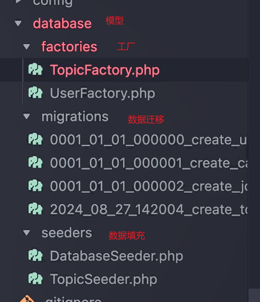

分析目录结构图可得，php的模型 = 工厂 + 数据迁移 + 数据填充

## 善用 grep 管道

> 这个是 `linux` 系统自带的，不是 `php` 特有

```bash
# 查看全部路由
php route:list

# 查看指定路由，使用grep管道过滤器。（过滤php route:list的值，返回包含topic的）
php route:list | grep topic
```

## 创建模拟数据

[fake 函数](https://laravel.com/docs/9.x/helpers#method-fake) 从容器中解析 `Faker` 单例，这在模型工厂、数据库种子、测试和原型视图中创建假数据时非常有用。

## 单元测试

```bash
# 创建单元测试
php artisan make:test 测试类名称

# 运行单元测试
php artisan test
```

### 定义帖子的单元测试用例

```bash
# 创建单元测试
php artisan make:test TopicTest
```

```php
// tests/Feature/TopicTest.php
<?php 
test('getTopicList',function(){
    $response = $this->get('/api/topic');
    // 测试状态码是200
    $response->assertStatus(200);
    // 测试状态码是200，且返回的数据是空数组
    $response->assertStatus(200)->assertJson(['data'=>[]]);
})
```

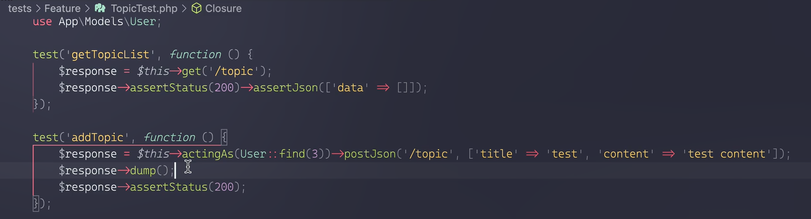

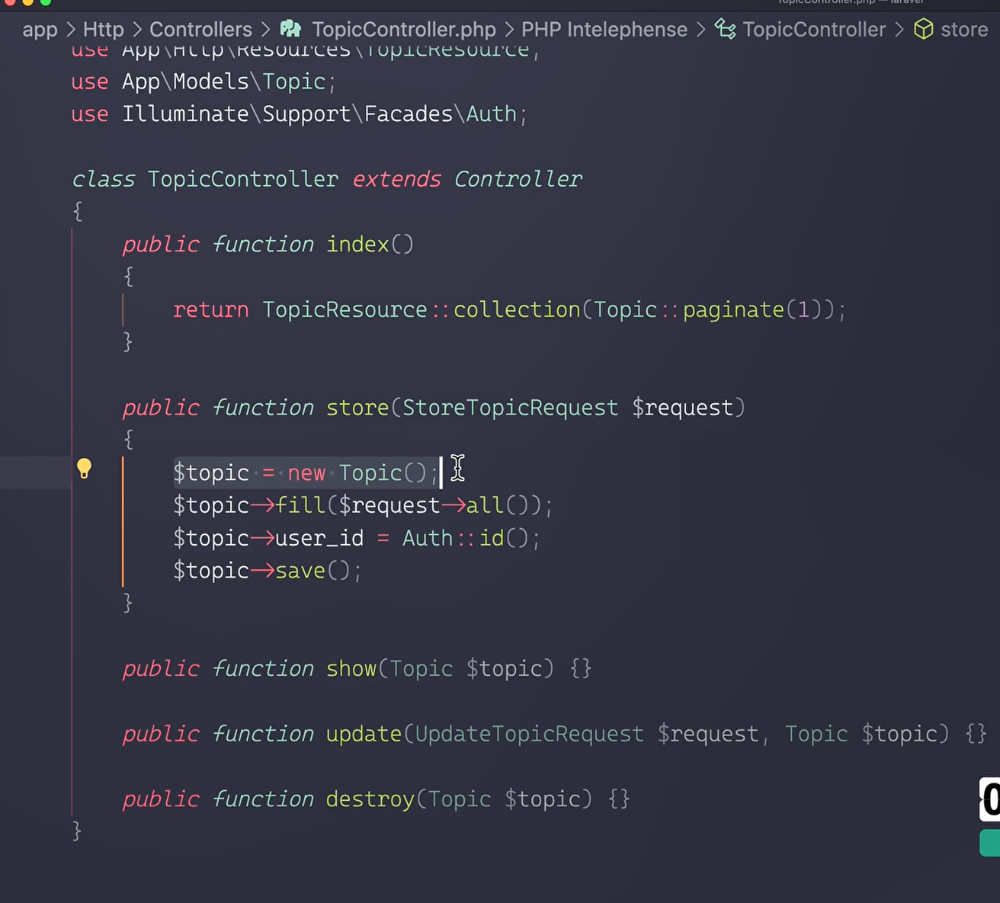

## X-XSRF-TOKEN

身份验证，验证失败，http状态码是 419


## 表单校验

表单校验，校验失败，http状态码是 422

## 无权限状态码

401 未授权

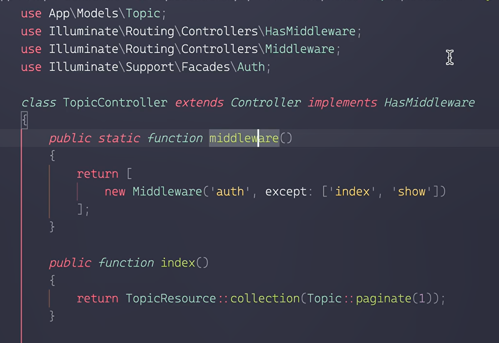

## session+cookies身份验证

这种 `session` + `cookies` 的方式，在 `laravel` 中，叫做 `CSRF`的`TOKEN`。

对于 小程序、App 这类没有 `cookies` 的，要使用 `sanctum`  身份验证。

### 中间件对需要鉴权的路由加判断

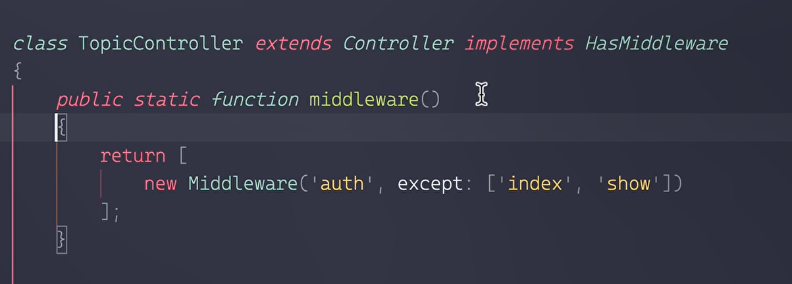

`except` 表示排除鉴权的路由

### 保存登录状态

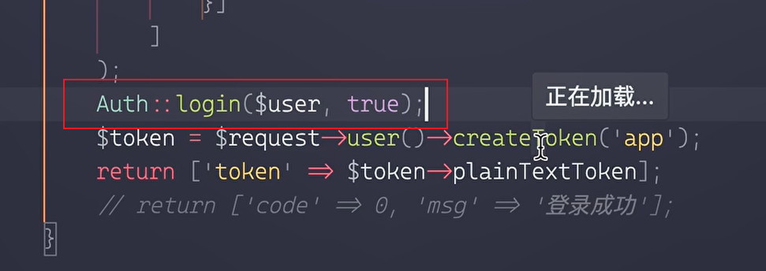

### 对当前身份进行验证，作用于全部帖子路由

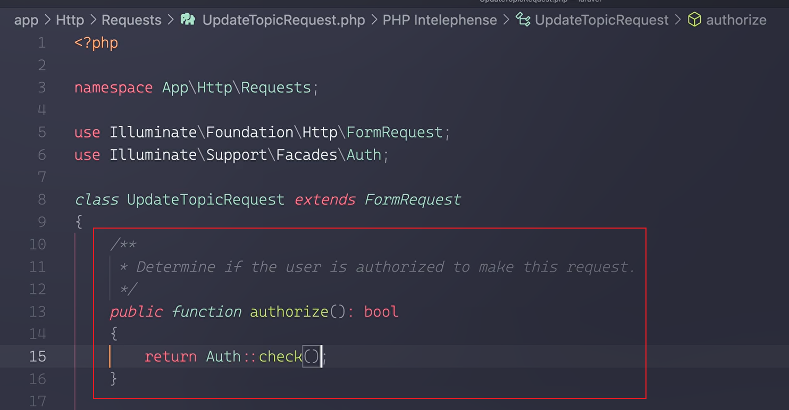

## sanctum身份验证

<https://laravel.com/docs/11.x/sanctum#main-content>

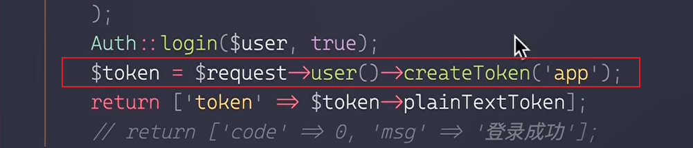

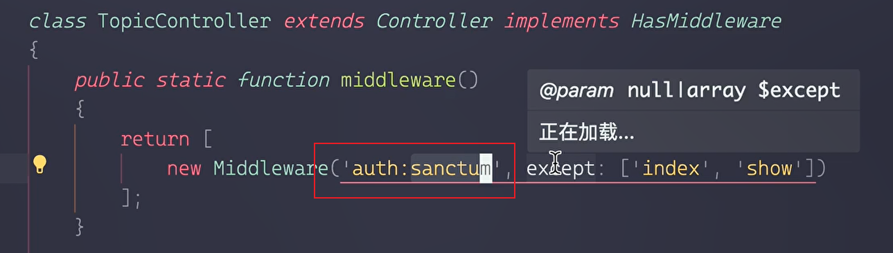

请求头格式：Authorization: Bearer {{TOKEN}}

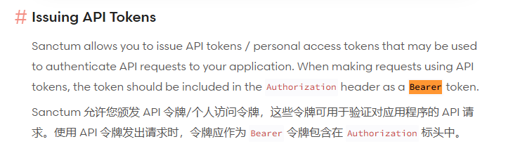

俩种Token生效的方法：

- 写在 `Controller/api.php` 中，通过 `/api/xxx`请求。（推荐这种）
- 写在 `routes/web.php` 中，通过 `/xxx`请求，login页面需要触发`/sanctum/csrf-cookie`接口。

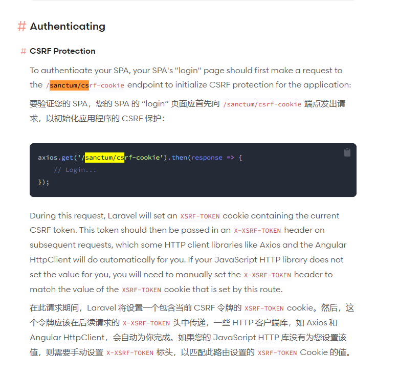

## 路由定义

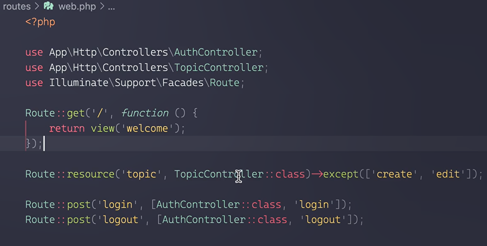

## 列表接口分页

分页+连表查询（使用orm连表查询，需要外键，但是不推荐使用外键）

连表自己写sql

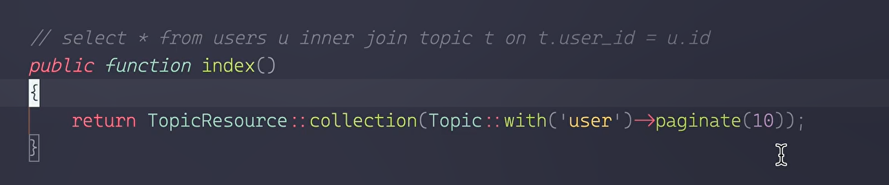

## 在模型文件关联表（不推荐）

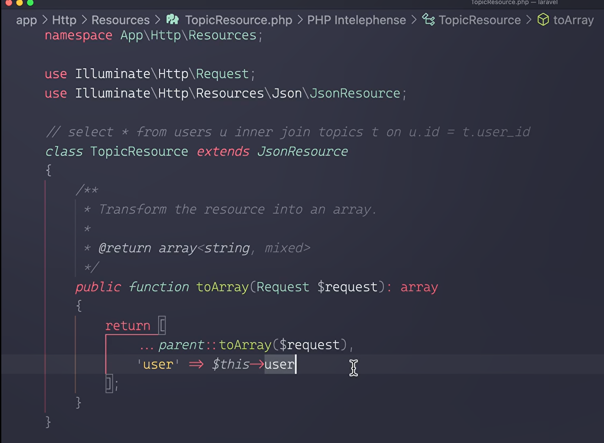
