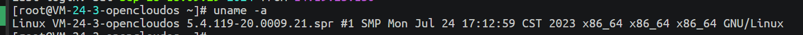

# 1Panel

[1Panel官方文档](https://1panel.cn/docs/)

> 1Panel 是一个现代化、开源的 Linux 服务器运维管理面板。
>
> 推荐，新手小白开发者使用，帮助开发人员更好的管理运维服务器。

## 安装

先查看当前服务器的内核信息，其中可能包含操作系统的名称和版本

```bash
uname -a
```



如果服务器操作系统，不是文档中已有的`RedHat/CentOS`、`Ubuntu`、`Debian`操作系统，就使用`openEuler/其他`方案：

> 根据上述服务器的操作系统，找不到对应的，使用的就是`openEuler/其他`方案~

第一步：安装 docker

```bash
bash <(curl -sSL https://linuxmirrors.cn/docker.sh)
```

第二步：安装 1Panel

```bash
curl -sSL https://resource.fit2cloud.com/1panel/package/quick_start.sh -o quick_start.sh && sh quick_start.sh
```

其他步骤参考文档~

## 卸载

只要在 `Linux` 终端输入`1pctl uninstall`就能卸载掉`1Panel`。

```bash
1pctl uninstall
```

💥上面的卸载命令行，百度和官网找都找不到。

💥最后是在 `github` 关闭的问题里才找到这个卸载 `1Panel` 的命令行

## 快捷指令

```bash
1panel app         # 应用相关命令
1panel completion  # Generate the autocompletion script for the specified shell
1panel help        # Help about any command
1panel listen-ip   # 切换监听 IP
1panel reset       # 重置系统信息
1panel restore     # 回滚 1Panel 服务及数据
1panel update      # 修改面板信息
1panel user-info   # 获取面板信息
1panel version     # 获取系统版本信息
1pctl update password #更新密码
```

