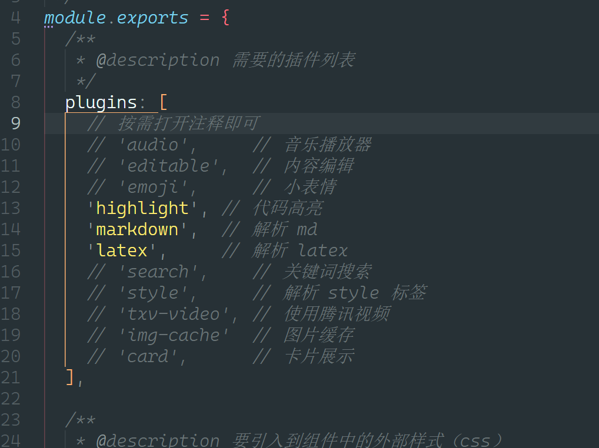
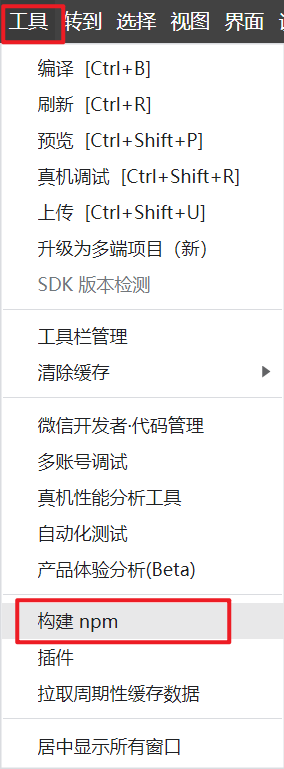

# Chat聊天页面

> tailwindcss原子化样式
> [mp-html渲染markdown](https://github.com/jin-yufeng/mp-html?tab=readme-ov-file)

## mp-html渲染markdown

[uniapp+mp-html 优化ai聊天 支持markdown的形式](https://juejin.cn/post/7378634249547546687)

安装`mp-html`

```bash
npm install mp-html
```

修改`mp-html`的插件配置

```bash
cd node_modules/mp-html/tools/config.js
```



重新下载插件依赖

```bash
cd node_modules/mp-html
npm install
```

npm构建-微信开发者工具



npm构建-命令行

```bash
npm run build:uni-app
```


## 完整代码

```vue
<template>
    <view class="h-[100vh] bg flex flex-col relative">
        <FreeNavBar :title="navBarTitle" :content-style="navBarStyle" class="shrink-0"></FreeNavBar>
        <view class="flex-1 overflow-hidden">
            <scroll-view :scroll-top="scrollTop" @scroll="scroll" scroll-y="true" class="h-full">
                <view class="flex flex-col gap-[32rpx] p-[32rpx]">
                    <view class="flex gap-[14rpx] mr-auto">
                        <image class="size-[50rpx] shrink-0 mt-[12rpx]"
                            src="xxx.log"
                            mode="scaleToFill" />
                        <view
                            class="text-[#1D2129] text-[24rpx] break-words bg-white rounded-[24rpx] p-[32rpx] flex-1 whitespace-pre-wrap">
                            欢迎使用{{ navBarTitle }}，请尽情问我吧！😁
                        </view>
                    </view>
                    <template v-for="(item, index) in messages" :key="index">
                        <view v-if="item.role === chatRoleMap.assistant" class="flex gap-[14rpx] mr-auto">
                            <image class="size-[50rpx] shrink-0 mt-[12rpx]"
                                src="xxx.log"
                                mode="scaleToFill" />
                            <mp-html :content="item.content" markdown
                                class="leading-[1.56] tracking-[3rpx] text-[#1D2129] text-[24rpx] break-words bg-white rounded-[24rpx] p-[32rpx] flex-1 whitespace-pre-wrap" />
                        </view>
                        <view v-else class="flex gap-[14rpx] ml-auto">
                            <view
                                class="text-white text-[24rpx] break-words rounded-[24rpx_0_24rpx_24rpx] p-[32rpx] bg-[#007AFF] whitespace-pre-wrap">
                                {{ item.content }}
                            </view>
                        </view>
                    </template>
                    <!-- 最新消息 -->
                    <view v-if="lastTypingMessage" class="flex gap-[14rpx] mr-auto">
                        <image class="size-[50rpx] shrink-0 mt-[12rpx]"
                            src="xxx.log"
                            mode="scaleToFill" />
                        <mp-html :content="lastTypingMessage" markdown
                            class="leading-[1.56] tracking-[3rpx] text-[#1D2129] text-[24rpx] break-words bg-white rounded-[24rpx] p-[32rpx] flex-1 whitespace-pre-wrap" />
                    </view>
                    <FreeLoading v-if="chatLoading"></FreeLoading>
                </view>
            </scroll-view>
        </view>
        <!-- 固定在底部的聊天框 -->
        <view class="shrink-0">
            <view id="chatBox" class="chat-box">
                <textarea v-model="content" type="text" class="chat-box-input" auto-height :cursor-spacing="10"
                    :adjust-position="false" :show-confirm-bar="false"></textarea>
                <view class="chat-box-btn" @click="sendChatBoxContent">发送</view>
            </view>
        </view>
        <view class="shrink-0" :style="{
            height: chatBoxBottom + 'px',
        }"></view>
    </view>
</template>

<script setup>
import { ref, nextTick } from "vue";
// api
import { getAiAliyunFaRui } from '@/api/ai'
// uniapp
import { onShareAppMessage, onShareTimeline, onPageScroll } from "@dcloudio/uni-app";
// mp-html渲染markdown
import mpHtml from "mp-html/dist/uni-app/components/mp-html/mp-html";

// 分享朋友
onShareAppMessage(() => {
    return {
        title: "法律咨询",
        path: "/pages/chat/index",
    };
});

// 导航栏样式
const navBarTitle = ref('法律咨询')
const navBarStyle = ref({
    background: "transparent",
})

// 聊天框底部距离：键盘弹出时，底部距离键盘高度
const chatBoxBottom = ref(0)

// 设置聊天区域滚动位置
const scrollTop = ref(0)
const oldScrollTop = ref(0)

// 设置滚动条在底部
const scrollToBottom = () => {
    scrollTop.value = oldScrollTop.value
    nextTick(() => {
        scrollTop.value = 99999999
    })
}

// 监听键盘高度变化
uni.onKeyboardHeightChange(res => {
    let { height = 0 } = res;
    chatBoxBottom.value = height
    scrollToBottom()
})

// 监听聊天区域滚动
const scroll = (e) => {
    oldScrollTop.value = e.detail.scrollTop
}

// 聊天框内容
const content = ref('')
// 接受系统返回的最新消息
const lastMessage = ref('')
const lastTypingMessage = ref('')
// 聊天框历史记录
const messages = ref([])
// 聊天角色
const chatRoleMap = {
    user: 'user',
    assistant: 'assistant',
}
// 聊天请求中
const chatLoading = ref(false)

// 打字机定时器
let typingTimer = null
// 打字机
const typingEffect = (text, callback) => {
    for (let i = 0; i < text.length; i++) {
        lastTypingMessage.value += text[i];
    }
    callback && callback()
    nextTick(() => {
        setTimeout(() => {
            scrollToBottom()
        }, 100)
    })
    // 打字机开启
    // let i = 0;
    // typingTimer = setInterval(() => {
    //     if (i < text.length) {
    //         lastTypingMessage.value += text[i];
    //         i++;
    //         scrollToBottom()
    //     } else {
    //         clearInterval(typingTimer);
    //         callback && callback()
    //     }
    // }, 50);
    // return typingTimer
}


// 发送聊天内容
const sendChatBoxContent = async () => {
    // 清除打字机
    // clearInterval(typingTimer)
    // typingTimer = null
    lastMessage.value && messages.value.push({
        role: chatRoleMap.assistant,
        content: lastMessage.value,
    })
    lastMessage.value = ''
    lastTypingMessage.value = ''
    if (chatLoading.value) {
        uni.showToast({
            title: '正在请求中，请不要重复发送！',
            icon: 'none',
            duration: 2000,
        })
        return
    }
    if (!content.value) {
        uni.showToast({
            title: '请输入您要咨询的内容！',
            icon: 'none',
            duration: 2000,
        })
        return
    }
    try {
        // 输入框内容
        const pContent = content.value
        content.value = ''
        messages.value.push({
            role: chatRoleMap.user,
            content: pContent,
        })
        chatLoading.value = true
        scrollToBottom()
        const { data } = await getAiAliyunFaRui({
            content: pContent,
            messages: messages.value,
        })
        lastMessage.value = data.message
        typingEffect(data.message)
        chatLoading.value = false
    } catch (error) {
        console.error(error)
        chatLoading.value = false
    }
}
</script>

<style lang="scss" scoped>
.bg {
    background: url('xxx/bg.png') center/100% 100vh no-repeat;
}

// 底部聊天框
.chat-box {
    background-color: #fff;
    box-shadow: 0 -1px 12.6px 2px rgba(0, 10, 48, 0.07);
    padding: 10px;
    display: flex;
    align-items: center;
    gap: 16rpx;
    width: 100%;
    padding-bottom: calc(32rpx + constant(safe-area-inset-bottom)) !important;
    /* 兼容 iOS < 11.2 */
    padding-bottom: calc(32rpx + env(safe-area-inset-bottom)) !important;
    padding-top: 32rpx;

    /* 兼容 iOS >= 11.2 */
    .chat-box-input {
        flex: 1;
        font-size: 32rpx;
        padding: 12rpx 32rpx;
        box-sizing: content-box;
        border-radius: 12rpx;
        background-color: #F9F9F9;
    }

    .chat-box-btn {
        width: 120rpx;
        height: 60rpx;
        background-color: #007AFF;
        color: #fff;
        border-radius: 12rpx;
        text-align: center;
        line-height: 60rpx;
    }
}
</style>
```

## scroll-view 踩坑

scroll-view 要能够区域范围内滚动，必须有一个明确的高度，或者父级元素有一个明确的高度。

不可以是 `max-height` 这种。

## 底部输入框 textarea 踩坑

问题在于如何使得软键盘弹起的时候，textarea能跟着被弹起来？？？

动态高度计算，添加一个 `padding-bottom` 的软键盘高度。
