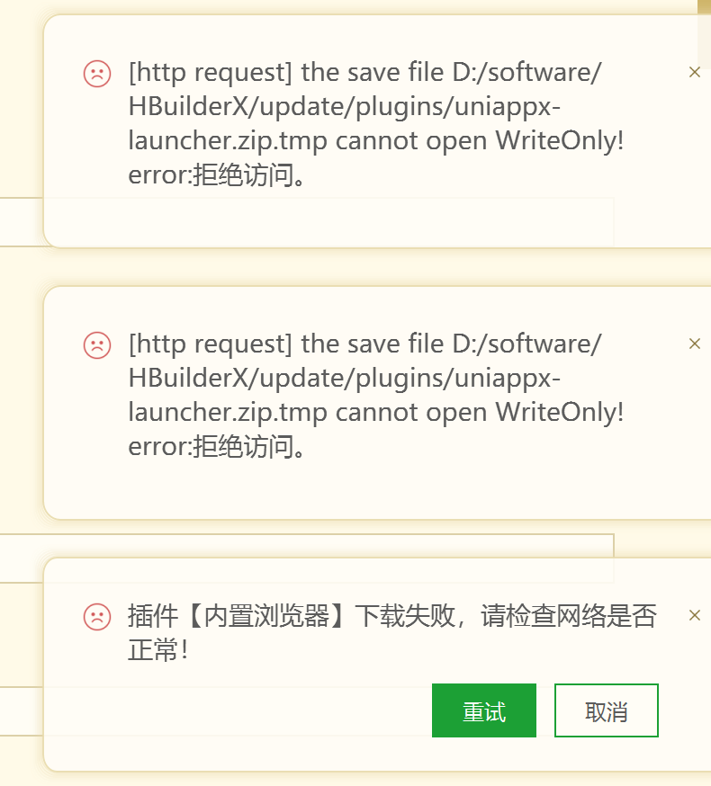

# uni-app

> uni-app 是一个使用 Vue.js 开发所有前端应用的框架，开发者编写一套代码，可发布到iOS、Android、Web（响应式）、以及各种小程序（微信/支付宝/百度/头条/飞书/QQ/快手/钉钉/淘宝）、快应用等多个平台。
>

## IOS和安卓展示时间兼容问题

**问题描述：**

IOS手机不支持“2021-12-30 22:22:30”里面带横杠“-”的时间格式，它只支持“2021/12/30 22:22:30”带斜杠“/”的时间格式，安卓手机则两种时间格式都兼容。

**解决方案：**

```js

// 处理时间兼容问题
const getCommonTimeStr = (time) => {
    return time.replace(/\-/g, '/');
}

// 使用场景

// 获取传入时间到当前时间的时间差，返回小时或者分钟
const getDiffHoursMins = (time) => {
    const newTime = getCommonTimeStr(time);
    const now = new Date().getTime();
    const updateTime = new Date(newTime).getTime();
    const hours = Math.floor((now - updateTime) / (1000 * 60 * 60));
    const mins = Math.floor((now - updateTime) / (1000 * 60));
    return hours ? `${hours}小时前` : (mins ? `${mins}分钟前` : '');
}

```

## IOS App端，video原生组件 和 swiper 组件使用问题

**问题描述：**

在 `IOS App` 端，`swiper` 组件嵌入了 `video` 原生组件，`video` 原生组件会影响到 `swiper` 组件的滑动。

**解决方案：**

使用 `v-if` 配合占位符，在 `swiper` 组件滑动时，先不渲染 `video` 原生组件，等 `swiper` 组件滑动结束后，再渲染 `video` 原生组件。  

## HbuilderX 网络问题导致插件下载失败



这咋会出现网络问题！vscode国外资源站点都不会出现网络问题。

经过一顿查阅资料，逛论坛，发现要以管理身份启动HbuilderX. (公司内网无法直接安装插件，设置好IE 代理，右击以管理员身份证运行软件，Hbuilder就能走IE代理啦！)

重新按管理身份启动HbuilderX，在进行插件下载，启动运行。项目正常启动！

