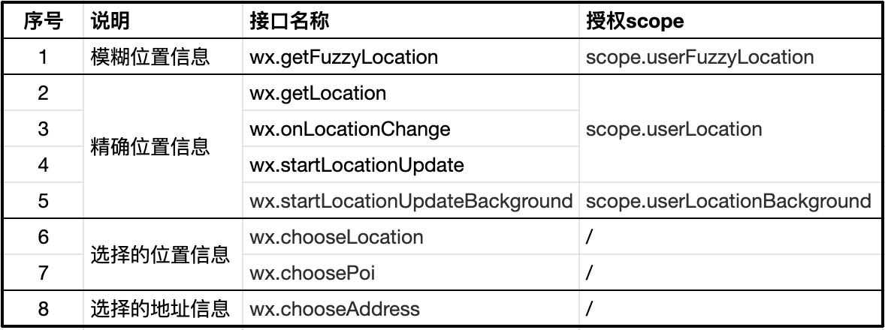
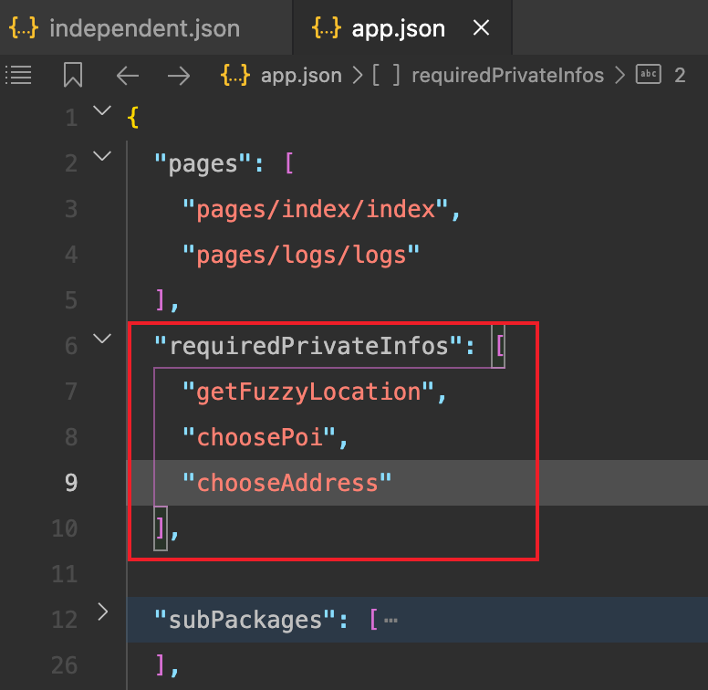

#  微信小程序

## 微信小程序对接企业微信客服

[微信小程序对接企业微信客服](https://developers.weixin.qq.com/community/develop/article/doc/00026676a30c2804cdbead76056413)

对应客服人员的链接、企业ID，都可以在企业微信后台获取！！！

```js
wx.openCustomerServiceChat({
  extInfo: {url: ''}, // 对应客服人员的链接
  corpId: '', // 企业ID
  success(res) {}
})

```

## 微信小程序选择地址


```html
<view data-latitude="{{xxx1}}" data-longitude="{{xxx2}}" data-address="{{xxx}}" data-userId="{{xxx}}" bindtap="handleChooseLocation"></view>
```

```js
const handleChooseLocation = (e)=>{
   const dataset = e.currentTarget.dataset
    wx.chooseLocation({
      latitude: +dataset.latitude,
      longitude: dataset.longitude,
      address: dataset.address,
      scale: 18,
      success: async ({address,latitude,longitude}) => {
        // 读取userId小驼峰变量踩坑：
        const userId = dataset.userid
        // 选择地址后的操作
      }
    })
}
```

### 踩坑

https://developers.weixin.qq.com/community/develop/doc/000a02f2c5026891650e7f40351c01



在代码中使用的地理位置相关接口（共计 8 个），开发者均需要在 `app.json` 中 `requiredPrivateInfos` 配置项中声明

