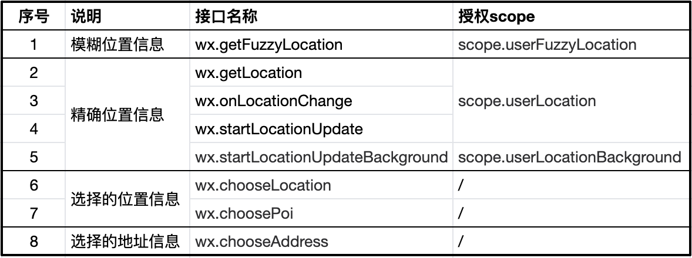

#  微信小程序

## 微信小程序对接企业微信客服

[微信小程序对接企业微信客服](https://developers.weixin.qq.com/community/develop/article/doc/00026676a30c2804cdbead76056413)

对应客服人员的链接、企业ID，都可以在企业微信后台获取！！！

```js
wx.openCustomerServiceChat({
  extInfo: {url: ''}, // 对应客服人员的链接
  corpId: '', // 企业ID
  success(res) {}
})

```

## 微信小程序选择地址


```html
<view data-latitude="{{xxx1}}" data-longitude="{{xxx2}}" data-address="{{xxx}}" data-userId="{{xxx}}" bindtap="handleChooseLocation"></view>
```

```js
const handleChooseLocation = (e)=>{
   const dataset = e.currentTarget.dataset
    wx.chooseLocation({
      latitude: +dataset.latitude,
      longitude: dataset.longitude,
      address: dataset.address,
      scale: 18,
      success: async ({address,latitude,longitude}) => {
        // 读取userId小驼峰变量踩坑：
        const userId = dataset.userid
        // 选择地址后的操作
      }
    })
}
```

### 踩坑

https://developers.weixin.qq.com/community/develop/doc/000a02f2c5026891650e7f40351c01



在代码中使用的地理位置相关接口（共计 8 个），开发者均需要在 `app.json` 中 `requiredPrivateInfos` 配置项中声明


## 微信小程序，修改三方组件样式穿透失效

https://juejin.cn/post/7384779116036243492

### 问题描述

使用 `uniapp+vue` 开发微信小程序，项目中使用 `uni-ui` 组件，但是 `uni-ui` 的组件不能满足设计稿样式，于是尝试在页面中结合深度选择器修改样式，但无效。

[官方参考文档](https://developers.weixin.qq.com/miniprogram/dev/framework/custom-component/wxml-wxss.html#%E7%BB%84%E4%BB%B6%E6%A0%B7%E5%BC%8F%E9%9A%94%E7%A6%BB)：参考微信小程序官方文档可知，在微信小程序中，默认情况下，**自定义组件的样式只受到自定义组件 wxss 的影响**。

因此，实际上问题点在于，微信小程序里在父组件中写的样式产生了样式隔离，没有办法在子组件里生效。

在问题描述的例子里，uni-ui组件对于引用uni-ui组件的组件来说是子组件，因此同样无法生效。

### 解决方法1

指定特殊的样式隔离选项 `styleIsolation` ， 默认为 `isolated` ，我们将它修改为 `shared` 。

```vue
<script lang='ts'>
export default {
   options: {
       styleIsolation: 'shared', // 解除样式隔离
   }
}
</script>
```

如果你在项目中使用的是组合式`api+ts`，这时候需要再增加一个 `script` 标签，往里面添加选项即可。

```vue
<script setup lang="ts">
import {ref} from 'vue'
const count = ref<Number>(0)
//……业务代码
</script>

<script lang='ts'>
export default {
   options: {
       styleIsolation: 'shared', // 解除样式隔离
   }
}
</script>
```

### 解决方法2

在 `uni.scss` 定义全局样式，重启项目即可。


## 微信支付

https://developers.weixin.qq.com/community/develop/doc/0008844e4b00a0e9c9c19c6ce61000

`wx.requestPayment` 微信支付，一定要点击完成，才可以进入`success`和`complete`回调。

### 问题描述

客户端支付成功，一段时间内没有点击完成，就进入了`fail`回调。

### 解决方法

不能在`success`和`complete`回调中，进行订单挂单、取消操作。

因为一定有人不点击完成，所以，不能以这里的回调做为最终依据。

要以 `notify_url` 的回调为最终依据。（后端调用api处理，成功回调会触发`notify_url`）

