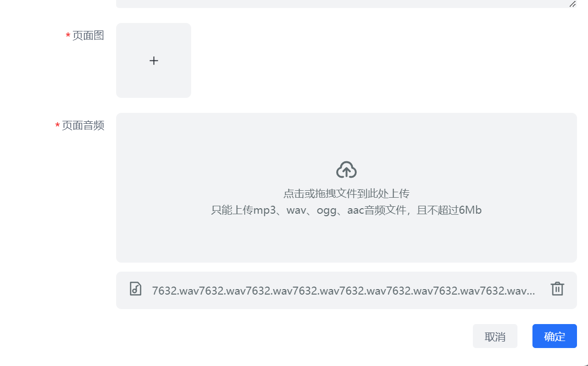

# arco 组件库踩坑


## a-upload

### 自定义上传



很多需要自己写，无法与`a-upload`组件配合。可以高度自定义样式。

```vue
<template>
<div>
  <a-form ref="formRef" :model="uploadForm">
     <div class="flex flex-col gap-[12px] w-full">
        <a-upload v-model:file-list="uploadAudioFileList" accept=".mp3,.wav,.ogg,.aac" draggable :auto-upload="false" :show-file-list="false"
          @change="onAudioFileChange">
          <!-- 内部交互自己写，limit不能设置成1，不然会替换掉upload-button插槽 -->
          <template #upload-button>
            <div class="w-full h-[200px] rounded-lg bg-[#F2F3F5] text-[#636e72] overflow-hidden">
              <div v-if="uploadAudioFileLoading" class="size-full flex-center">
                <a-spin />
              </div>
              <div v-else class="size-full flex-center flex-col">
                <UploadOne theme="outline" size="30" />
                <div>点击或拖拽文件到此处上传</div>
                <div>只能上传mp3、wav、ogg、aac音频文件，且不超过{{ maxAudioMbSize }}Mb</div>
              </div>
            </div>
          </template>
          <template #preview-icon="slotProps"></template>
        </a-upload>
        <!-- 附件列表需要自己写 -->
        <div v-if="uploadAudioFileList?.length" class="flex items-center justify-between gap-[12px] h-[50px] bg-[#F2F3F5] text-[#636e72] rounded-lg px-[16px] overflow-hidden">
          <div class="flex items-center gap-[12px] overflow-hidden">
            <AudioFile theme="outline" size="20" />
            <div class="truncate">{{ uploadAudioFileList[0]?.name }}</div>
          </div>
          <div class="shrink-0">
            <Delete theme="outline" size="20" class="cursor-pointer" @click="handleDeleteAudioFile" />
          </div>
        </div>
      </div>
  </a-form> 
</div>
</template>

<script setup lang="ts">
import { reactive, ref, watch } from 'vue';
import { FileItem } from '@arco-design/web-vue/es/upload/interfaces';
import { Message } from '@arco-design/web-vue';

// aForm元素
const formRef = ref();

// 上传前校验，大小不超过6mb
const maxAudioMbSize = 6;
const maxAudioSize = maxAudioMbSize * 1024 * 1024;

const uploadAudioFileLoading = ref(false);
const uploadAudioFileList = ref<FileItem[]>()
const onAudioFileChange = async (
  fileList: FileItem[],
  currentFile: FileItem
) => {
  if (currentFile?.file?.size && currentFile.file.size > maxAudioSize) {
    Message.error(`音频大小超过${maxAudioMbSize}MB`);
    return;
  }
  uploadAudioFileLoading.value = true;
  const data = await arcoUploadFile(<File>currentFile.file);
  uploadForm.audio_file = data;
  uploadAudioFileList.value = [currentFile];
  uploadAudioFileLoading.value = false;
  formRef.value?.$formRef.validateField('audio_file');
};
const handleDeleteAudioFile = ()=>{
  uploadForm.audio_file = undefined;
  uploadAudioFileList.value = [];
}
</script>

<style lang="less" scoped>

</style>
```


### 遵循组件使用规范

