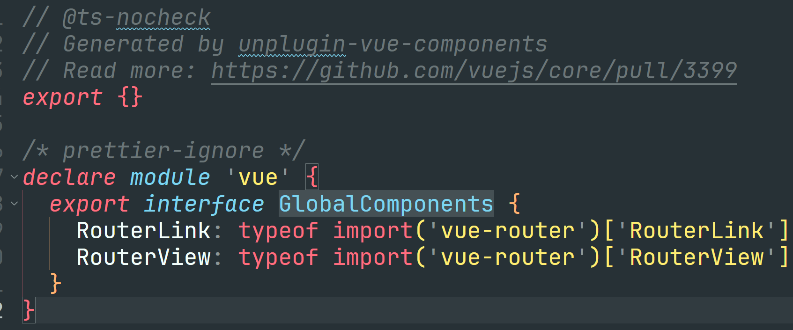
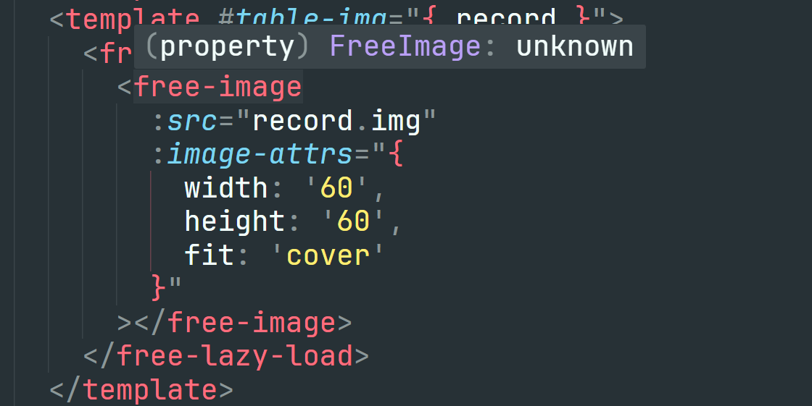
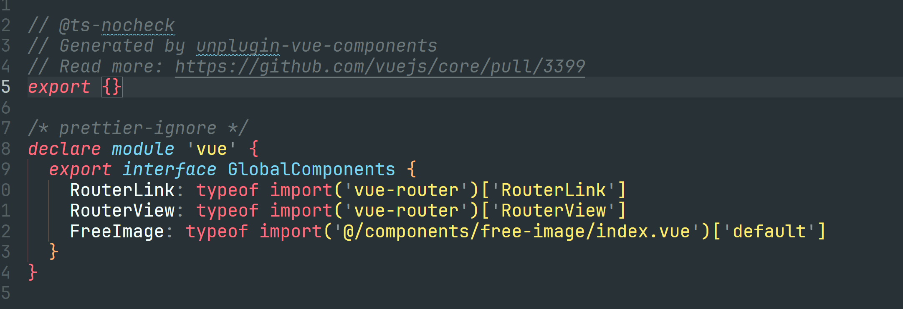
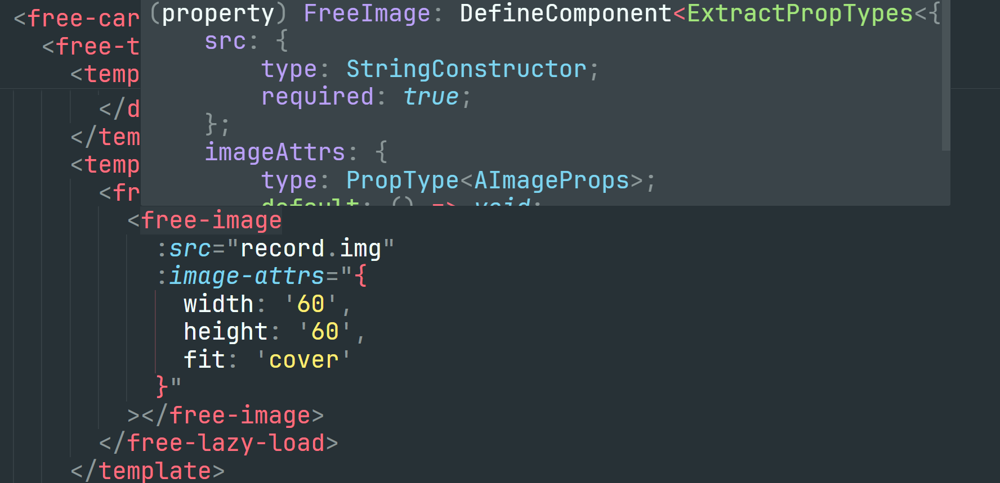
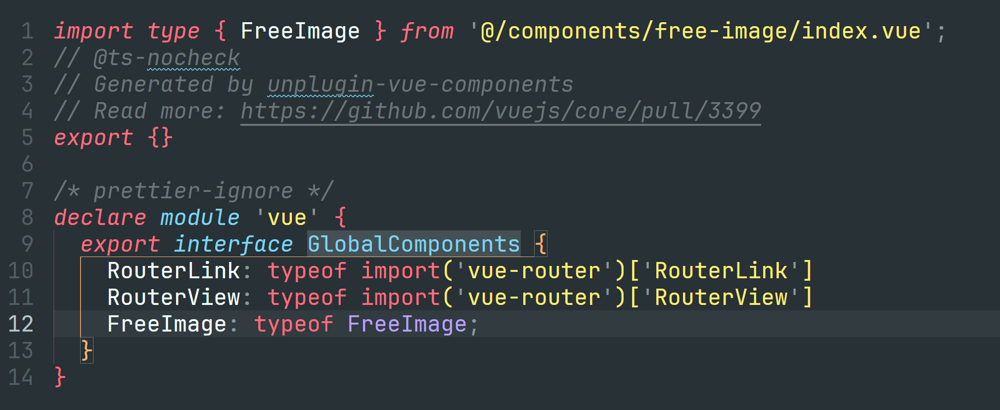
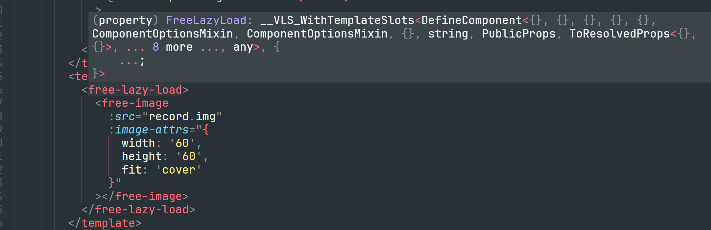

# vue3+ts声明自定义组件

## 背景

在 `vue3` + `ts` 的项目中，自定义的`components/**/*.vue`组件，在页面中使用，不具备任何提示功能，这让我很苦恼~

## 排查问题

在 `arco-vue` 后台管理系统中，检查`ts`声明文件：`src/env.d.ts` 、`src/components.d.ts`。

### env.d.ts


```ts
/// <reference types="vite/client" />

declare module '*.vue' {
  import type { DefineComponent } from 'vue';
  const component: DefineComponent<object, object, any>;
  export default component;
}


interface ImportMetaEnv {
  readonly VITE_API_BASE_URL: string;
}
```


这段代码是 `TypeScript` 中的一个模块声明，它的作用是告诉 `TypeScript` 编译器如何处理以 `.vue` 为扩展名的文件，理解 `.vue` 文件是 `Vue` 组件，并能够正确地进行类型检查和编译。

具体来说，它定义了一个模块，该模块导出了一个 `DefineComponent` 类型的常量 `component`，这个常量表示一个 Vue 组件。

**DefineComponent** 是 `Vue 3` 中引入的一个类型，它用于定义组件的类型。它接受三个类型参数：

- Props：组件的属性类型。
- Emits：组件的事件类型。
- Slots：组件的插槽类型。

在这个模块声明中，我们没有指定具体的类型参数，而是使用了 `object` 作为占位符，表示这些类型是未知的或者是动态的。

最后，`export default component;` 这行代码将 `component` 常量导出为模块的默认导出，这样其他文件就可以通过` import Component from 'path/to/Component.vue';` 这样的方式来导入这个 `Vue` 组件了。

### components.d.ts

```ts
// @ts-nocheck
// Generated by unplugin-vue-components
// Read more: https://github.com/vuejs/core/pull/3399
export {}

/* prettier-ignore */
declare module 'vue' {
  export interface GlobalComponents {
    RouterLink: typeof import('vue-router')['RouterLink']
    RouterView: typeof import('vue-router')['RouterView']
  }
}
```

#### 没有声明组件类型



提示如下：



和 `src/env.d.ts` 没什么关系

#### 有声明组件类型

在 `src/components.d.ts` 定义 `FreeImage` 组件类型声明



提示如下：



#### 注意


**`typeof import('@/components/free-image/index.vue')['default']` 需要和 `export {}` 是成对出现的！！！，反之，则不需要。**

**如果 `src/components.d.ts` 缺少  `export {}` ，会影响到子级的声明文件！！！**


#### 不正规写法

不能在 `src/components.d.ts` 中这么定义，组件声明不生效。
但在`src`的子级目录下，可以这么定义，组件声明生效。



## 解决问题

### tsconfig.json

```json
{
  "compilerOptions": {
    "target": "ES2020",
    "module": "ES2020",
    "moduleResolution": "node",
    "strict": true,
    "jsx": "preserve",
    "sourceMap": true,
    "resolveJsonModule": true,
    "esModuleInterop": true,
    "baseUrl": ".",
    "paths": {
      "@/*": ["src/*"]
    },
    "lib": ["es2020", "dom"],
    "skipLibCheck": true,
    "noImplicitAny": false, // 是否在表达式和声明上有隐含的any类型时报错
  },
  "include": ["src/**/*", "src/**/*.vue"],
  "exclude": ["node_modules"]
}

```
由 `tsconfig.json` 文件内容，我们可以知道，如果定义`ts`声明文件，就需要在`src`目录下定义！

如果在`src`目录外，即根目录下定义，ts不会解析。

提示就还是如图所示：


### src/components/components.d.ts

为了不和 `src/components.d.ts` 声明文件混淆，这里针对 **自定义的通用组件** 进行声明。

定义声明文件 `src/components/components.d.ts` 

```ts
// 俩种写法都可以，但是还是统一成：typeof import('@/components/free-lazy-load/index.vue')['default']
// 混合写的时候可以不需要 export {}
import type FreeImage from '@/components/free-image/index.vue'

declare module 'vue' {
  export interface GlobalComponents {
    FreeLazyLoad: typeof import('@/components/free-lazy-load/index.vue')['default']
    FreeImage: typeof FreeImage
  }
}
```




### vite插件 - config/plugins/vite-plugin-component-types.js

实现 `typeof import('@/components/free-image/index.vue')['default']`。

**`typeof import('@/components/free-image/index.vue')['default']` 需要和 `export {}` 是成对出现的！！！，反之，则不需要。**

```js
import { glob } from 'glob';
import fs from 'fs-extra';
import path from 'path';
import { fileURLToPath } from 'url';

function componentTypesPlugin() {
  const __filename = fileURLToPath(import.meta.url);
  const __dirname = path.dirname(__filename);
  const componentsDir = path.join(__dirname, '../../src', 'components');
  const outputFile = path.join(
    __dirname,
    '../../src',
    'components/components.d.ts'
  );
  // Function to convert kebab-case to PascalCase
  function kebabToPascal(str) {
    return str
      .split('-')
      .map(part => part.charAt(0).toUpperCase() + part.slice(1))
      .join('');
  }

  function generateComponentTypes() {
    // console.log('组件目录', componentsDir);
    // console.log('输出路径', outputFile);

    // Get all component files
    const componentFiles = glob
      .sync('**/*.vue', { cwd: componentsDir })
      .map(file => file.split(path.sep).join('/'));

    // Generate component declarations
    let declarations = `export {}\ndeclare module 'vue' {\n  export interface GlobalComponents {\n`;

    componentFiles.forEach(file => {
      let componentName = kebabToPascal(path.basename(file, '.vue'));
      if (componentName === 'Index') {
        componentName = kebabToPascal(path.basename(path.dirname(file)));
      }
      const importPath = `@/components/${file}`;
      declarations += `    ${componentName}: typeof import('${importPath}')['default']\n`;
    });
    declarations += '  }\n}\n';

    // Write to output file
    fs.writeFileSync(outputFile, declarations);
    // console.log(`Component type declarations generated in ${outputFile}`);
  }

  return {
    name: 'vite-plugin-component-types',
    buildStart() {
      generateComponentTypes();
    },
    handleHotUpdate({ file }) {
      if (path.extname(file) === '.vue') {
        generateComponentTypes();
      }
    }
  };
}

export default componentTypesPlugin;

```

`vite.config.js` 使用插件

```js
import { defineConfig } from 'vite';
// 自定义组件声明补充
import componentTypesPlugin from './plugin/vite-plugin-component-types';
export default defineConfig({
  plugins: [
    componentTypesPlugin()
  ],
})
```

执行`npm run dev`，生成如下：

生成如下：

```ts

export {}
declare module 'vue' {
  export interface GlobalComponents {
    FreeLazyLoad: typeof import('@/components/free-lazy-load/index.vue')['default']
    FreeImage: typeof import('@/components/free-image/index.vue')['default']
  }
}

```


### node脚本 - generate-component-types.js

`export {}` 加不加无所谓

```js
import { glob } from 'glob';
import fs from 'fs-extra';
import path from 'path';
import { fileURLToPath } from 'url';

const __filename = fileURLToPath(import.meta.url);
const __dirname = path.dirname(__filename);
const componentsDir = path.join(__dirname, 'src', 'components');
const outputFile = path.join(__dirname, 'src', 'components/components.d.ts');

console.log('组件目录', componentsDir);
console.log('输出路径', outputFile);

// Function to convert kebab-case to PascalCase
function kebabToPascal(str) {
  return str
    .split('-')
    .map(part => part.charAt(0).toUpperCase() + part.slice(1))
    .join('');
}

// 拿到所有组件信息
const componentFiles = glob
  .sync('**/*.vue', { cwd: componentsDir })
  .map(file => file.split(path.sep).join('/'));

// 导入组件
let declarations = '';
const componentNameList = [];

componentFiles.forEach(file => {
  let componentName = kebabToPascal(path.basename(file, '.vue'));
  if (componentName === 'Index') {
    componentName = kebabToPascal(path.basename(path.dirname(file)));
  }
  const importPath = `@/components/${file}`;
  declarations += `import type ${componentName} from '${importPath}'\n`;
  componentNameList.push(componentName);
});

// 声明组件
declarations += `declare module 'vue' {\n  export interface GlobalComponents {\n`;

componentNameList.forEach(componentName => {
  declarations += `    ${componentName}: typeof ${componentName}\n`;
});

declarations += '  }\n}\n';

// 写入输出
fs.writeFileSync(outputFile, declarations);

console.log(`Component type declarations generated in ${outputFile}`);
```

执行

```bash
node generate-component-types.js
```

生成如下：

```ts

import type FreeLazyLoad from '@/components/free-lazy-load/index.vue'
import type FreeImage from '@/components/free-image/index.vue'


declare module 'vue' {
  export interface GlobalComponents {
    FreeLazyLoad: typeof FreeLazyLoad
    FreeImage: typeof FreeImage
  }
}

```
