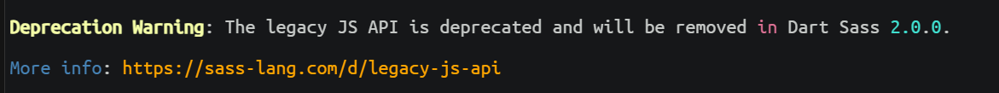

# 其他踩坑

## How to set sassOptions in Vite

### 问题描述

在启动运行项目后，控制台会出现下图错误：



### 解决方案

https://stackoverflow.com/questions/68147471/how-to-set-sassoptions-in-vite/78997875#78997875

```js
// vite.config.js
export default defineConfig({
  css: {
    preprocessorOptions: {
      scss: {
        api: 'modern-compiler', // or "modern"
        silenceDeprecations: ['legacy-js-api'],
      }
    }
  },
});
```