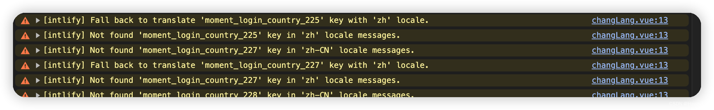
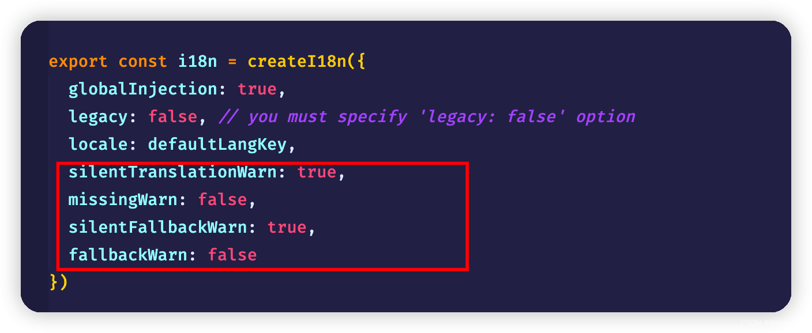
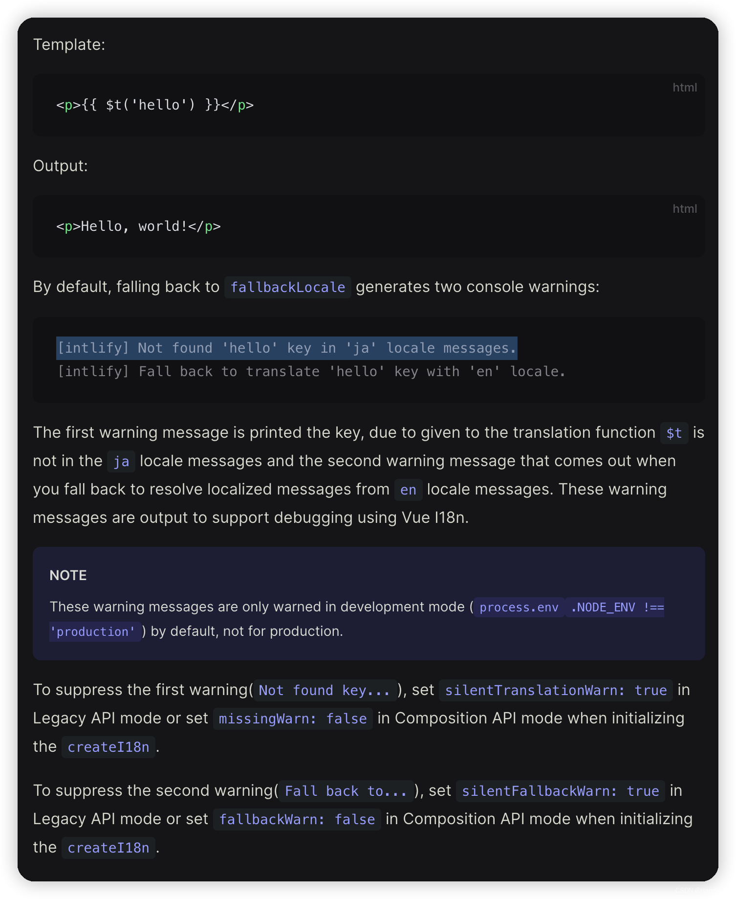

# Vue3 + 国际化i18n

## 解决 [intlify] Not found ‘xx‘ key in ‘x‘ locale messages. 的两个警告

https://blog.csdn.net/aijiaren_leilei/article/details/135388771

话不多说先上一个烦人的警告截图（词条越多警告越多会卡死控制台）：

### 场景

在开发 `vue3` 国际化项目中使用了 `vue-i18n` 插件，词条是非本地 `json` 的，都是从接口取回的，所以本地并没有实际词条文件，而 `vue-i18n` 插件在开发环境是默认打开警告的，所以当调试页面的时候会发现有很多类似的`[intlify] Not found 'xx' key in 'x' locale messages.` 警告，然后浏览器的控制台就会卡到要爆炸非常影响开发。

### 解决方案

在 `i18n` 的配置地方追加关闭警告参数即可。

配置文件处添加四行代码即可（它是两种模式，我这里没做测试直接四个都加了）从此控制台清净了！！！

### 参考i18n官方配置说明

                        