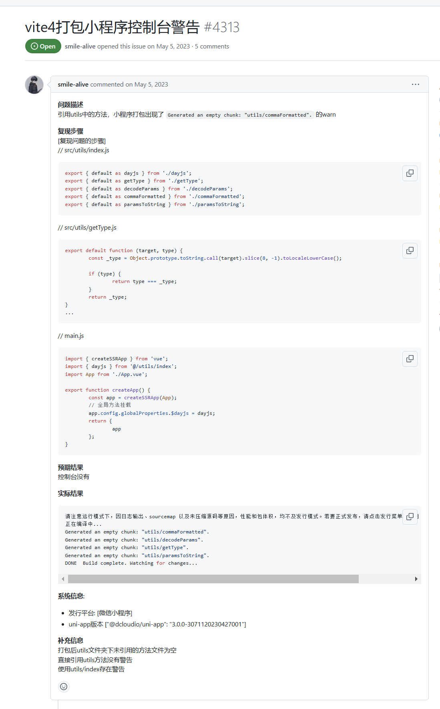

# 踩坑总结

## Deprecation Warning: The legacy JS API is deprecated and will be removed in Dart Sass 2.0.0. 

> How to set sassOptions in Vite ???

### 问题描述

在启动运行项目后，控制台会出现下图错误：


解释如下：
> Deprecation Warning: The legacy JS API is deprecated and will be removed in Dart Sass 2.0.0.
> 弃用警告：旧版 JS API 已弃用，并将在 Dart Sass 2.0.0 中删除。


### 根本原因
 
`Sass` 的开发者做了一些让人不满的决定：

- 首先，他们不希望用户能关闭弃用警告，因为一旦这些特性被移除，用户会在GitHub上提出大量问题。
- 其次，他们对依赖的定义非常严格，只有在依赖造成警告时才能“静音”这些警告，但这个标准让大多数人根本无法满足，导致无法真正关闭弃用警告。
- 这些决策让开发者感到沮丧。


### 解决方案

https://stackoverflow.com/questions/68147471/how-to-set-sassoptions-in-vite/78997875#78997875

```js
// vite.config.js
export default defineConfig({
  css: {
    preprocessorOptions: {
      scss: {
        api: 'modern-compiler', // or "modern"
        silenceDeprecations: ['legacy-js-api'],
      }
    }
  },
});
```

## Deprecation Warning:Sass @import rules are deprecated and will be removed in Dart Sass 3.0.0.

https://blog.csdn.net/keledian/article/details/143055665


简单的说，就是新版本`sass`不再支持`@import`，建议使用`@use`

```vue
<template>
    <div>

    </div>
</template>

<script setup>

</script>

<style lang="scss">
// @import "@/styles/index.scss";  // 新版本不支持
/* 全局使用 */
@use "@/styles/index.scss";
</style>
```

## Generated an empty chunk: "styles/variables"


参考：https://github.com/dcloudio/uni-app/issues/4313



### 根据上图`issues`分析原因

打包后utils文件夹下未引用的方法文件为空
直接引用utils方法没有警告
使用utils/index存在警告

### 结论

有没有可能是对未使用的引用的警告？？？

尝试注释掉未使用的`styles/variables`引入，成功解决警告！！！
