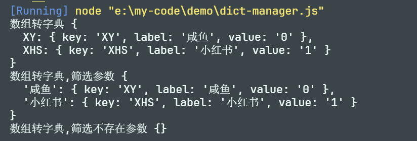

# 字典

字典是为了减少代码的魔法字符串，方便维护、拓展项目。

## 代码文件形式（常用）

定义字典文件 `src/utils/dict.js`

```js
// js 字典定义

/**
 *  数据库定义字典值 - value
 *  - 应对任何类型的字典，使用varchar
 *  - 确定是数字类型的字典，可以使用int
 */


// 销售平台
const SALE_PLATFORM = {
    XY: {
        label: '咸鱼',
        value: '0'
    },
    XHS: {
        label: '小红书',
        value: '1'
    },
}

// [
//     {
//         label: '咸鱼',
//         value: '0'
//     },
//     {
//         label: '小红书',
//         value: '1'
//     }
// ]

function convertDictToArray(obj, fieldList, emptyValue) {
    if (!fieldList?.length) {
        return Object.values(obj)
    }
    return Object.values(obj).map(item => {
        return fieldList.reduce((cur, field) => {
            cur[field] = item[field] || emptyValue
            return cur
        }, {})
    })
}

console.log('字典转数组',convertDictToArray(SALE_PLATFORM))
console.log('字典转数组,筛选参数',convertDictToArray(SALE_PLATFORM,['label']))
console.log('字典转数组,筛选不存在参数',convertDictToArray(SALE_PLATFORM,['label','key']))
```


这种方式，如果使用ts，可以有很好的类型提示。


## 数据库形式（不常用）

如：后台管理系统的字典管理

个人觉得非必要，除非是一些数据字典，不对业务逻辑有影响，仅做展示的可以。

定义字典文件 `src/utils/dict-manager.js`

```js

// 字典管理，数据接口
const getData = () => {
    return [
        {
            key: 'XY',
            label: '咸鱼',
            value: '0'
        },
        {
            key: 'XHS',
            label: '小红书',
            value: '1'
        }
    ]
}

function convertArrayToDict(arr, keyField = "key") {
    return arr.reduce((cur, item) => {
        if (item[keyField]) {
            cur[item[keyField]] = item
        }
        return cur
    }, {})
}

const data = getData()


console.log('数组转字典', convertArrayToDict(data))
console.log('数组转字典,筛选参数', convertArrayToDict(data, 'label'))
console.log('数组转字典,筛选不存在参数', convertArrayToDict(data, 'code'))
```




这种方式，如果使用ts，需要自己写vite插件脚本，才能有很好的类型提示。（个人是这么认为的）

**而且，涉及到业务逻辑相关的字典，如果改动大，代码也需要修改，所以如果是用于业务逻辑相关的，我觉得这个的意义不大。**