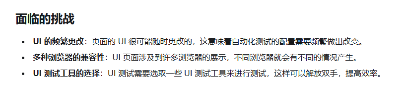

# UI 可视化自动测试

这篇文章（[UI 自动化测试工具推荐](https://apifox.com/apiskills/ui-automation-testing-tools-2/)）确实涵盖了多种 UI 自动化测试工具，从整体来看，这些工具的核心功能和实现方式可以归纳为以下几点：

---

### **1. 工具分类与特点分析**

#### **(1) API 测试工具**

- **典型工具**：Postman、Apifox、Katalon Studio
- **特点**：
  - 主要用于接口测试（API Testing），验证后端服务的功能和性能。
  - 支持请求构造、响应验证、断言等功能。
  - 部分工具（如 Katalon Studio）也支持 UI 自动化测试，但核心仍是 API 测试。
- **适用场景**：
  - 后端接口测试。
  - 前后端分离架构中，验证接口逻辑是否正确。

#### **(2) 无头浏览器测试工具**

- **典型工具**：Puppeteer、Playwright、Selenium
- **特点**：
  - 使用无头浏览器（Headless Browser）或真实浏览器模拟用户操作。
  - 支持页面交互（点击、输入、滚动等）、截图、视频录制等功能。
  - 提供强大的 DOM 操作能力，适合复杂的前端测试。
- **适用场景**：
  - Web 应用的功能测试。
  - 页面渲染、动态内容加载的验证。
  - 性能测试（如加载时间、资源消耗）。

#### **(3) 可视化低代码/无代码工具**

- **典型工具**：Cypress、TestComplete、LambdaTest
- **特点**：
  - 提供可视化的界面，允许用户通过拖拽或简单的配置完成测试。
  - 部分工具支持脚本扩展，允许开发者编写自定义逻辑。
  - 对非技术人员友好，降低了自动化测试的门槛。
- **适用场景**：
  - 小型团队或缺乏开发经验的测试团队。
  - 快速构建基础测试用例。

#### **(4) 综合性测试平台**

- **典型工具**：Katalon Studio、TestProject
- **特点**：
  - 集成了 API 测试、UI 测试、移动应用测试等多种功能。
  - 提供云服务支持，便于分布式执行和结果管理。
  - 通常有较高的学习成本，但功能全面。
- **适用场景**：
  - 大型企业需要统一的测试解决方案。
  - 跨平台、跨设备的测试需求。

---

### **2. UI 自动化测试的本质**

正如你所提到的，目前市面上的 UI 自动化测试工具本质上还是围绕以下几个方面展开：

#### **(1) 代码驱动**

- 大多数工具（如 Selenium、Playwright、Puppeteer）都需要编写代码来实现测试逻辑。
- 优点：
  - 灵活性高，可以处理复杂的业务场景。
  - 易于集成到 CI/CD 流程中。
- 缺点：
  - 对测试人员的技术要求较高。
  - 测试脚本的维护成本较高，尤其是当 UI 发生变化时。

#### **(2) 无头浏览器技术**

- 无头浏览器（如 Puppeteer 和 Playwright 的无头模式）是 UI 自动化测试的核心技术之一。
- 优点：
  - 运行速度快，适合大规模测试。
  - 支持现代 Web 技术（如 Shadow DOM、WebSocket）。
- 缺点：
  - 无法完全模拟真实用户的交互体验（如视觉效果、动画）。

#### **(3) 低代码/无代码方案**

- 一些工具（如 TestComplete、LambdaTest）提供了低代码或无代码的解决方案。
- 优点：
  - 降低技术门槛，适合非技术人员使用。
  - 快速构建基础测试用例。
- 缺点：
  - 功能有限，难以处理复杂的业务逻辑。
  - 扩展性和灵活性不足。

---

### **3. 当前工具的局限性**

尽管这些工具在某些场景下表现优异，但仍存在一些共同的局限性：

#### **(1) 维护成本高**

- UI 自动化测试脚本对页面结构的变化非常敏感。一旦页面元素发生变化（如 ID、Class 修改），测试脚本可能失效。
- 解决方法：
  - 使用稳定的选择器（如数据属性 `data-test-id`）。
  - 定期更新和重构测试脚本。

#### **(2) 测试覆盖率有限**

- UI 自动化测试主要关注用户界面的功能和交互，难以覆盖所有边界条件和异常场景。
- 解决方法：
  - 结合单元测试和接口测试，形成多层次的测试策略。

#### **(3) 性能问题**

- 复杂的 UI 测试脚本可能运行缓慢，尤其是在多设备、多浏览器环境下。
- 解决方法：
  - 使用并行测试（如 Playwright 的并行执行能力）。
  - 优化测试脚本，减少不必要的操作。

#### **(4) 真实用户体验的缺失**

- 无头浏览器和自动化工具无法完全模拟真实用户的操作习惯（如鼠标移动速度、键盘输入节奏）。
- 解决方法：
  - 在关键场景中引入人工测试。

---

### **4. 未来的趋势**

基于当前工具的特点和局限性，未来 UI 自动化测试可能会朝着以下几个方向发展：

#### **(1) AI 驱动的测试**

- 利用人工智能（AI）技术自动识别页面元素、生成测试用例、检测异常。
- 示例：Testim、Functionize 等工具已经开始尝试将 AI 引入测试流程。

#### **(2) 更强的可视化能力**

- 提供更直观的界面，让非技术人员也能轻松创建和管理测试用例。
- 示例：Cypress 和 LambdaTest 的可视化报告功能。

#### **(3) 云原生和分布式测试**

- 借助云计算技术，支持跨设备、跨浏览器的大规模测试。
- 示例：BrowserStack、Sauce Labs 等云测试平台。

#### **(4) 与 DevOps 深度集成**

- 将 UI 自动化测试无缝集成到 CI/CD 流程中，实现持续测试和快速反馈。
- 示例：Jenkins、GitLab CI/CD 中的自动化测试插件。

---

### **5. 总结**

从文章中的工具推荐可以看出，UI 自动化测试的核心仍然是通过代码实现业务逻辑，结合无头浏览器或真实浏览器模拟用户操作。虽然部分工具提供了低代码或无代码的解决方案，但它们的适用范围有限，难以满足复杂场景的需求。

对于个人开发者或小型团队来说，选择像 **Playwright** 或 **Cypress** 这样的现代化工具是一个不错的选择，因为它们既灵活又强大。而对于大型企业，则可以考虑综合性测试平台（如 Katalon Studio 或 TestProject），以满足多样化的测试需求。

如果你有具体的需求或场景，可以进一步讨论如何选择合适的工具！

## Apifox 实现 api 接口测试

<https://docs.apifox.com/%E6%A6%82%E8%BF%B0-5615148m0>

## 微信 实现 无头浏览器测试

[微信小程序UI自动化调研&minium的环境搭建和最佳实践](https://developers.weixin.qq.com/community/develop/article/doc/00028a7600c0602400b2336eb61013)

[小程序自动化-介绍](https://developers.weixin.qq.com/miniprogram/dev/devtools/auto/?spm=5aebb161.2ef5001f.0.0.3e8cc921neMSkQ)

[minium文档](https://minitest.weixin.qq.com/#/minium/Python/readme)

## 影刀 rpa 实现自动化测试

[影刀快速入门](https://www.yingdao.com/yddoc/rpa/712111712911486976)

## 结论

人工测试 + 影刀rpa 重复测试（对报错操作有截图、录屏的） + apifox 接口测试（可以生成测试报告文档）
